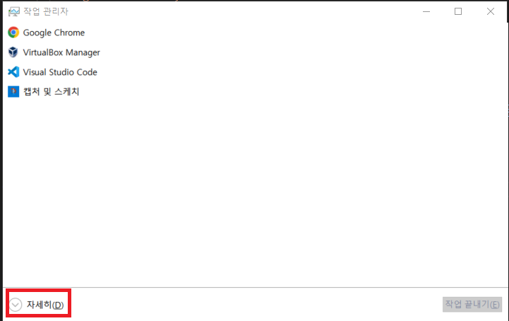
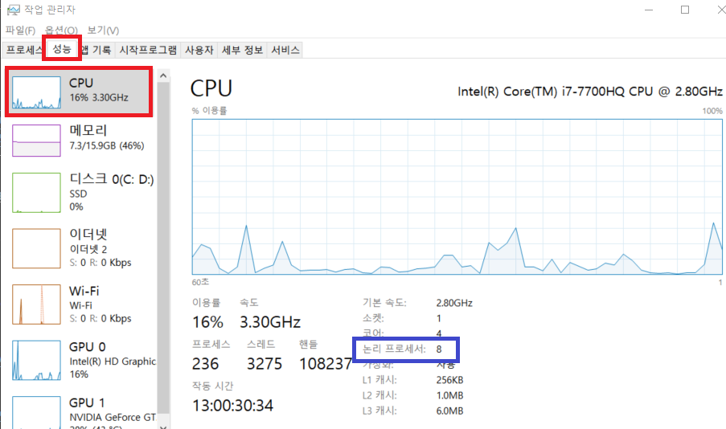
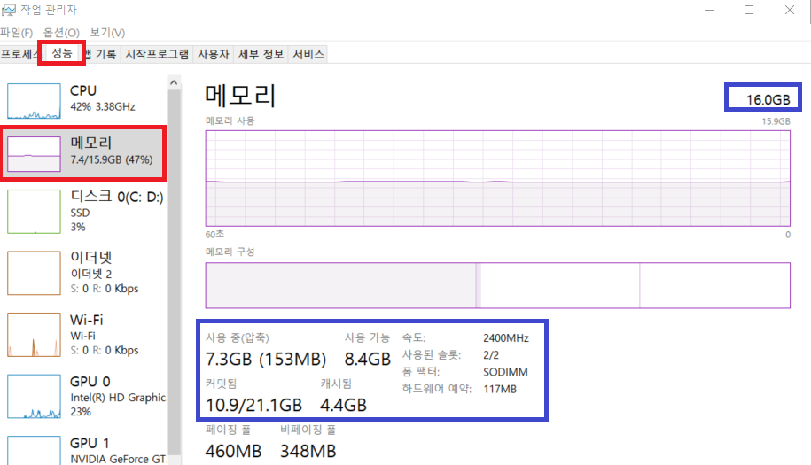
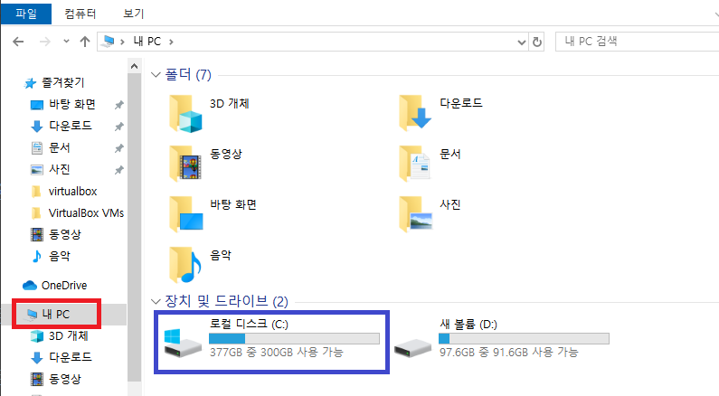

# [프로세서 확인](https://support.microsoft.com/ko-kr/windows/%ED%94%84%EB%A1%9C%EC%84%B8%EC%84%9C%EC%9D%98-%EC%BD%94%EC%96%B4-%EC%88%98-%ED%99%95%EC%9D%B8-3126ef99-0247-33b3-81fc-065e9fb0c35b)
1. Ctrl +Shift + Esc를 눌러 작업 관리자 실행 

---
2. CPU 코어 확인 

---
3. 메모리 확인 

---
[4. 저장소 용량 확인](https://support.microsoft.com/ko-kr/windows/pc%EC%9D%98-%EC%A0%80%EC%9E%A5%EC%86%8C-%EC%9A%A9%EB%9F%89-%ED%99%95%EC%9D%B8-c7cbe6ef-267b-6b8a-32d9-01161623ba5a) 

---
# [Hadoop Ecosystem](./hadoop%20ecosystem/README.md)

---
# [Spark](./spark/README.md)

---
# [Kubernetes](./kubernetes/README.md)

---
# [Kubeflow](./kubeflow/README.md)

