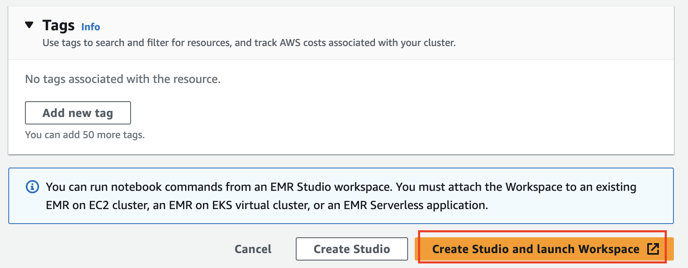

# [EMR Studio](https://docs.aws.amazon.com/ko_kr/emr/latest/ManagementGuide/emr-studio.html)
- Amazon EMR Studio는 Amazon EMR 클러스터에서 실행되는 완전관리형 Jupyter Notebook을 위한 웹 기반 통합 개발 환경(IDE)입니다.

---
## [EMR Studio 작동방식](https://aws.amazon.com/ko/blogs/big-data/build-an-optimized-self-service-interactive-analytics-platform-with-amazon-emr-studio/) 

---
### 단계1: Studio 생성 

---
### 단계2: 설정
- Studio settings

---
### 단계3: IAM > EMR Service
- add `AmazonS3FullAccess`, `AmazonEMRFullAccessPolicy_v2`, `AmazonS3FullAccess`

---
### 단계4: 설정
- Workspace settings

---
### 단계5: 설정
- Authentication

---
### 단계6: 설정
- Networking and security

---
### 단계7: 설정 및 생성
- Create Studio and launch Workspace

---
### 단계8: Studio Access

---
### 단계9: 팝업 및 리다이렉션 허용

