# EKS 아키텍처 
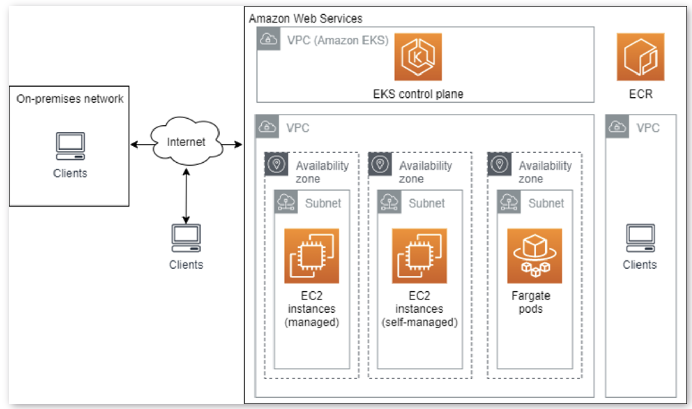

---
# Instance 생성

---
### 단계1: Launch instance
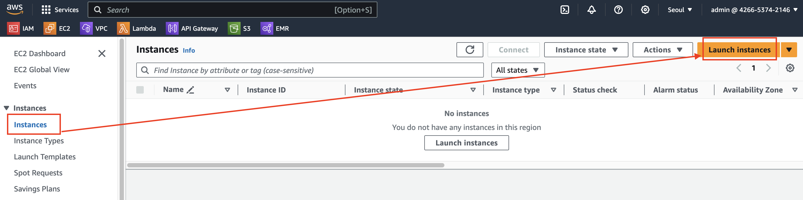

---
### 단계2: Name & OS Images
- Name: eks-client
- OS Images: Ubuntu Server 20.04 LTS

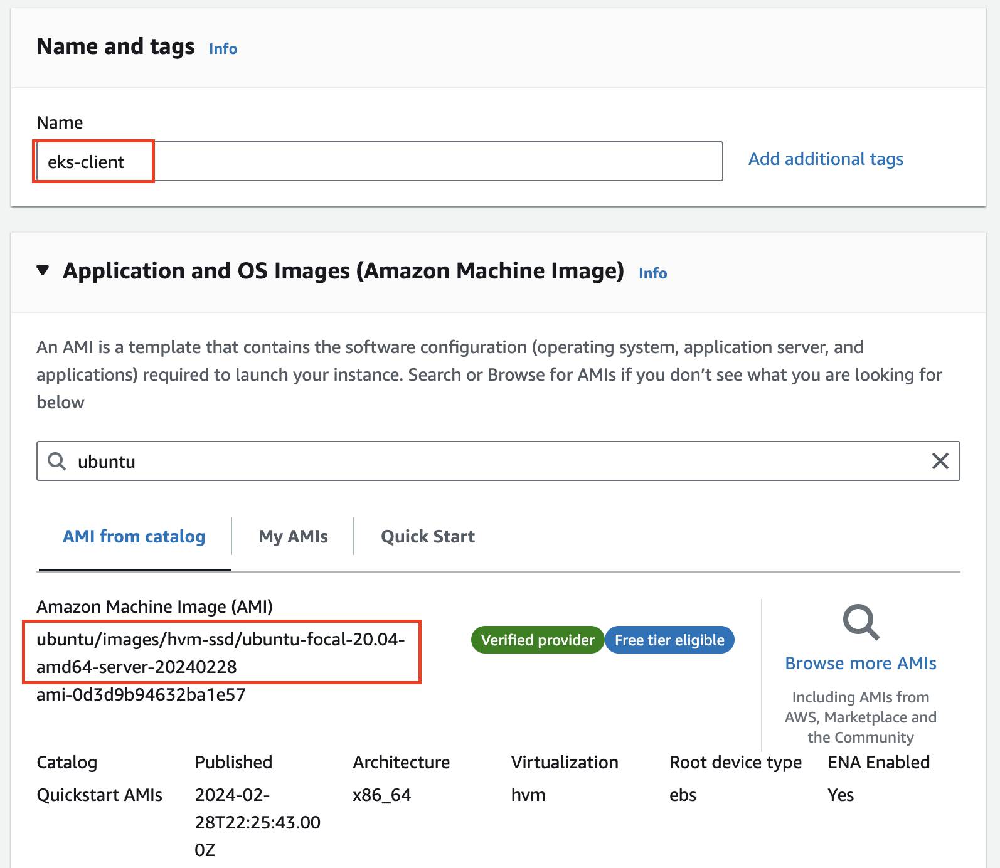

---
### 단계3: Instance Type & Key pair
- Instance Type: t2.micro
- Key pair: eks-client-keypair

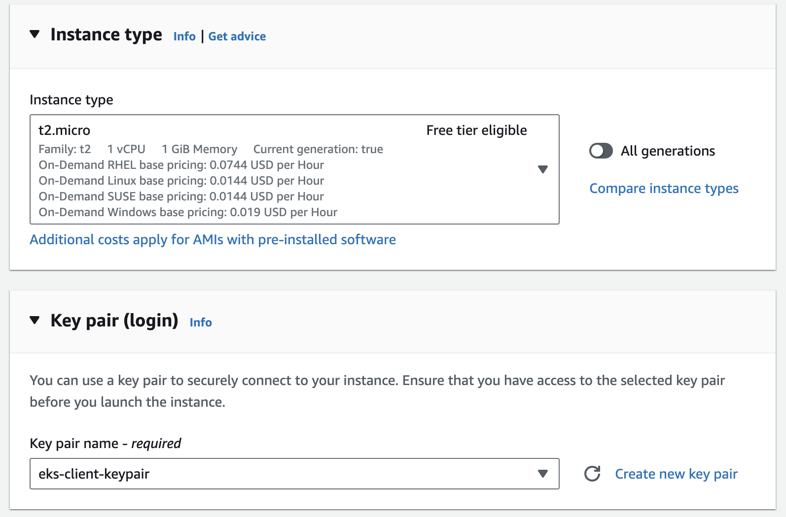

---
### 단계4: Network settings
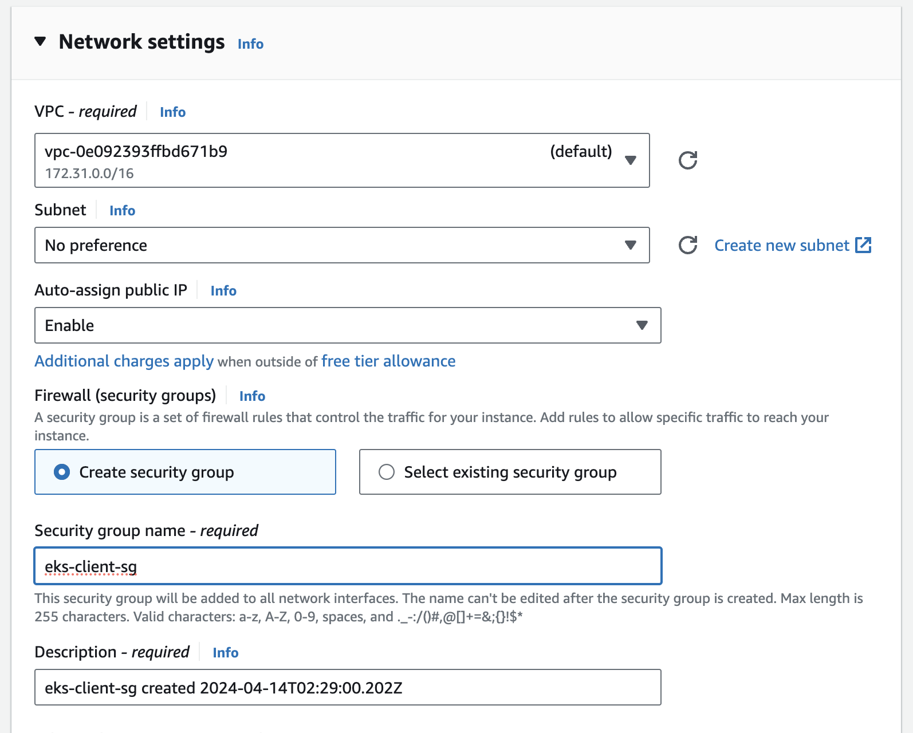

---
### 단계5: Configure storage & Launch instance
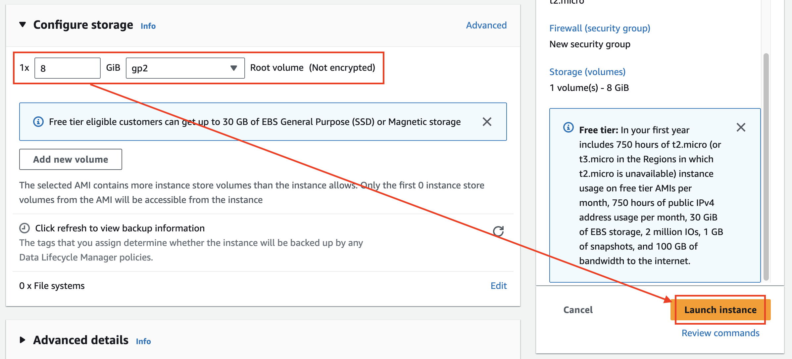

---
### 단계6: Instance 확인 
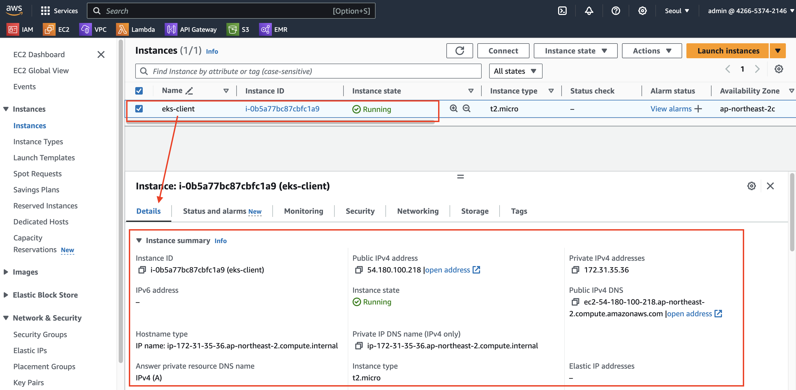

---
# [Elastic IP](https://docs.aws.amazon.com/ko_kr/AWSEC2/latest/UserGuide/elastic-ip-addresses-eip.html)
- 탄력적 IP 주소는 동적 클라우드 컴퓨팅을 위해 고안된 고정 퍼블릭 IPv 주소
- 모든 인스턴스 또는 네트워크 인터페이스에 탄력적 IP 주소를 연결 가능 
### Elastic IP 사용하는 이유
- EC2 인스턴스를 생성하여 서버를 실행시키면 고정 IP가 아닌 동적 IP를 할당받습니다. 
- 인스턴스(서버)를 중지하고 다시 실행시키면 IP가 변경되어 버리는 문제가 발생합니다. 
- 그렇기 때문에 Elastic IP를 할당받아서 사용해야 합니다. 

---
### 단계1: Elastic IP 생성 
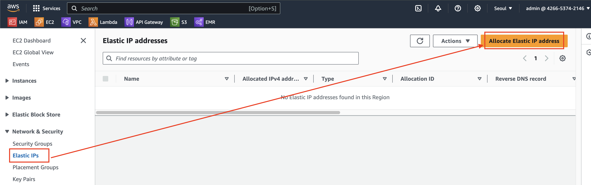

---
### 단계2: Allocate Elastic IP address
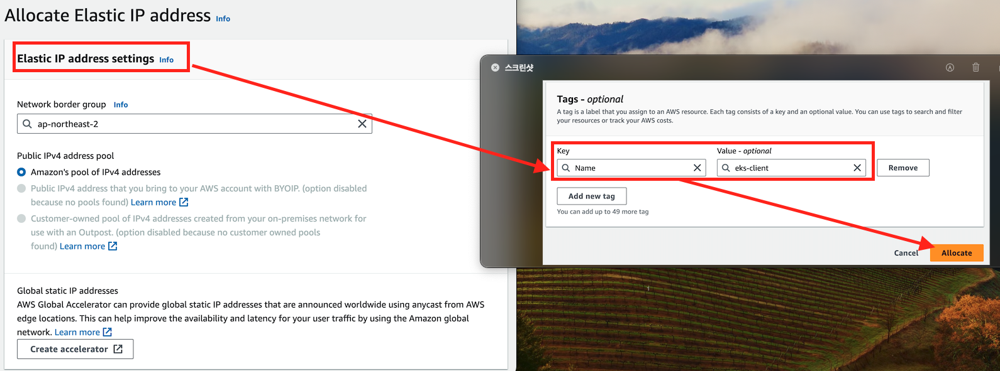

---
### 단계3: Elastic IP 확인 
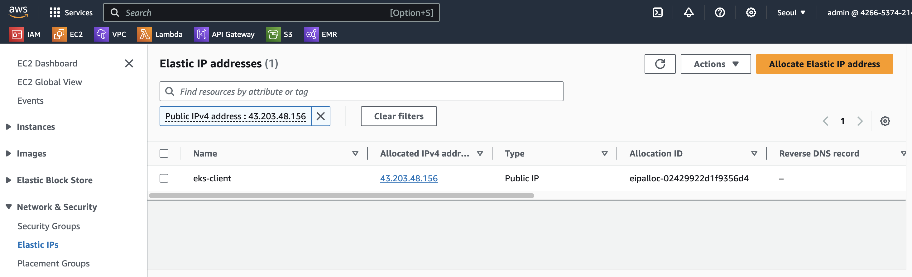

---
### 단계4: Associate Elastic IP address
- 시간이 조금 걸림 (리프레쉬)

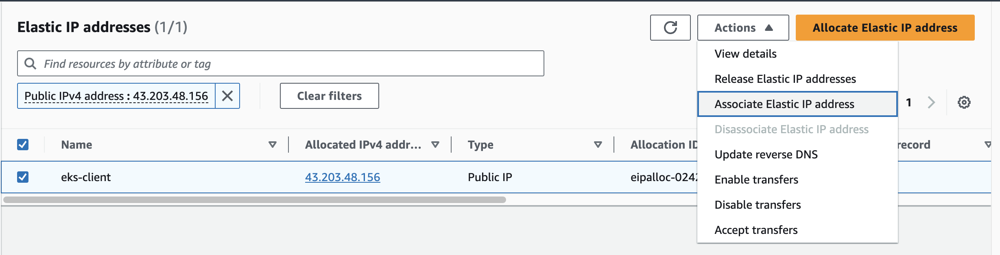

---
### 단계5: Associate Instance
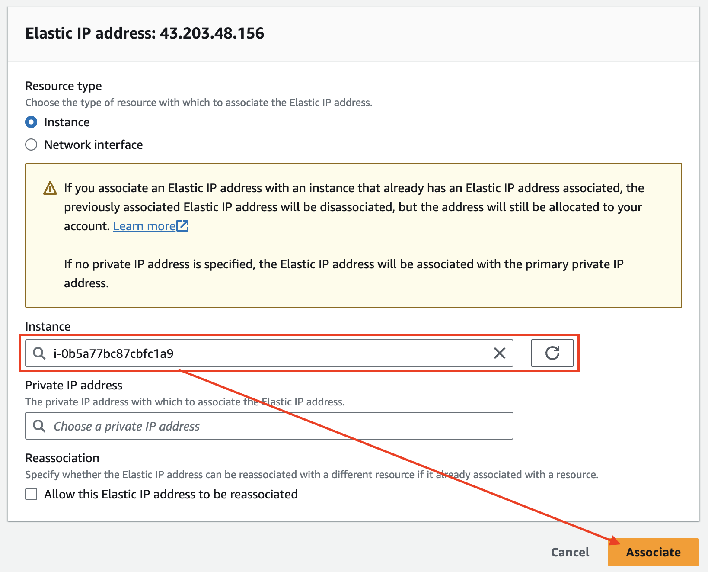

---
### 단계6: 결과 확인 
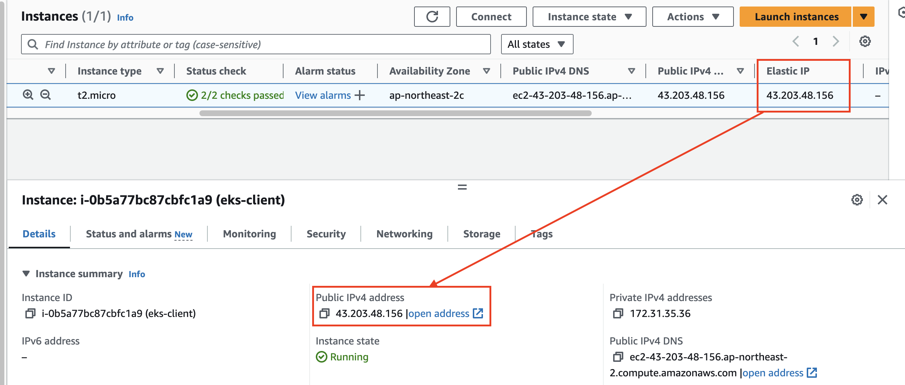

---
# EC2 접속 

---
### 단계1: eks-client-keypair.pem 
```shell
# 만약 없다면, 생성 
mkdir ~/identity

# 파일 이동 
mv eks-client-keypair.pem ~/identity
# 폴더 이동 
cd ~/identity
# 확인 
ls
```

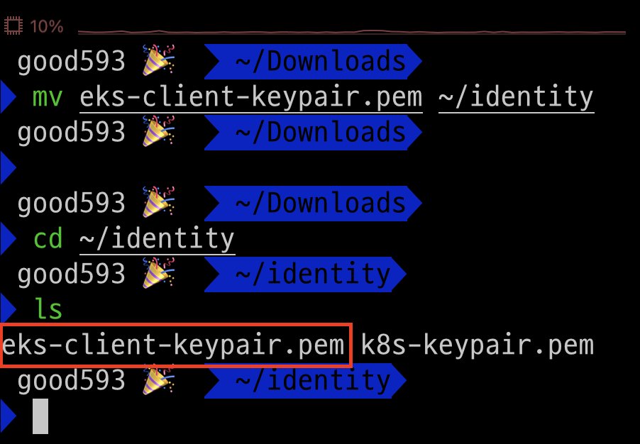

---
### 단계2: 권한 변경 
```shell
sudo chmod 600 ~/identity/eks-client-keypair.pem

ls -l ~/identity/eks-client-keypair.pem
```
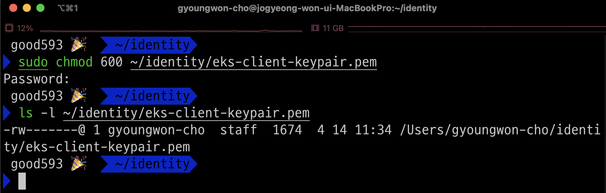

---
### 단계3: config
```shell
vim ~/.ssh/config
# 아래내용 작성 
Host eks-client
        HostName 43.203.48.156 # Elastic IP
        User ubuntu
        IdentityFile ~/identity/eks-client-keypair.pem # 생성한 key pair
```
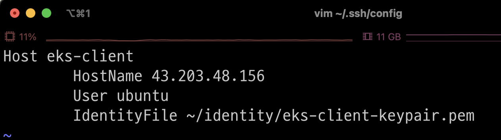

---
### 단계4: ssh eks-client 
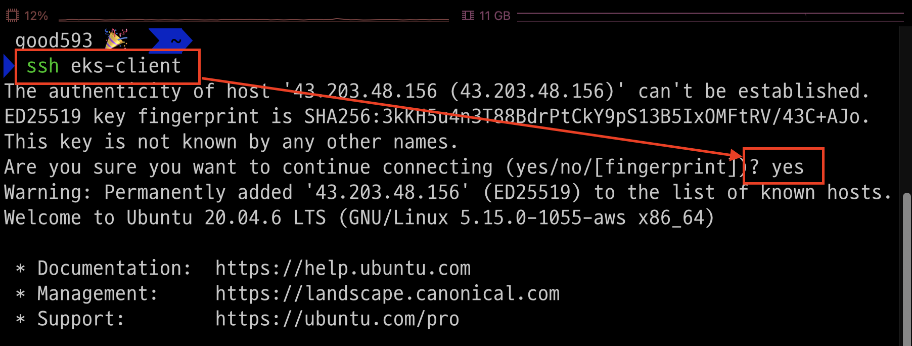

