# 설치

---
### 단계1: [aws CLI 설치](https://docs.aws.amazon.com/ko_kr/cli/latest/userguide/getting-started-install.html)
- aws 관리툴 
```shell
sudo apt-get install -y unzip
curl "https://awscli.amazonaws.com/awscli-exe-linux-x86_64.zip" -o "awscliv2.zip"
unzip awscliv2.zip
sudo ./aws/install
```
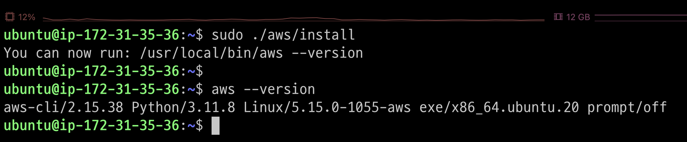

---
### 단계2: eksctl 설치
- EKS 관리툴
```shell
curl --silent --location "https://github.com/weaveworks/eksctl/releases/latest/download/eksctl_$(uname -s)_amd64.tar.gz" | tar xz -C /tmp
sudo mv /tmp/eksctl /usr/local/bin
eksctl version
```
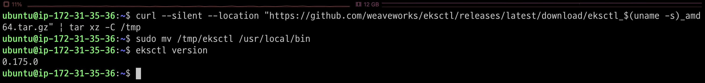

---
### 단계3: [kubectl 설치](https://docs.aws.amazon.com/ko_kr/eks/latest/userguide/install-kubectl.html)
- kubernetes 관리툴 
```shell
curl -O https://s3.us-west-2.amazonaws.com/amazon-eks/1.29.0/2024-01-04/bin/linux/amd64/kubectl
chmod +x ./kubectl
mkdir -p $HOME/bin && cp ./kubectl $HOME/bin/kubectl && export PATH=$HOME/bin:$PATH
echo 'export PATH=$HOME/bin:$PATH' >> ~/.bashrc
kubectl version --client
```
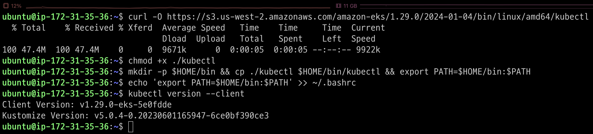

---
# 계정 생성 

---
### 단계1: IAM > Create user
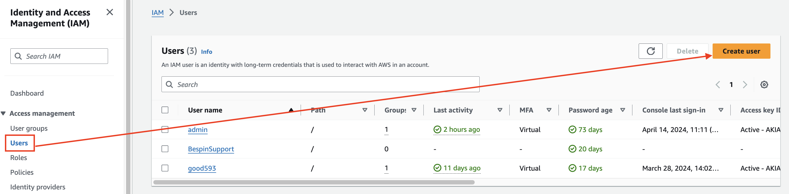

---
### 단계2: Specify user details
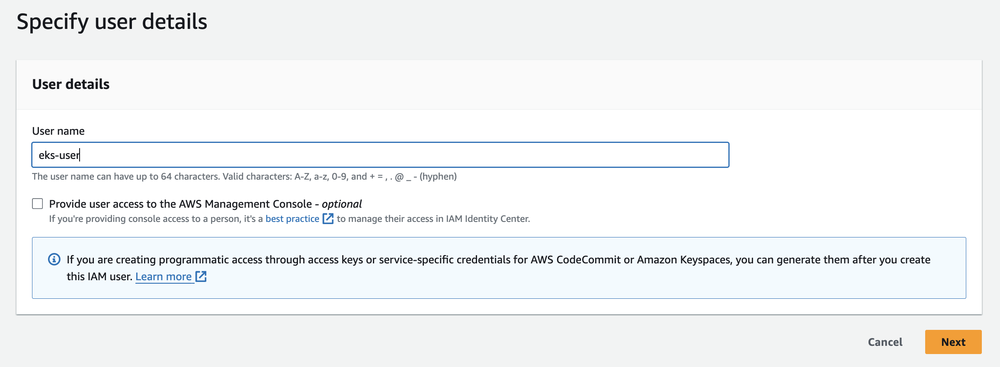

---
### 단계3: Set permissions
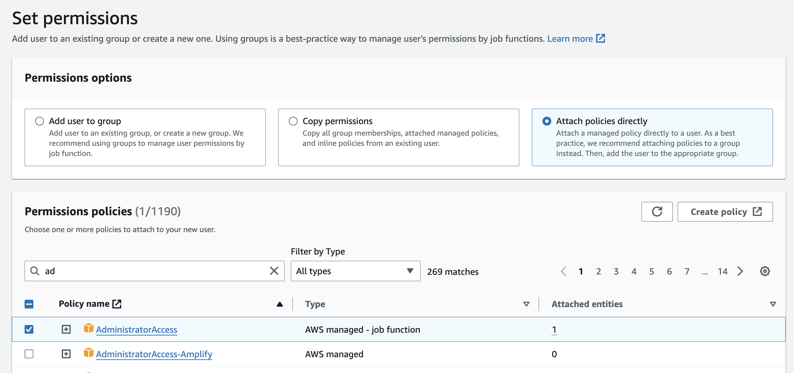

---
### 단계4: Create user


---
### 단계5: Create access key
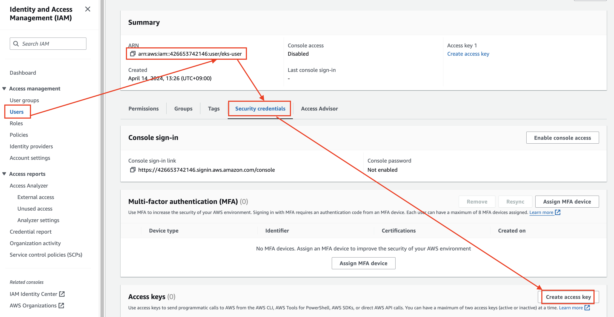

---
### 단계6: Access key best practices & alternatives
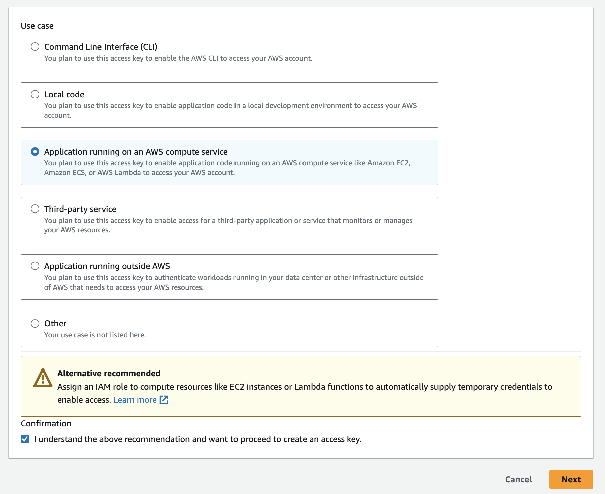

---
### 단계7: Create access key
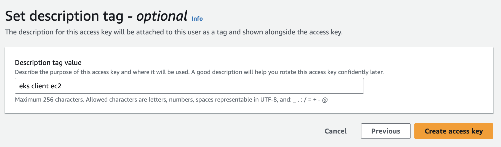

---
### 단계8: Retrieve access keys 
- Access key & Secret access key 복사

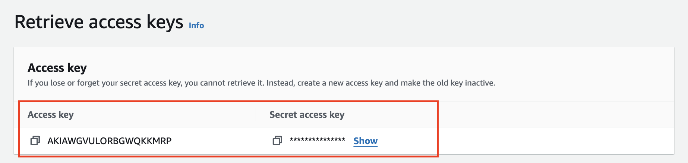

---
# 생성된 계정 EKS Client에 적용하기 

---
### 단계1: aws configure
- Access key & Secret access key 적용 
```shell
aws configure
```
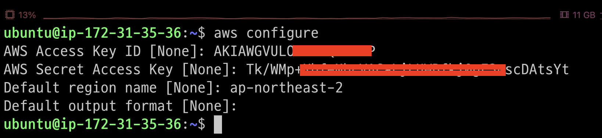

---
- 확인 
```shell
aws sts get-caller-identity
```
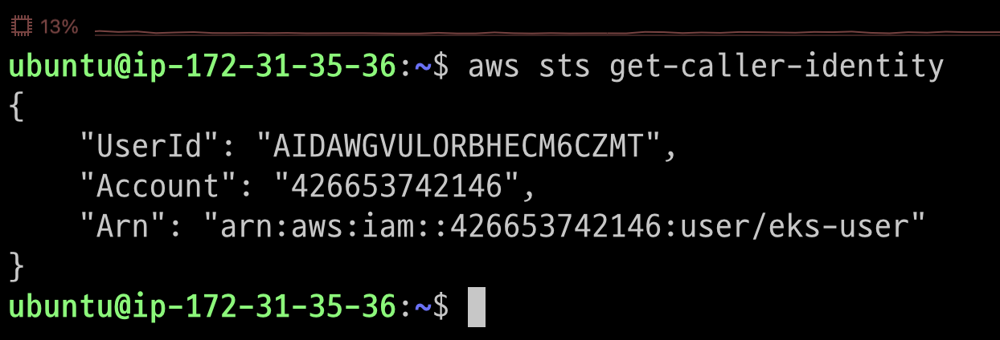

