### 단계1: Create EKS
- OpenID: aws eks와 kubernetes 클러스터에 대한 사용자 인증 옵션 
```shell
eksctl create cluster \
--name my-eks \
--region ap-northeast-2 \
--with-oidc \
--ssh-access \
--ssh-public-key eks-client-keypair \
--nodes 3 \
--node-type t3.medium \
--node-volume-size=20 \
--managed 
```
---
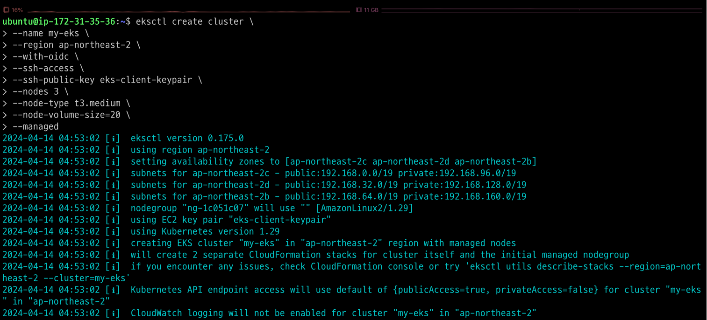

---
### 단계2: CloudFormation
- CloudFormation을 통해서 EKS가 구축되고 있음

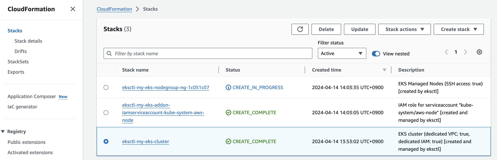

---
### 단계3: CloudFormation > Events
- Events를 통해서 구축되는 내용을 확인할 수 있음 

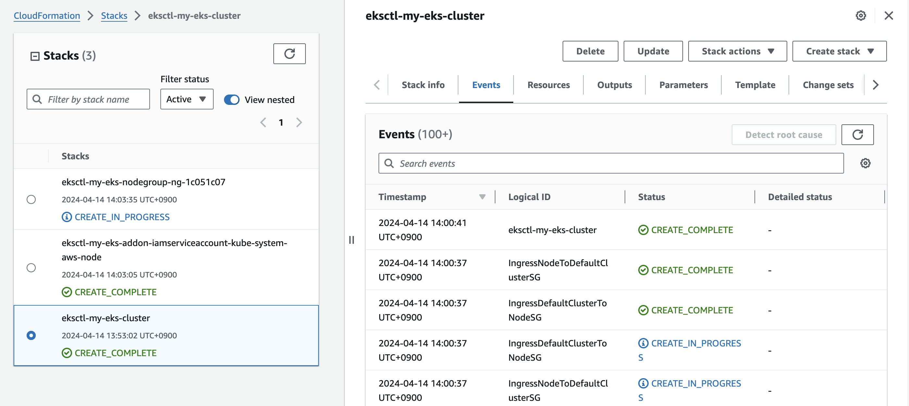

---
### 단계4: 구축 완료 
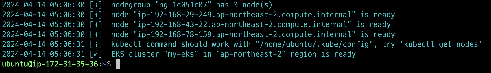

---
- CloudFormation


---
- EC2

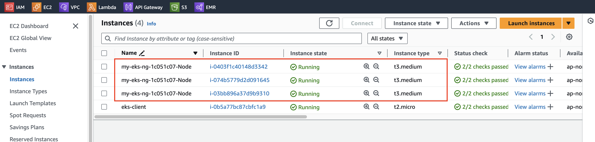

---
- Amazon Elastic Kubernetes Service


---
### 단계5: kubectl get nodes
```shell
kubectl get nodes
```
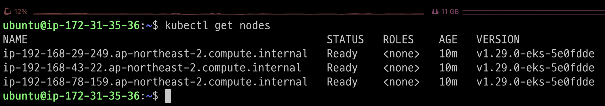

---
### 단계6: kubectl 자동완성 적용 
```shell
source <(kubectl completion bash)
echo "source <(kubectl completion bash)" >> ~/.bashrc
```
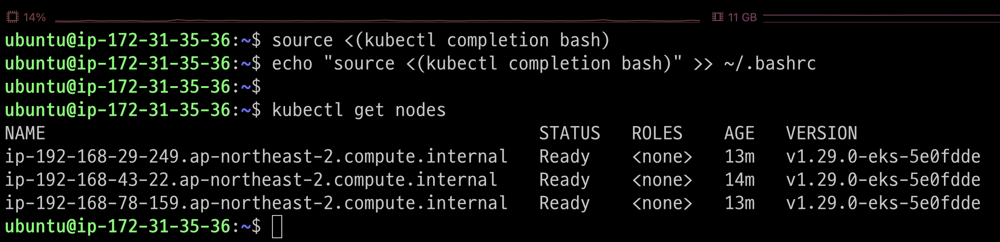

---
### 단계7: Create pod of nginx server
```shell
kubectl run web --image=nginx:1.14 --port=80
kubectl get pods -o wide
```
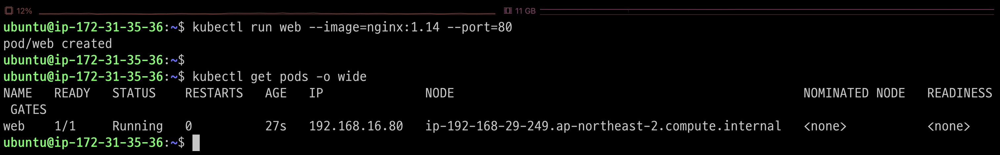

---
### 단계8: eks client > nginx server 접속 불가능 
- eks client에서는 접속이 불가능 
- pod가 속해있는 VPC에 없기 때문에 접속이 불가능 

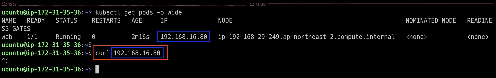

---
### 단계8: eks node > nginx server 접속 가능 
- eks node 접속 


---
- Connect to instance

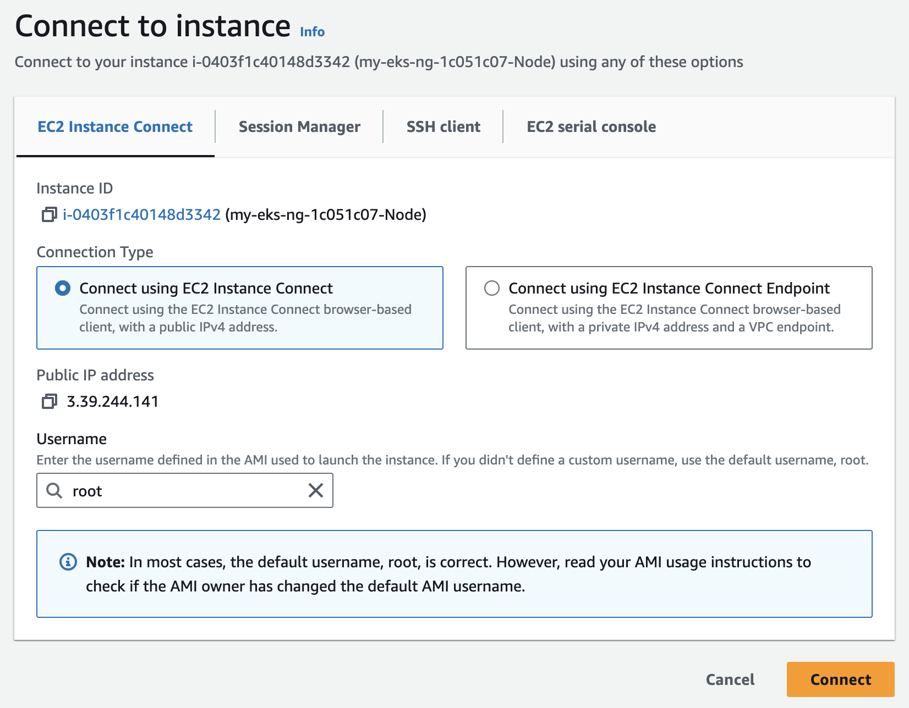

---
- nginx server 접속 가능 

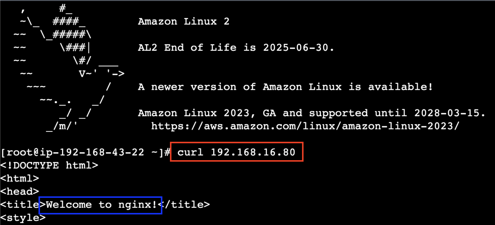

---
### 단계9: pod 삭제 
```shell
kubectl delete pod --all
kubectl get pods -o wide
```


