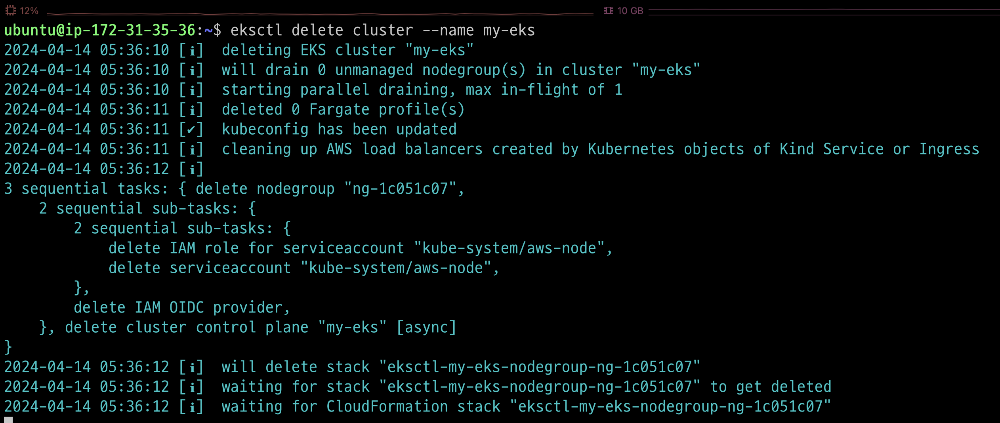
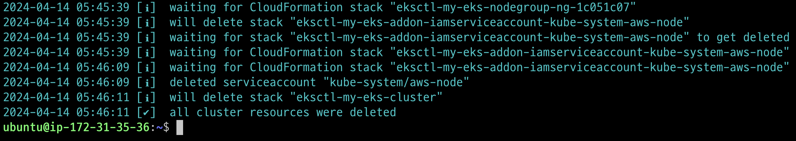
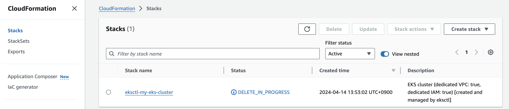
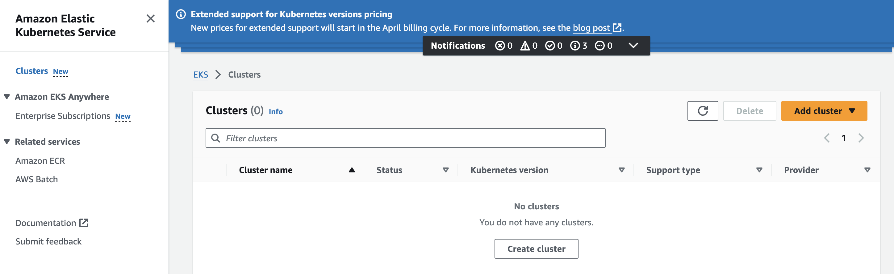
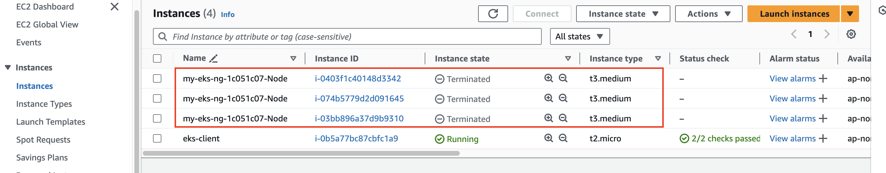
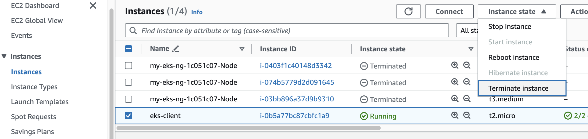
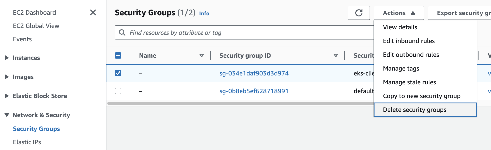
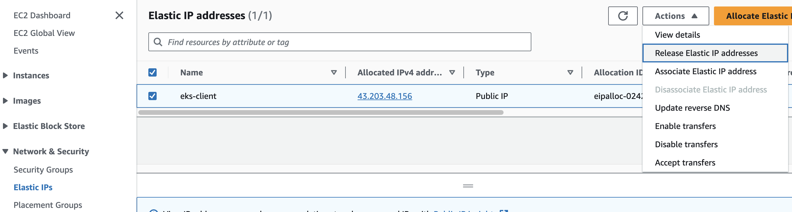
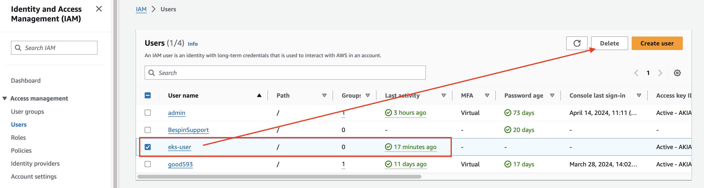

### 단계1: eks cluster 삭제 
```shell
eksctl delete cluster --name my-eks
```


---
### 단계2: eks cluster 삭제 확인


---
- CloudFormation



---
- Amazon Elastic Kubernetes Service



---
- EC2



---
### 단계3: eks client 삭제 



---
### 단계4: Security Groups 삭제



---
### 단계5: Elastic IP 삭제


---
### 단계6: 계정 삭제 


