# [Apache Airflow란?](https://velog.io/@sophi_e/Airflow-%EA%B8%B0%EC%B4%88-%EA%B0%9C%EB%85%90-%EB%B0%8F-%EC%9E%A5%EB%8B%A8%EC%A0%90)
- Apache Airflow는 초기 에어비엔비(Airfbnb) 엔지니어링 팀에서 개발한 워크플로우 오픈 소스 플랫폼
  - 워크플로우란? : 의존성으로 연결된 작업(Task)들의 집합
    > (ex) ETL의 경우 Extractaction > Transformation > Loading 의 작업의 흐름
- 프로그래밍 방식으로 워크플로우를 작성, 예약 및 모니터링
---
### DAG (Directed Acyclic Graph)
- 단어 뜻 그대로 순환하지 않는 그래프, DAG(대그)라고 부름
- 반복이나 순환을 허용하지 않음
- 순차적으로 작업(task)이 이루어지며, 순환 실행을 방지하기 때문에 매우 중요함
  - 논리적 오류는 교착상태(deadlock)로 이어짐

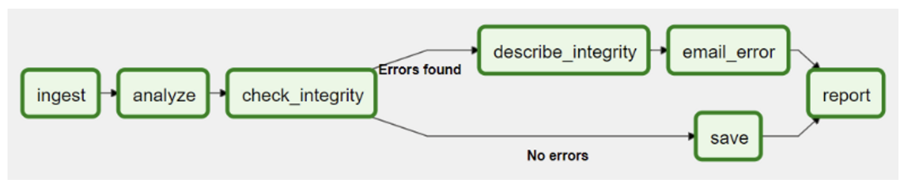

---
# 프로젝트 아키텍쳐
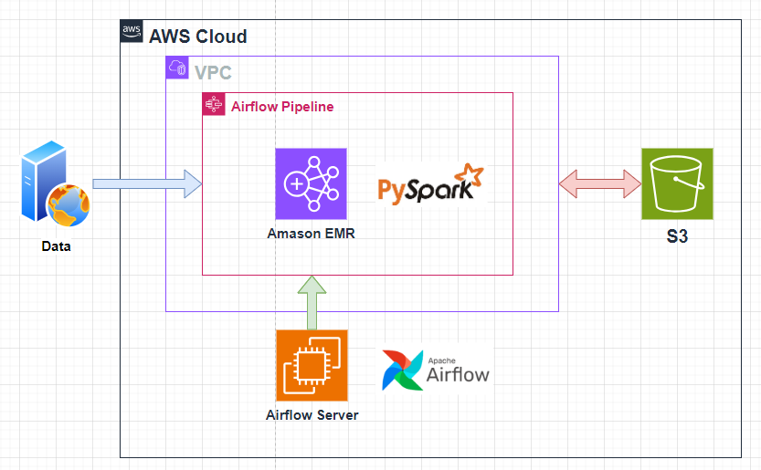

---
# Create EC2

---
### 단계1: EC2 생성
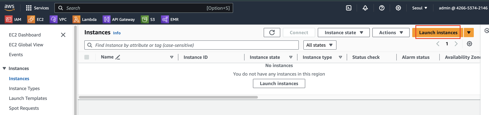

---
### 단계2: 설정 > 이름
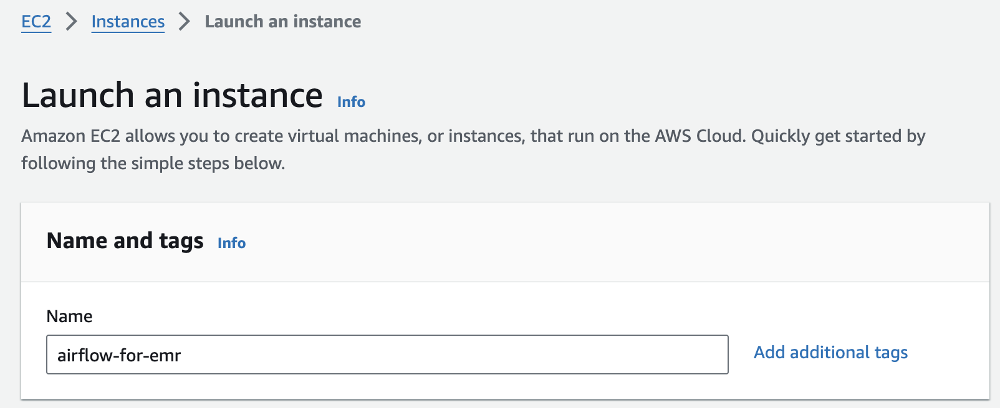

---
### 단계3: 설정 > AMI
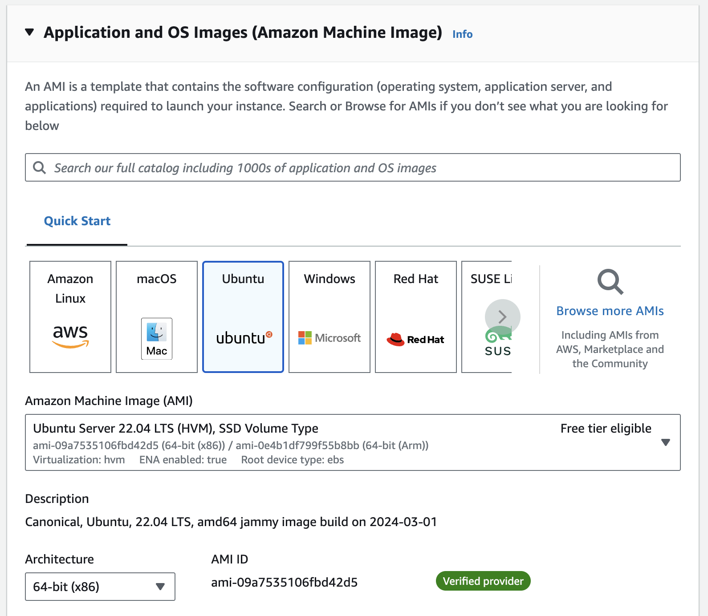

---
### 단계4: 설정 > Instance Type
- Airflow 최소스펙: 2 core / 4 GiB

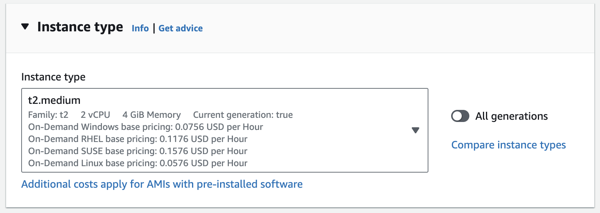

---
### 단계5: 설정 > Key pair 
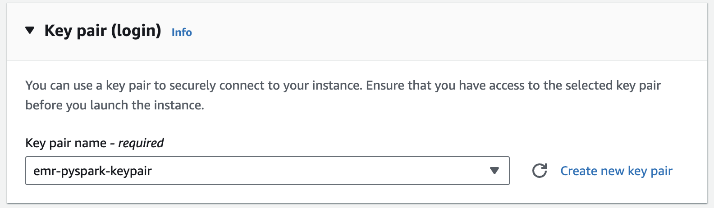

---
### 단계6: 설정 > Network settings
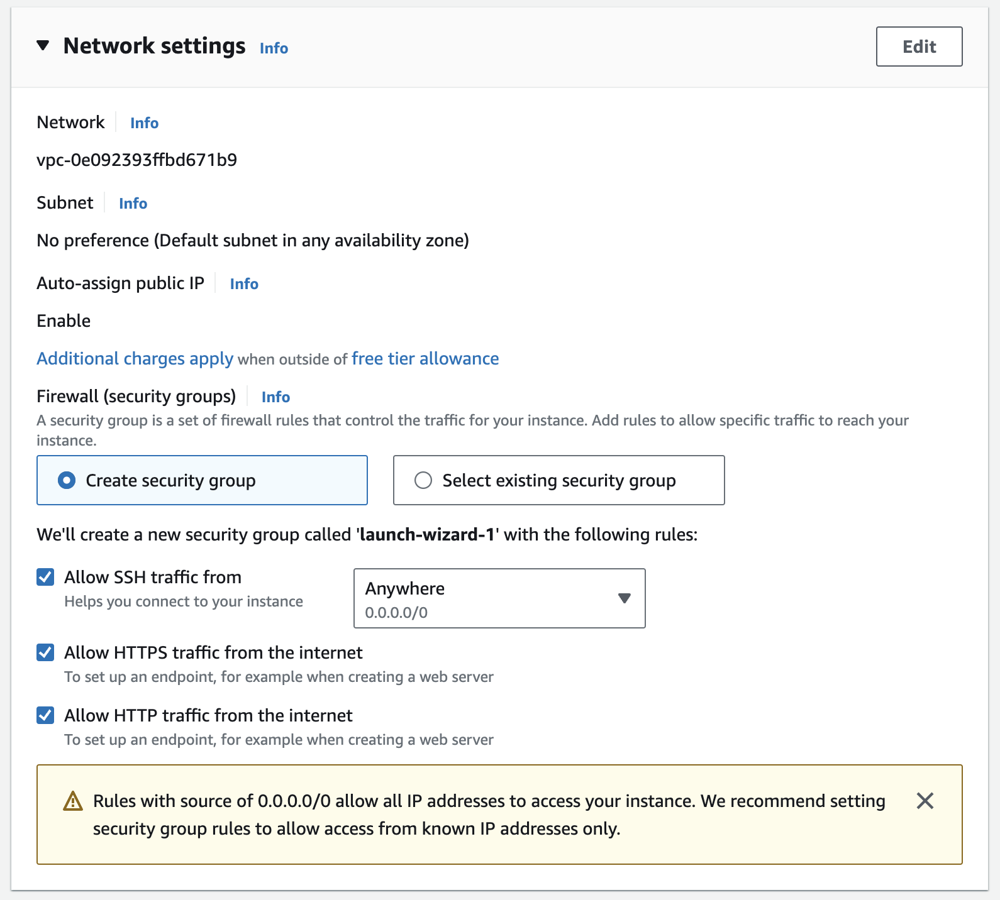

---
### 단계7: 생성 
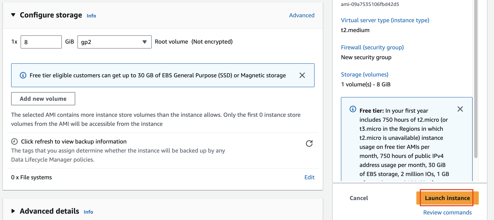

---
# Install dependencies on EC2

---
### 단계1: EC2 접속  
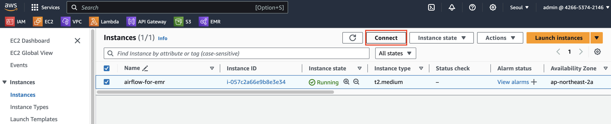

---
### 단계2: EC2 Instance Connect
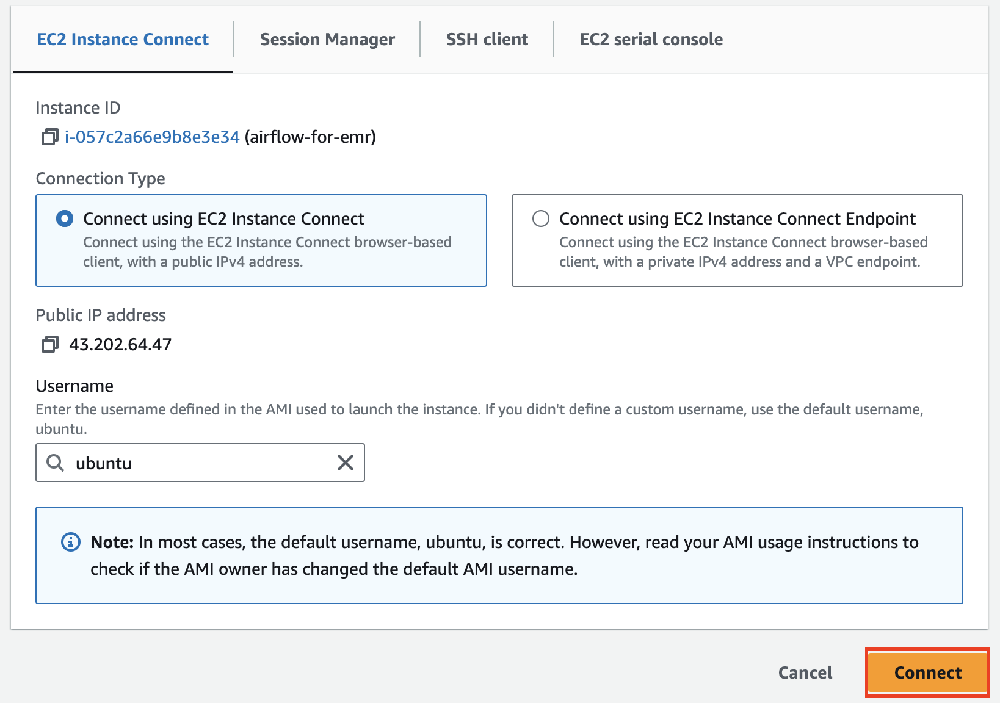

---
### 단계3: Install dependencies
```shell
# update ubuntu
sudo apt-get update

# install pip & venv
python3 --version
sudo apt-get install -y python3-pip python3.10-venv python3-boto3

# venv
python3 -m venv .venv
source .venv/bin/activate
```