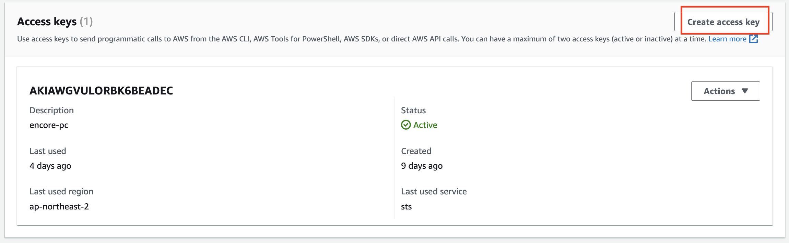
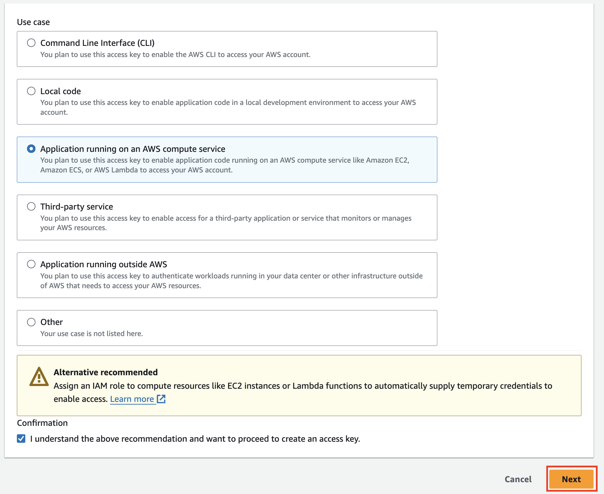
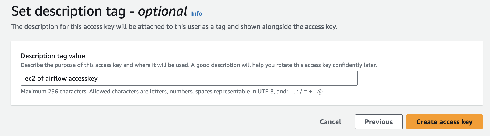
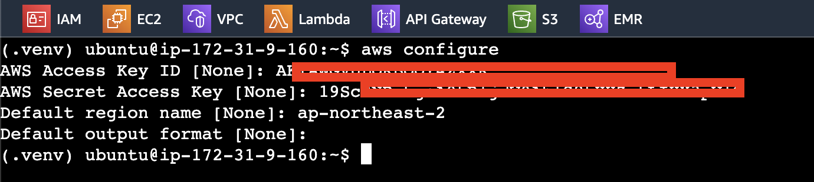

# awscli

---
### 단계1: IAM 
- User


---
### 단계2: IAM 
- Create access key


---
### 단계3: IAM
- Application running on an AWS compute service


---
### 단계4: IAM
- Create access key


---
### 단계5: EC2 
- aws configure
```shell
# aws configure
pip install --upgrade awscli
aws configure
```

