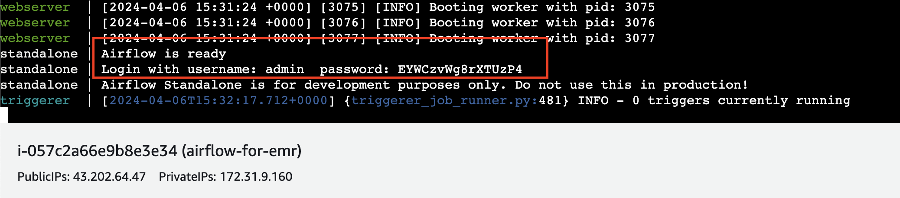
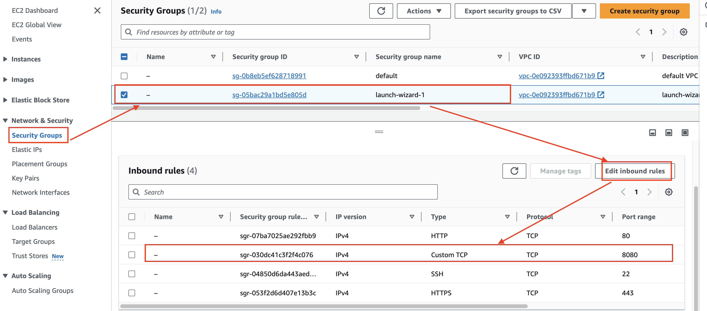
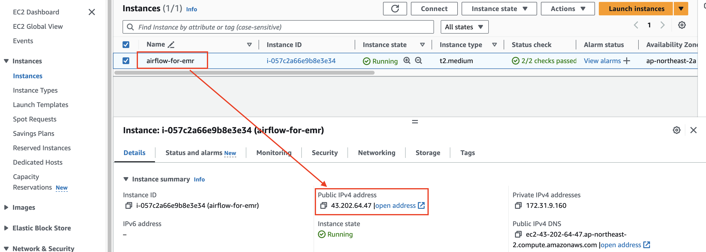
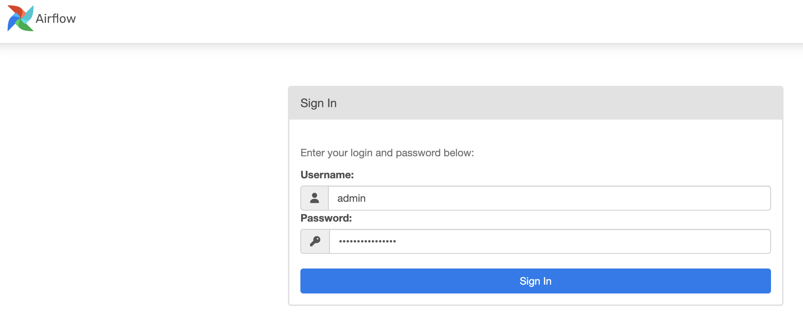
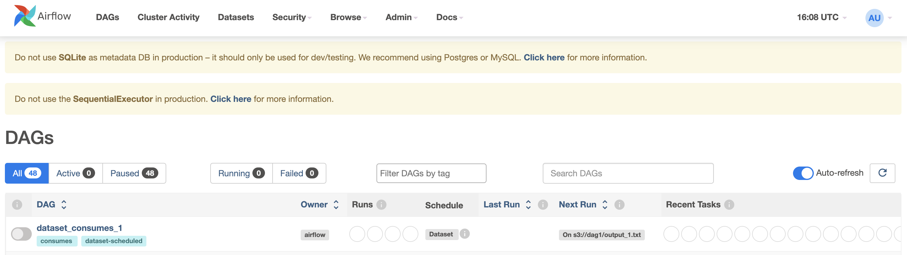

# Airflow
### 단계1: install airflow
```shell
# install 
pip install apache-airflow

# check airflow
airflow version
```
---
- install apache-airflow-providers-amazon
```shell
# install 
pip install apache-airflow-providers-amazon
```
- [만약 오류가 발생한다면, Failed building wheel for xmlsec](https://stackoverflow.com/questions/63859803/cant-install-xmlsec-using-pip-command)
```shell
sudo apt-get install -y pkg-config libxml2-dev libxmlsec1-dev libxmlsec1-openssl
pip install apache-airflow-providers-amazon
```

---
### 단계2: Start airflow
- Login with username: admin  password: EYWCzvWg8rXTUzP4
```shell
airflow standalone
```


---
### 단계3: Security Groups
- add Inbound rule 8080



---
### 단계4: Public Ipv4 address


---
### 단계5: Login on airflow
- `<Public Ipv4 address>:8080`


---
