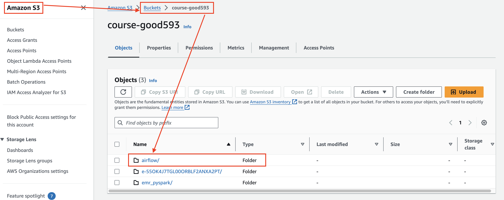
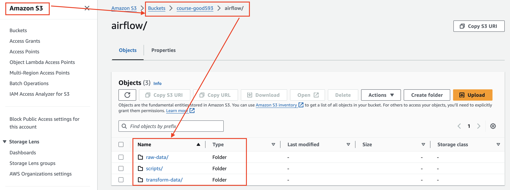
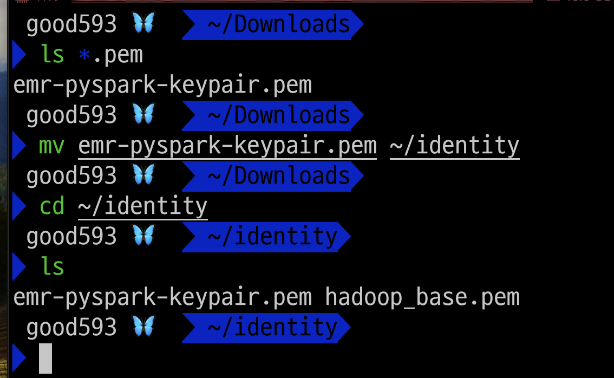
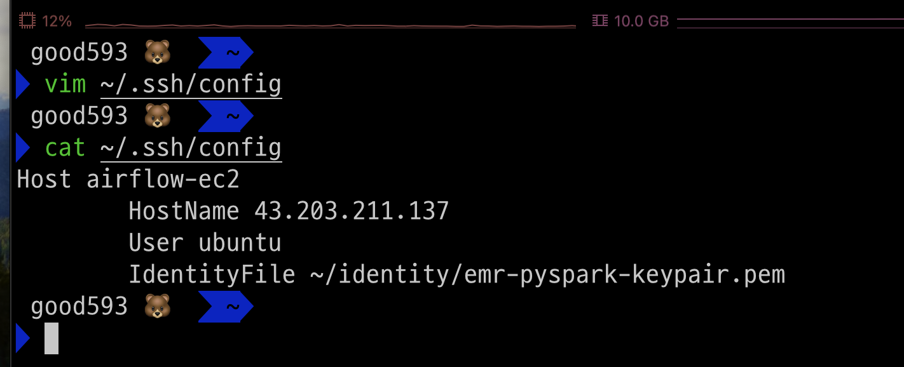
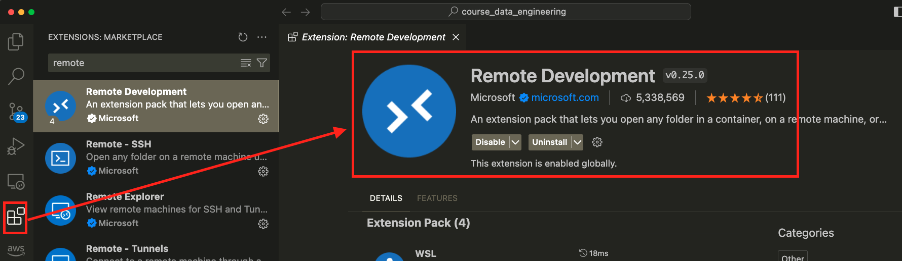
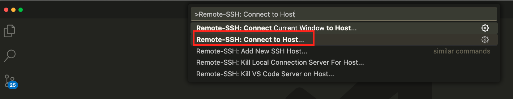
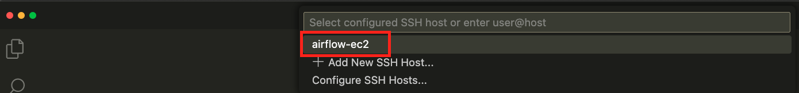
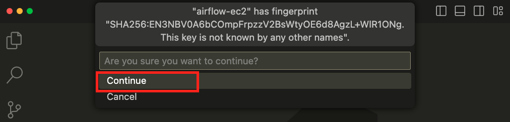
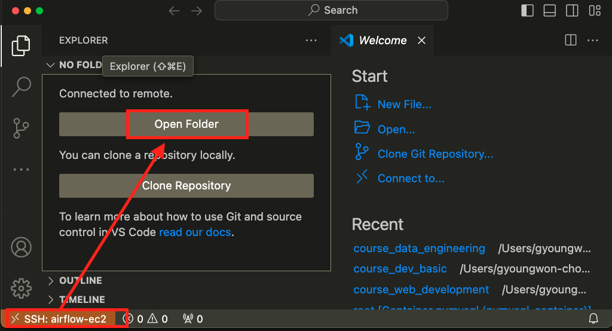
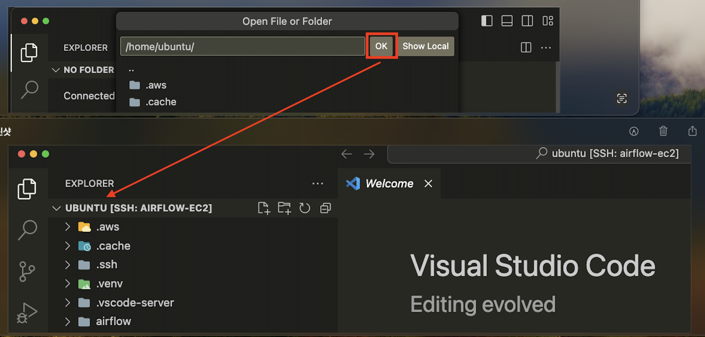

# S3
### 단계1: folder 생성 
- `airflow`: airflow 프로젝트용 폴더  



---
### 단계2: folder 생성 airflow > 
- `raw-data`: 처리전 데이터
- `transform-data`: 처리후 데이터
- `scripts`: 프로그램 파일



---
# VS code

---
### 단계1: key pair
```shell
# 만약 폴더가 없다면,
mkdir ~/identity

# key pair 이동 
mv emr-pyspark-keypair.pem ~/identity
# pem 키 권한 변경 -> 600이 아닐 경우 보안 취약으로 판단
chmod 600 ~/identity/emr-pyspark-keypair.pem

# 확인 
ls -l ~/identity
```


---
### 단계2: config 수정 
```shell
vim ~/.ssh/config
# 아래내용 입력 
Host airflow-ec2
        HostName 43.203.211.137 # ec2의 public ip
        User ubuntu
        IdentityFile ~/identity/emr-pyspark-keypair.pem

# config 파일 권한 수정
chmod 440 ~/.ssh/config
```


---
### 단계3: Remote Development

### 단계4: Remote-SSH: Connect to Host
- `Shift + Ctrl + p` 



---
### 단계5: airflow-ec2 접속  



---
### 단계6: 접속 확인 


---
### 단계7: 홈 디렉토리 
- `.aws`: aws의 리소스와 연동할 수 있는 계정 정보
- `.venv`: python의 가상환경
- `airflow`: airflow 프로그램

