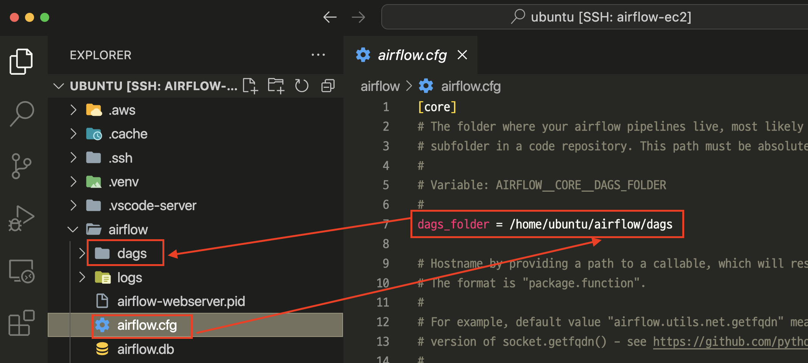
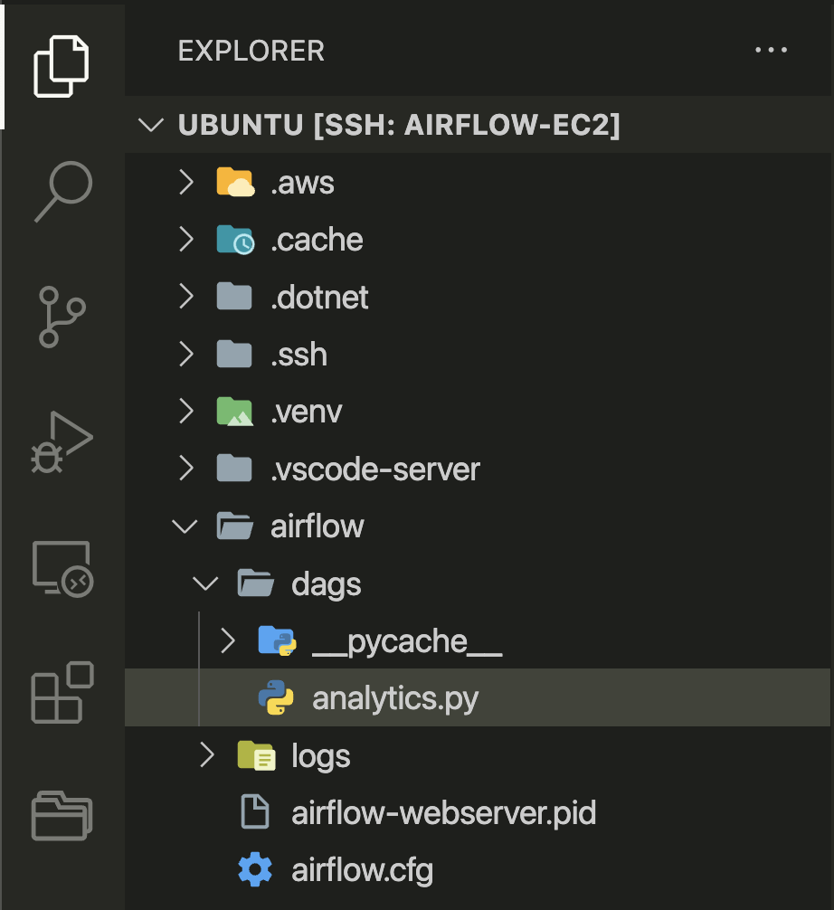
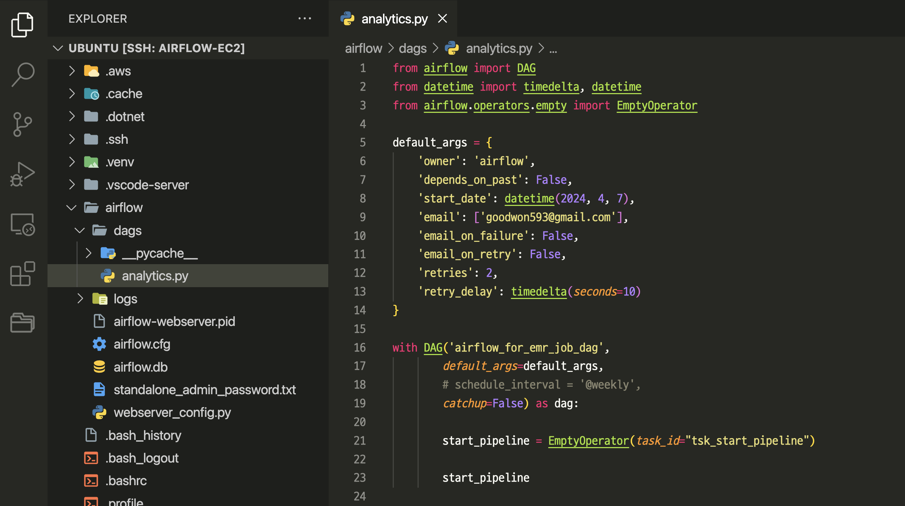
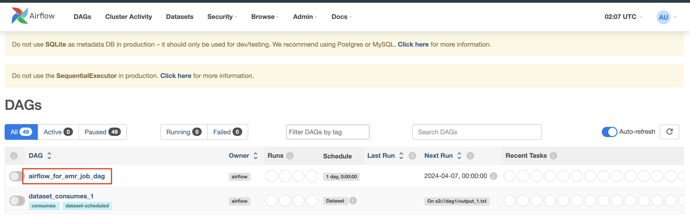
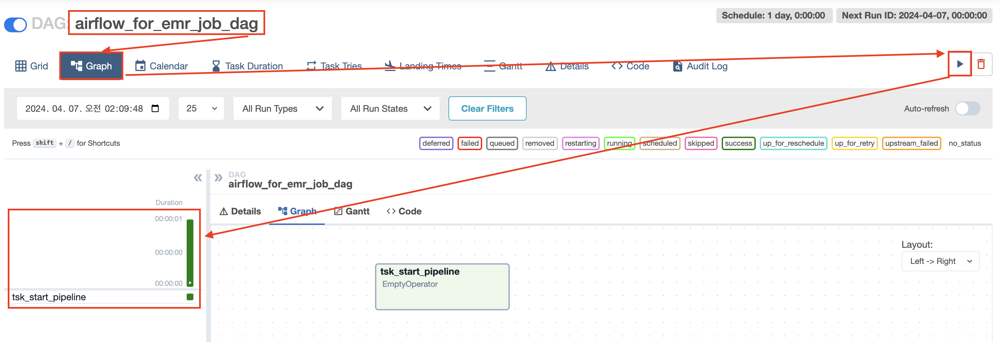

# airflow > analytics01.py

---
### 단계1: airflow 설정 > dags 폴더 생성 

---
### 단계2: dags > analytics.py 파일 생성

---
### 단계3: [EmptyOperator](https://airflow.apache.org/docs/apache-airflow/stable/_api/airflow/operators/empty/index.html#airflow.operators.empty.EmptyOperator)
- src/analytics01.py 참고

---
### 단계4: Airflow Web UI > 리프레쉬 > 생성된 Dag 확인 

---
### 단계5: 생성한 Dag 실행 

