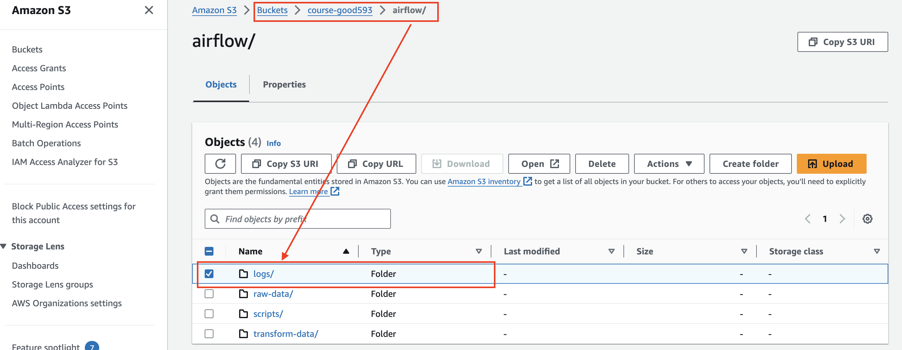
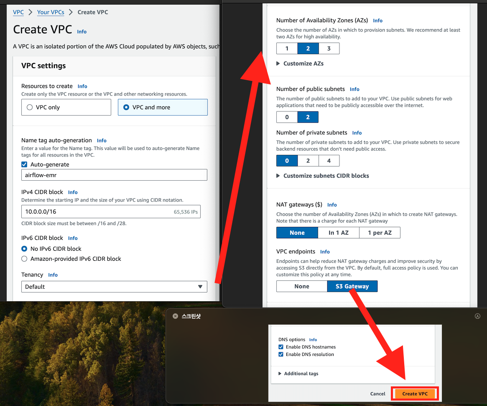
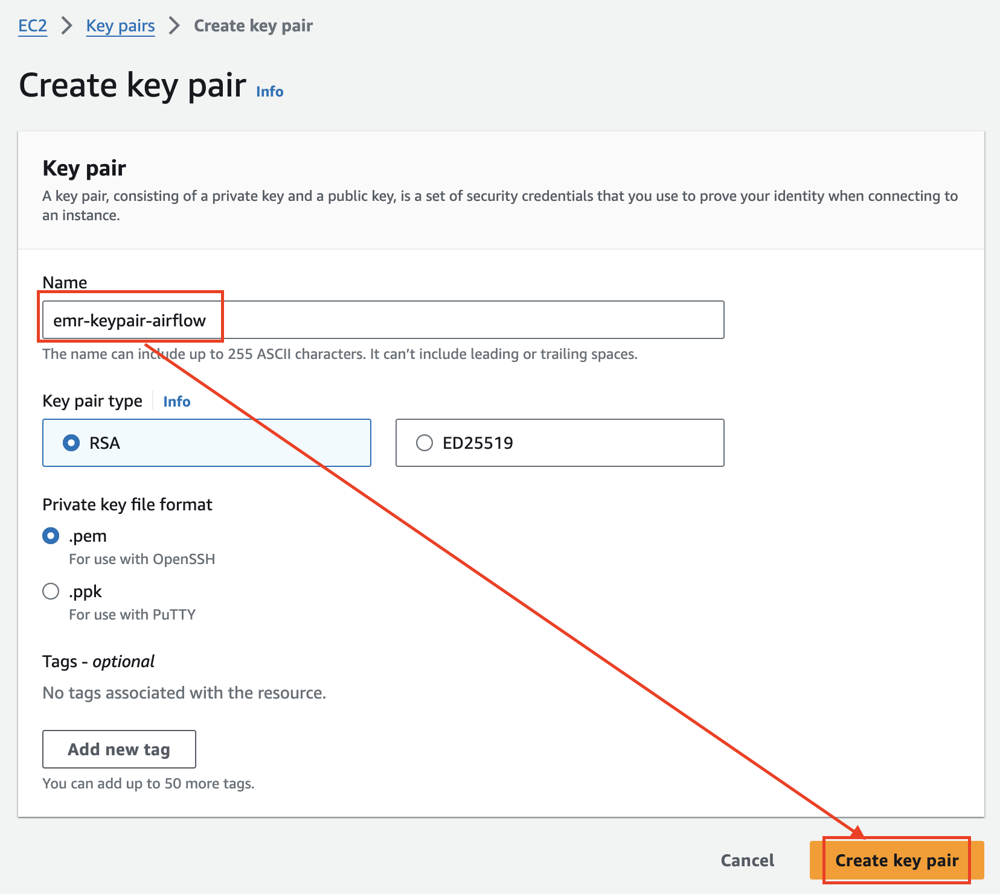
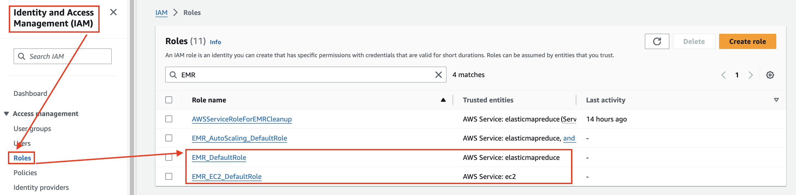
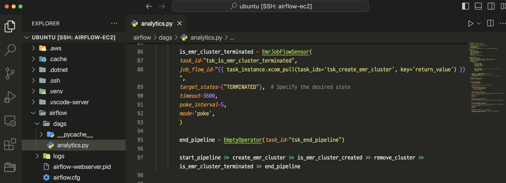
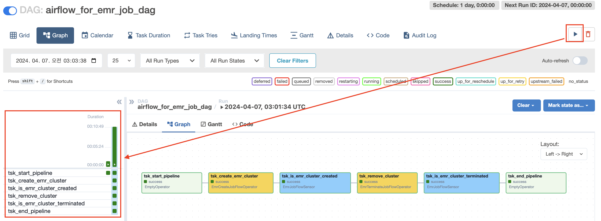
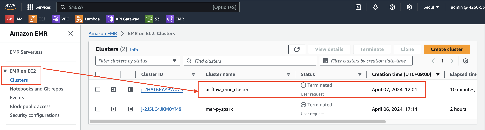

# airflow > analytics02.py

---
### 단계1: S3 > logs 폴더 생성 


---
### 단계2: VPC 생성 


---
### 단계3: EC2 Key Pair 생성


---
### 단계4: Create EMR Roles 
```shell
# search rols
aws iam list-roles | grep 'EMR_DefaultRole\|EMR_EC2_DefaultRole'
# 만약 없다면, create aws rols
aws emr create-default-roles
# search rols
aws iam list-roles | grep 'EMR_DefaultRole\|EMR_EC2_DefaultRole'
```


---
### 단계5: IAM > search EMR Roles


---
### 단계6: [EmrCreateJobFlowOperator](https://airflow.apache.org/docs/apache-airflow-providers-amazon/stable/_api/airflow/providers/amazon/aws/operators/emr/index.html#airflow.providers.amazon.aws.operators.emr.EmrCreateJobFlowOperator)
- 참고문서: src/analytics02.py



---
### 단계7: 생성한 Dag 실행


---
### 단계8: 결과 확인  

