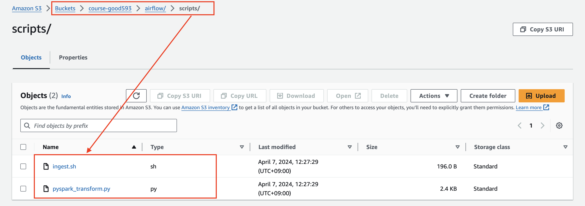
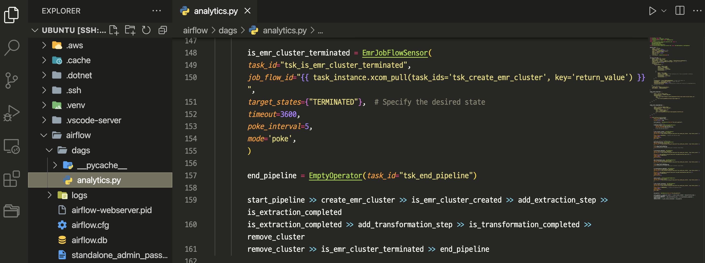
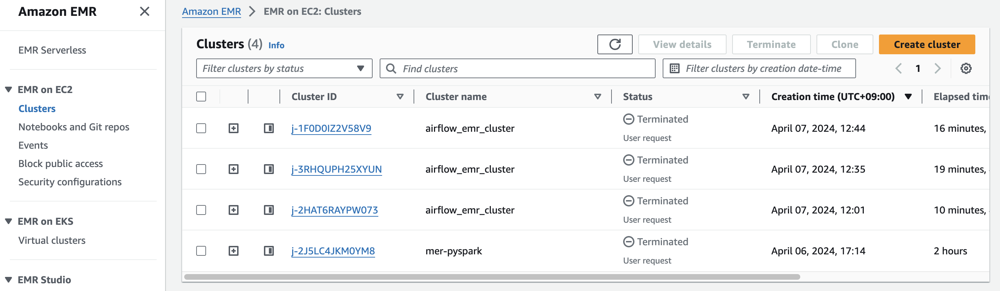
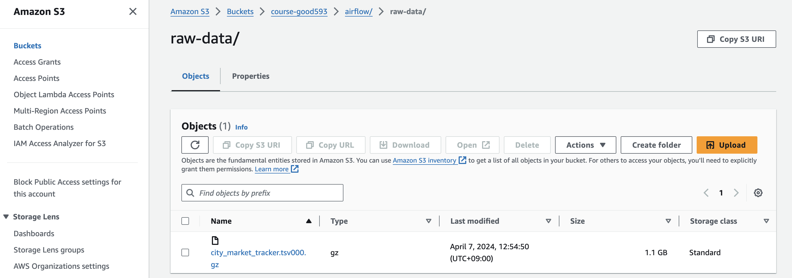
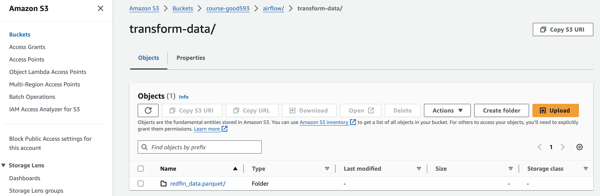
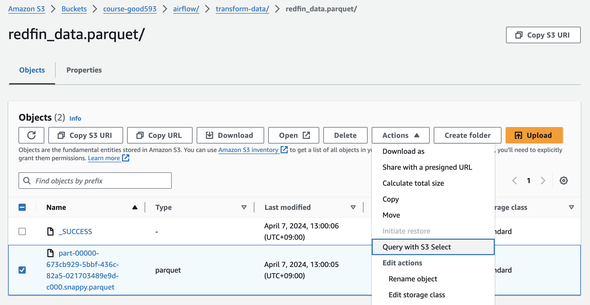
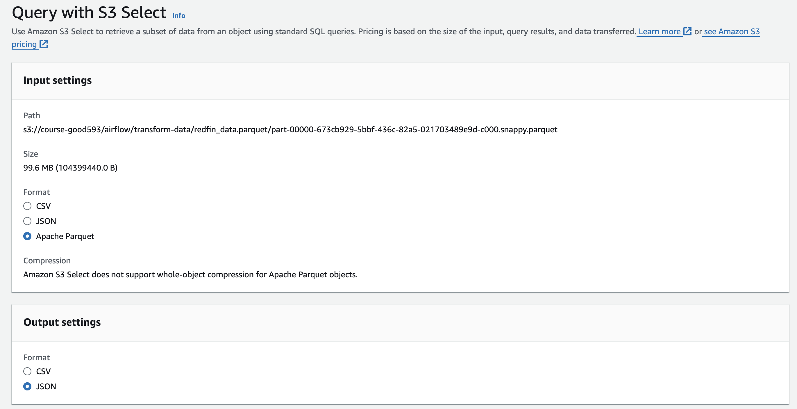
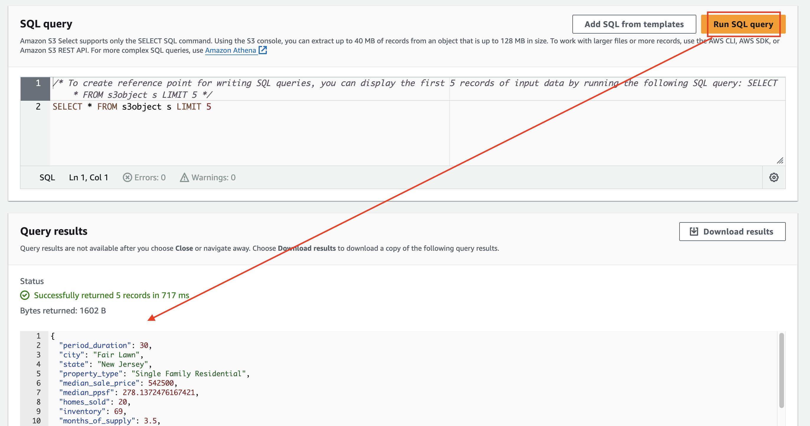

# airflow > analytics03.py

---
### 단계1: S3 > 코드 업로드 
- src 폴더 참고 

---
### 단계2: [EmrAddStepsOperator](https://airflow.apache.org/docs/apache-airflow-providers-amazon/stable/_api/airflow/providers/amazon/aws/operators/emr/index.html#airflow.providers.amazon.aws.operators.emr.EmrAddStepsOperator)
- 참고문서: src/analytics03.py

---
### 단계3: 생성한 Dag 실행

---
### 단계4: EMR > Terminated

---
### 단계5: S3 > raw-data

---
### 단계6: S3 > transform-data

---
### 단계7: S3 > transform-data > 데이터 조회 

---

---

