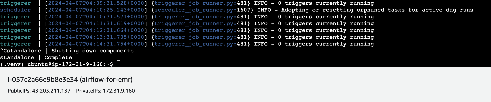
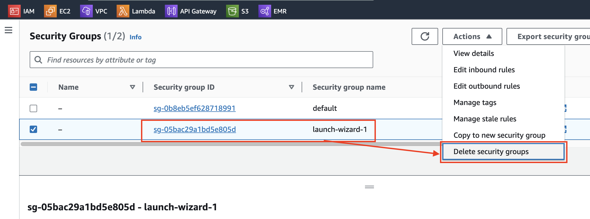
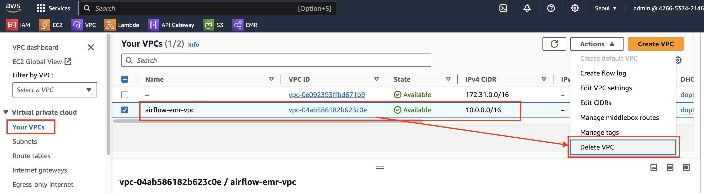
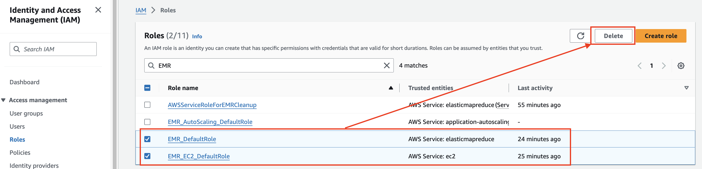

# 삭제

---
### 단계1: airflow server stop
- `Ctrl + c`

---
### 단계2: EC2 > Instance > terminate

---
### 단계3: EC2 > Security Groups > delete

---
### 단계4: VPC > delete

---
### 단계5: IAM > Roles > delete

---
# 참고문서 
- https://youtu.be/MLopLbB3MEQ?si=F-GfrhuKdtK-Ss-7
- https://github.com/YemiOla/data_engineering_redfin_emr_airflow/blob/main/commands_run.txt

