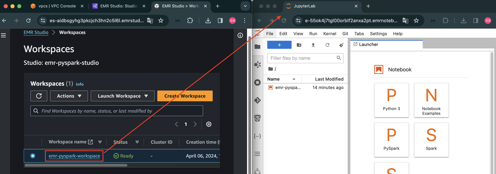
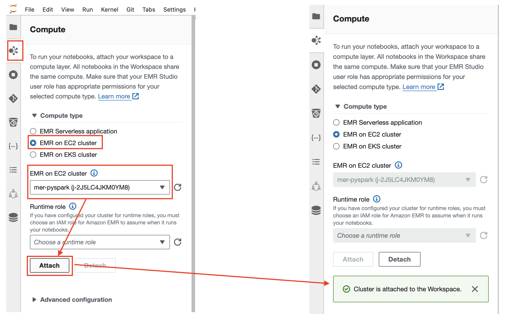
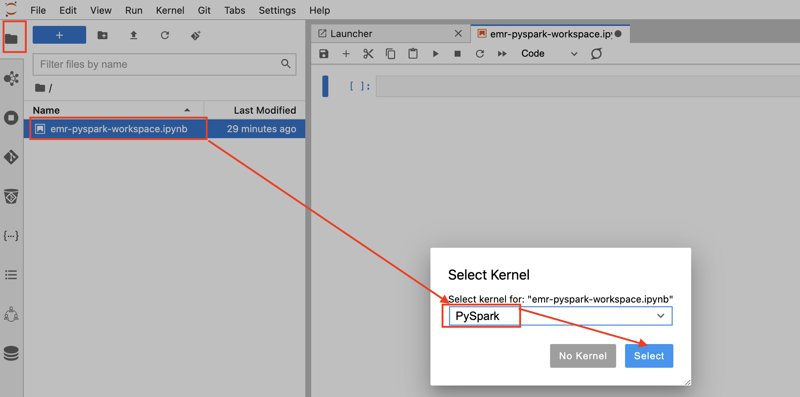
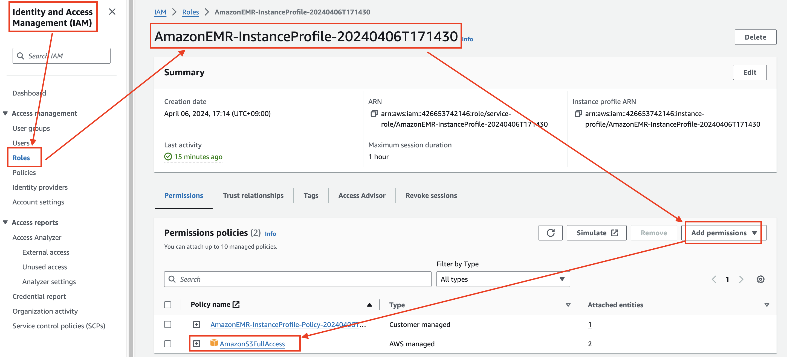
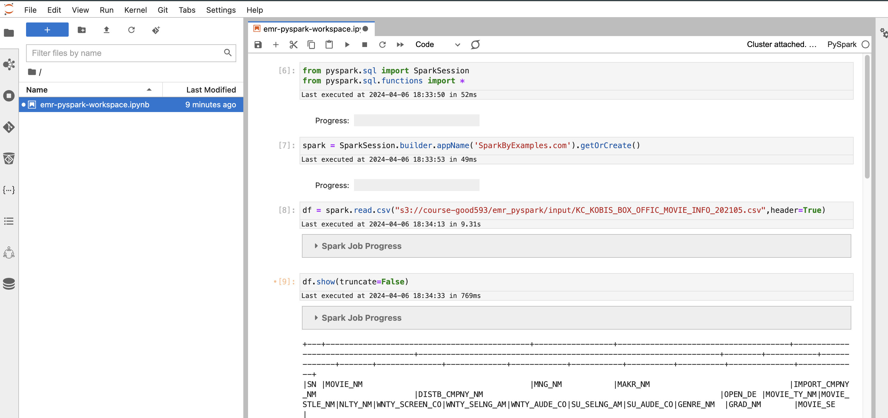

# JupyterLab(Workspace)

---
### 단계1: 재접속


---
### 단계2: EMR 적용 


---
### 단계3: noteboot with pyspark 


---
### 단계4: IAM > EMR InstanceProfile
- add `AmazonS3FullAccess`


---
### 단계5: Spark 테스트 
```python
from pyspark.sql import SparkSession
from pyspark.sql.functions import *
```
```python
spark = SparkSession.builder.appName('SparkByExamples.com').getOrCreate()
```
```python
df = spark.read.csv("s3://course-good593/emr_pyspark/input/KC_KOBIS_BOX_OFFIC_MOVIE_INFO_202105.csv",header=True)
```
```python
df.show(truncate=False)
```
---



