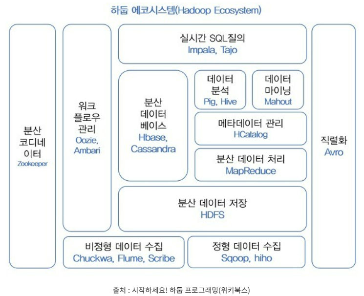

# [Hadoop Ecosystem](https://butter-shower.tistory.com/73)
빅데이터 시대의 도래로 하둡을 좀 더 편하게, 그리고 단점은 수정하여 쉽게 잘 이용하는 여러 서브 프로젝트들이 진행되어 왔다. 그 서브 프로젝트의 모임을 하둡 에코 시스템이라고 한다. 

### [Hadoop](./hadoop.md)
- 하둡은 빅데이터의 처리를 위해서 주로 HDFS(Hadoop Distributed FileSystem)이라는 분산 데이터 저장과 빅데이터 처리를 위한 방식인 MapReduce 방식으로 이루어져 있다. 

---

---
### [Zookeeper](http://zookeeper.apache.org/) 
분산 환경에서 서버들간에 상호 조정이 필요한 다양한 서비스를 제공하는 시스템.
1. 하나의 서버에만 서비스가 집중되지 않도록 서비스를 알맞게 분산하여 동시에 처리하게 해줌
2. 하나의 서버에서 처리한 결과를 다른 서버들과도 동기화 -> 데이터 안정성 보장
3. 운영(active) 서버에서 문제가 발생해 서비스를 제공할 수 없는 경우, 다른 대기중인 서버를 운영 서버로 바꿔 서비스가 중지없이 제공되게 해줌
4. 분산 환경을 구성하는 서버들의 환경설정을 통합적으로 관리

---
### [Hive](http://hive.apache.org)
- 하둡 기반의 데이터웨어하우징용 솔루션 
- 페이스북에서 만든 오픈소스로, SQL과 매우 유사한 HiveQL이라는 쿼리를 제공한다. 
- HiveQL은 내부적으로 MapReduce 잡으로 변환되어 실행된다.

---
### [Sqoop](http://sqoop.apache.org)
- 대용량 데이터 전송 솔루션 
- Sqoop은 HDFS, RDBMS, DW, NoSQL등 다양한 저장소에 대용량 데이터를 신속하게 전송할 수 있는 방법을 제공한다.
- Oracle, MS-SQL, DB2 등과 같은 상용 RDBMS와 MySQL, PostgresSQL과 같은 오픈소스 RDBMS등을 지원합니다.

---
### [Pig](http://pig.apache.org)
- 복잡한 MapReduce 프로그래밍을 대체할 Pig Latin이라는 자체 언어를 제공 
- MapReduce API를 매우 단순화시키고 SQL과 유사한 형태로 설계되었다.
- [Pig vs Hive](https://warm-uk.tistory.com/62)

---
# Spark

---
# Kafka
- Zookeeper, Broker, Producer, Consumer

