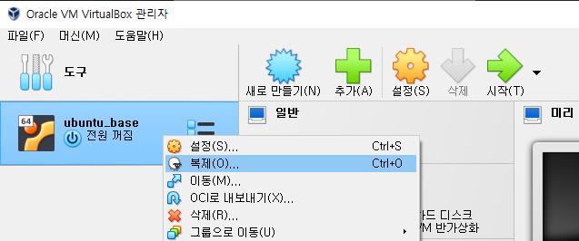
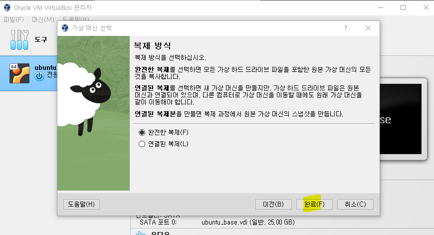

# 0. 인스턴스 생성
### 단계1: ubuntu_base 복제
- 클립보드 설정
- 기본 라이브러리 설치 완료
- java, python3 설치 완료
- hadoop, spark, zookeeper 다운로드 완료

---
### 단계2: 새 인스턴스 설정

---
### 단계3: 생성

---
# [1. 라이브러리 설치 및 환경설정](./1.%20라이브러리%20설치%20및%20환경설정.md)

---
# [2. 하둡 설정](./2.%20하둡%20설정.md)

---
# [3. 하둡 실행 및 테스트](./3.%20하둡%20실행%20및%20테스트.md)

