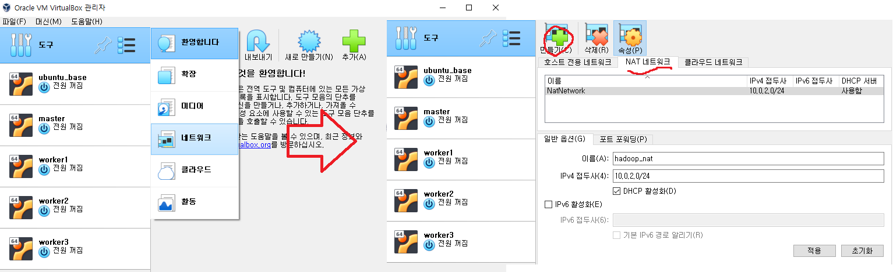
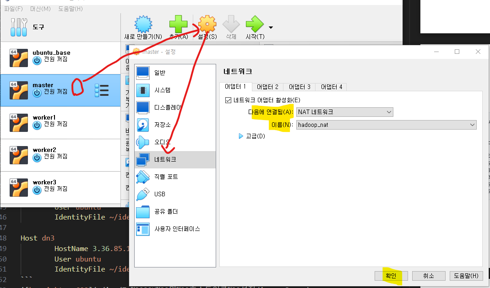
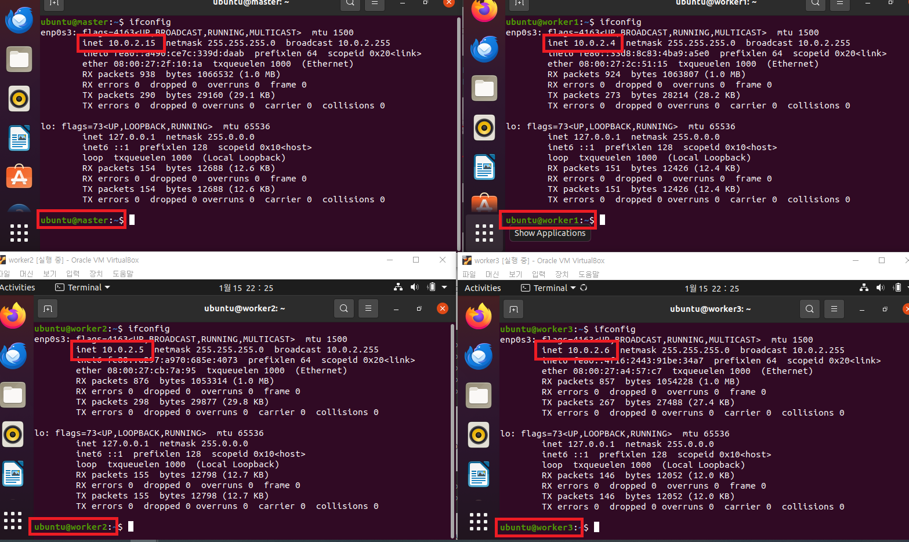
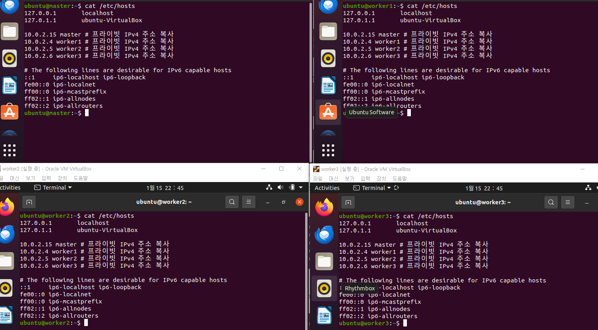
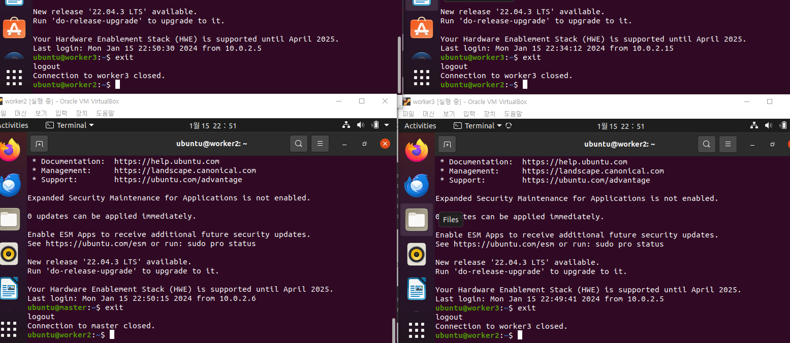

### 단계1: worker 생성
- master를 이용하여 3개의 worker 생성


---
### 단계2: NAT 네트워크 생성 


---
### 단계3: NAT 네트워크 적용
- 모두 적용: master, worker1, worker2, worker3



---
### 단계4: hostname 적용 및 재기동 
```shell
sudo hostnamectl set-hostname 인스턴스명
hostname
```


---
### 단계4: Hosts 설정 
- IP 확인 
```shell
ifconfig
```


---
- Hosts 설정
  - 각 프라이빗 IPv4 주소 복사 및 적용 
```shell
# hosts 파일 편집
sudo vim /etc/hosts

# 아래 내용으로 추가 후 저장
10.0.2.15 master # 프라이빗 IPv4 주소 복사
10.0.2.4 worker1 # 프라이빗 IPv4 주소 복사
10.0.2.5 worker2 # 프라이빗 IPv4 주소 복사
10.0.2.6 worker3 # 프라이빗 IPv4 주소 복사
```


---
### 단계5: ssh 접속 테스트 
- 모든 인스턴스에서 테스트 
```shell
# Are you sure you want to continue connecting (yes/no/[fingerprint])? yes
ssh master
ssh worker1
ssh worker2
ssh worker3
exit
```



