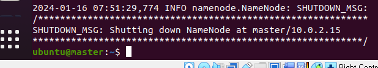
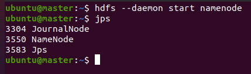
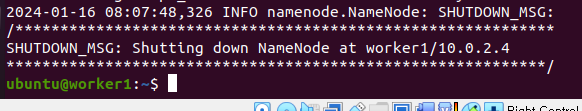
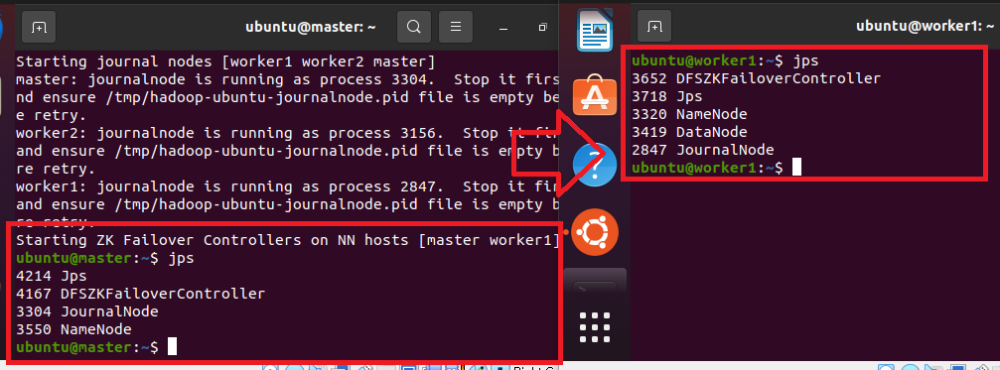
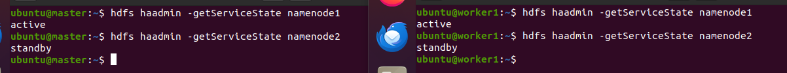
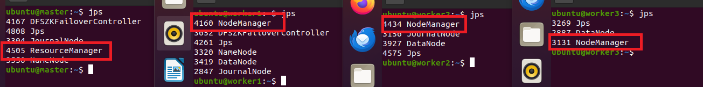
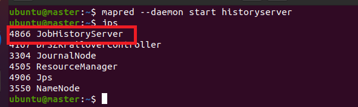
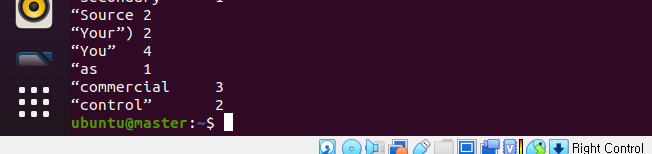

### 단계1: master 서버 > Namenode
- Namenode 초기화 
```shell
# hdfs namenode 포맷
hdfs namenode -format
```


---
- Namenode 실행 
```shell
# hdfs namenode 실행
hdfs --daemon start namenode

# node 확인 
jps
``` 


---
### 단계2: worker1 > Standby NameNode
- Standby NameNode 실행
```shell
# hdfs standby namenode 실행
hdfs namenode -bootstrapStandby
```


---
### 단계3: master 서버 > (Hadoop)start-dfs.sh 실행
- master, worker1에 “DFSZKFailoverController” 프로세스가 실행 된다.
- master 서버에서 장애가 생기면, worker1 서버가 작동하게 된다.
```shell
start-dfs.sh
```


---
### 단계4: master, worker1 서버 > Active, Standby NameNode 확인
```shell
hdfs haadmin -getServiceState namenode1 
hdfs haadmin -getServiceState namenode2
```


---
#### 참고용 
- 강제로 Standby -> Active 
```shell
hdfs haadmin -transitionToActive namenode1 --forcemanual
```
- 강제로 Active -> Standby
```shell
hdfs haadmin -transitionToStandby namenode2 --forcemanual
```

---
### 단계5: master 서버 > (Yarn)start-yarn.sh 실행
- 해당 단계에서 “ResourceManager” 프로세스가 실행된다. 
- 나머지 DataNode 서버에서는 “NodeManager” 프로세스가 실행된다.
```shell
start-yarn.sh
```


---
### 단계6: master 서버 > JobHistory 실행 
- 해당 단계에서 “JobHistoryServer” 프로세스가 실행된다.
```shell
mapred --daemon start historyserver
```


---
### 단계7: master 서버 > Hadoop Word Count 예제 테스트
```shell
# HDFS test 디렉토리 생성
hdfs dfs -mkdir /test
# HDFS LICENSE.txt 파일을 test 디렉토리에 삽입
hdfs dfs -put /usr/local/hadoop/LICENSE.txt /test/

cle# Word Count 예제 실행
yarn jar /usr/local/hadoop/share/hadoop/mapreduce/hadoop-mapreduce-examples-3.2.3.jar wordcount hdfs:///test/LICENSE.txt /test/output

# Word Count 결과 확인
hdfs dfs -text /test/output/*
```


while invoking ClientNamenodeProtocolTranslatorPB.getFileInfo over  after 3 failover attempts.


