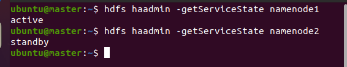
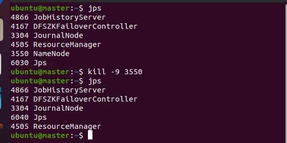
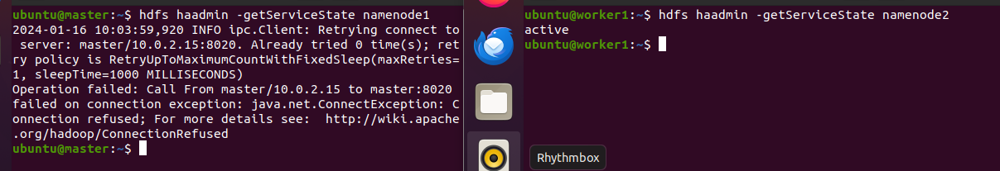
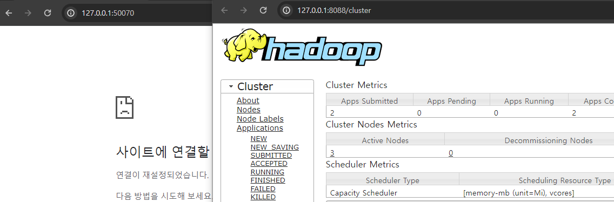
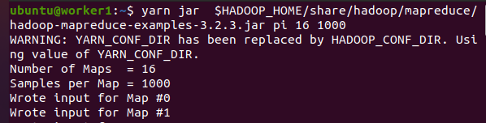

### 단계1: master > NameNode 상태 확인 
```shell
hdfs haadmin -getServiceState namenode1 
hdfs haadmin -getServiceState namenode2
```


---
### 단계2: master > NameNode kill
```shell
# jps 프로세스 확인
jps

1664 NameNode
2786 JobHistoryServer
4359 Jps

# NameNode 프로세스 kill
kill -9 1664
```


---
- 결과 확인 
```shell
# NameNode1 상태 확인
hdfs haadmin -getServiceState namenode1 # error
# NameNode2 상태 확인
hdfs haadmin -getServiceState namenode2 # active
```


---
- hadoop web ui & yarn web ui 확인 



---
### 단계3: worker1 > Hadoop 예제 테스트
```shell
yarn jar  $HADOOP_HOME/share/hadoop/mapreduce/hadoop-mapreduce-examples-3.2.3.jar pi 16 1000
```



