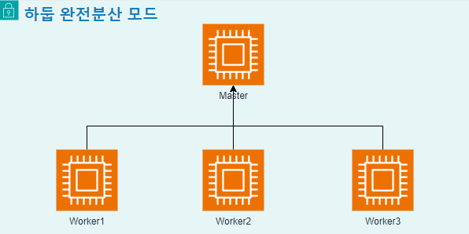
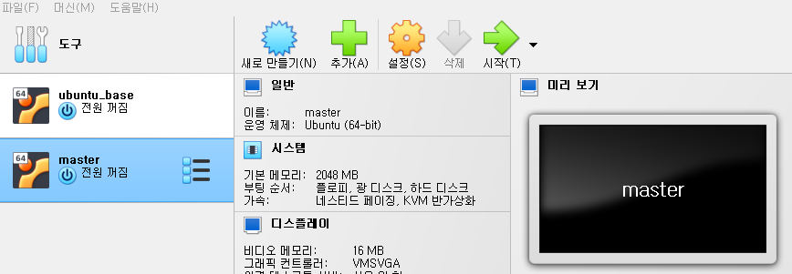

# 하둡 완전분산 모드 구축 
- [아키텍쳐툴](https://app.diagrams.net/)



---
# 0. ubuntu_base를 이용하여 master 생성 


---
# [1. hadoop 설치 및 환경설정](./1.%20hadoop%20설치%20및%20환경설정.md)

---
# [2. Zookeeper 설치 및 환경설정](./2.%20Zookeeper%20설치%20및%20환경설정.md)

---
# 3. SSH 설정 
```shell
# ssh key 생성
ssh-keygen -t rsa # 이후 Enter만 세 번 입력 탁! 탁! 탁!

# authorized_keys 생성
cat >> ~/.ssh/authorized_keys < ~/.ssh/id_rsa.pub

# localhost 접속 테스트
ssh localhost
# Are you sure you want to continue connecting (yes/no/[fingerprint])? yes
```
---
# [4. worker 및 네트워크설정](./4.%20worker%20및%20네트워크설정.md)

---
# [5. Zookeeper 실행](./5.%20Zookeeper%20실행.md)

---
# [6. Hadoop & Yarn 실행](./6.%20Hadoop%20&%20Yarn%20실행.md)

---
# [7. WEB UI](./7.%20WEB%20UI.md)

---
# [8. Hadoop FailOver 테스트](./8.%20Hadoop%20FailOver%20테스트.md)

---
# [9. 실행 스크립트 생성](9.%20실행%20스크립트%20생성.md)
