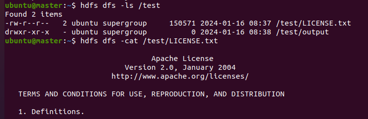

# [하둡 명령어](https://wooono.tistory.com/344) 

### ls
- 특정 디렉토리 또는 디렉토리 내부의 파일을 보여준다.
```shell
hdfs dfs -ls /
hdfs dfs -ls /test
hdfs dfs -ls -R /test # 특정 디렉토리 이하에 대해서 정보 제공
```


---
### cat
- 해당 파일의 내용을 출력한다. (linux 명령어 cat 과 동일)
```shell
hdfs dfs -cat /test/LICENSE.txt
```


---
### mkdir
- 특정 path 에 directory 를 생성한다.
```shell
hdfs dfs -mkdir /test1 
```
### cp
- Hdfs 내부에서 파일을 복사/붙여넣기 한다.
- 만약 복사하고자 하는 대상이 여러개라면, 붙여넣는 곳은 반드시 Directory 여야 한다.
```shell
# -f: Overwrite the destination if it already exist
hdfs dfs -cp -f /test/LICENSE.txt /test1/LICENSE.txt 
hdfs dfs -ls /test1 # 확인 
```
---
### rm 
- Hdfs 의 특정 폴더 혹은 파일을 삭제한다.
```shell
hdfs dfs -rm /test1/LICENSE.txt
hdfs dfs -ls /test1 # 확인 
```
### put
- Local 의 파일들을 hdfs 에 저장한다.
```shell
hdfs dfs -put /usr/local/hadoop/LICENSE.txt /test1/
hdfs dfs -ls /test1 # 확인 
```