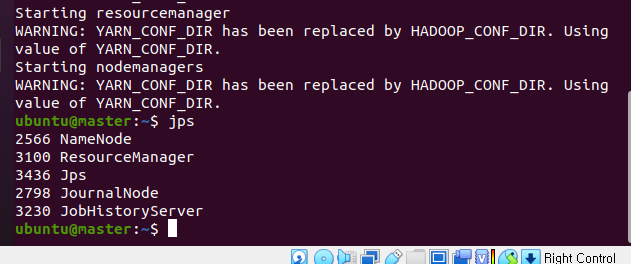

# 하둡 실행
### 단계1: 모든 인스턴스 실행 


---
### 단계2: master > cluster-start-all.sh 실행 
```shell
# 실행
. cluster-start-all.sh
# 확인 
jps
```


---
#### 만약 전부 standby이면, 강제로 Active 실행 
```shell
hdfs haadmin -getServiceState namenode1 
hdfs haadmin -getServiceState namenode2
```

- 강제로 Standby -> Active 
```shell
hdfs haadmin -transitionToActive namenode1 --forcemanual
```
- (참고)강제로 Active -> Standby
```shell
hdfs haadmin -transitionToStandby namenode2 --forcemanual
```

---
# [1. hadoop 명령어](./1.%20hadoop%20명령어.md)

---
# [2. yarn 명령어](./2.%20yarn%20명령어.md)

---
# [3. mapreduce with python](./3.%20mapreduce.md)


