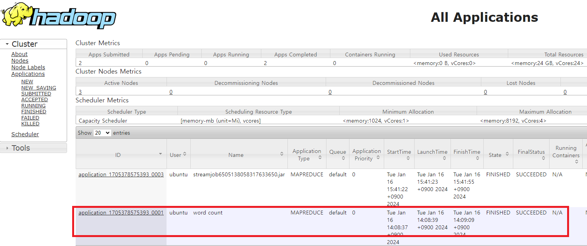
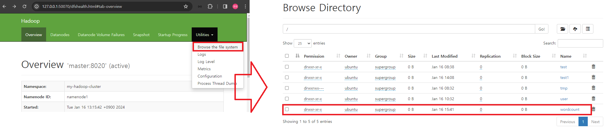

### 단계1: (영어명언)데이터 생성 
```shell
# 인생에서 가장 큰 영광은 넘어지지 않는 것에 있는 것이 아니라 매번 일어선다는 데 있다. (넬슨 만델라)
echo "The greatest glory in living lies not in never falling, but in rising every time we fall. – Nelson Mandela" >> part-00000.txt
# 인생은 산이다. 당신의 목표는 정상에 도달하는 것이 아니라 당신의 길을 찾는 것이다. (막심 라가세)
echo "Life is a mountain. Your goal is to find your path, not to reach the top. – Maxime Lagacé" >> part-00001.txt
```
### 단계2: 하둡에 데이터 저장 
```shell
# 폴더 생성 
hdfs dfs -mkdir -p /wordcount/input/ 
# 데이터 저장
hdfs dfs -put part-*.txt /wordcount/input/
# 데이터 확인
hdfs dfs -ls /wordcount/input/
```
---
### 단계3: mapper
- wordcount_mapper.py
```python
#!/usr/bin/env python
import sys

for line in sys.stdin:
    words = line.strip().split()
    for word in words:
        print('{}\t{}'.format(word, 1))
``` 
---
### 단계4: reducer
- wordcount_reducer.py
```python
#!/usr/bin/env python
import sys

def print_output(word, count):
        print('{}\t{}'.format(word, count))

word, count = None, 0

for line in sys.stdin:
    fields = line.strip().split('\t')

    if fields[0] != word:
        if word is not None:
            print_output(word, count)

        word, count = fields[0], 0

    count += 1

print_output(word, count)
```
---
### 단계5: 실행 
```shell
# 폴더 생성
hdfs dfs -rm -r /wordcount/output
# 실행 
hadoop jar $HADOOP_HOME/share/hadoop/tools/lib/hadoop-streaming-3.2.3.jar \
-files 'wordcount_mapper.py,wordcount_reducer.py' \
-mapper 'python3 wordcount_mapper.py' \
-reducer 'python3 wordcount_reducer.py' \
-input /wordcount/input/* \
-output /wordcount/output 
```
---
### 단계6: 확인 
```shell
hdfs dfs -text /wordcount/output/part-*
```


---
### 단계7: yarn web ui
- http://127.0.0.1:8088/cluster



---
### 단계8: hadoop web ui
- http://127.0.0.1:50070/dfshealth.html#tab-overview




