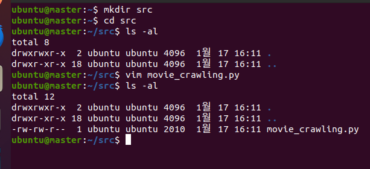

# (참고용)파이썬 설치 
```shell
# 파이썬 설치 
sudo apt-get install -y python3-pip
pip3 install --upgrade pip
# 버전 확인 
python3 --version
# 크롤링에 필요한 라이브러리 설치 
pip3 install requests beautifulsoup4 pandas pyarrow hdfs
```

---
# [1. 크롤링 with python](./2.%20크롤링%20with%20python.md)

---
# 2. 크롤링 데이터를 하둡에 저장하기 
### 단계1: 하둡 실행 
```shell
# 실행
. cluster-start-all.sh
# 확인 
jps
```
---
#### 만약 전부 standby이면, 강제로 Active 실행 
```shell
hdfs haadmin -getServiceState namenode1 
hdfs haadmin -getServiceState namenode2
```
- 강제로 Standby -> Active 
```shell
hdfs haadmin -transitionToActive namenode1 --forcemanual
```
- (참고)강제로 Active -> Standby
```shell
hdfs haadmin -transitionToStandby namenode2 --forcemanual
```
---
### 단계2: src 디렉토리 생성 
```shell
mkdir src # 디렉토리 생성
cd src # 디렉토리로 이동 
ls -al # 디렉토리 조회 
```
### 단계3: 크롤링 파이썬 파일 생성 
- sample_movie_crawling.py 확인
  - guest_ip 주소 변경!!
```shell
# sample_movie_crawling.py 파일 내용 복사 및 붙여넣기
vim movie_crawling.py  
```


---
### 단계4: 파이썬 파일 실행 및 확인
```shell
# 파일 실행 
python3 movie_crawling.py
# 결과 확인 
ls -al
# hadoop 데이터 확인 
hdfs dfs -ls /crawling
```


