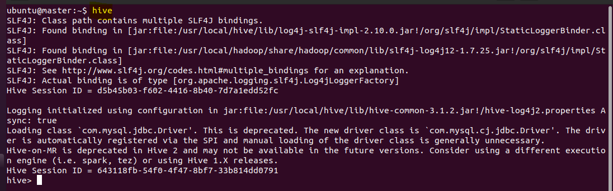
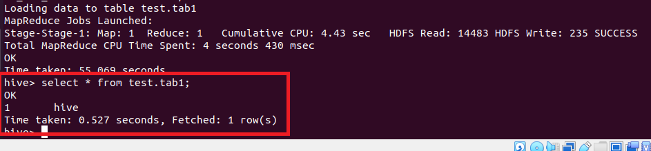
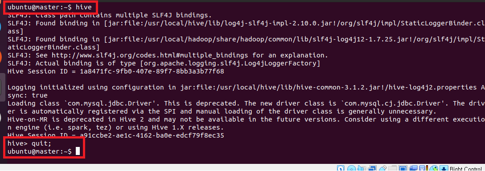

# [1. mysql 설치 및 세팅](./1.%20mysql.md)
- master 인스턴스에 설치

---
# [2. hive 설치 및 세팅](./2.%20hive.md)
- master 인스턴스에 설치

---
# 3. hive 테스트 
### 단계1: hive접속 
```shell
hive 
```


---
### 단계2: 테스트 및 확인 
```shell
# 데이터베이스 생성
create database test;
use test;
# 테이블 생성
create table test.tab1(col1 integer, col2 string);
show tables;
# 데이터 추가하기 
insert into table test.tab1 select 1 as col1, 'hive' as col2;
select * from test.tab1;
```


---
- http://127.0.0.1:8088/cluster


---
### 단계3: hive 나오기 
```shell
quit;
```



