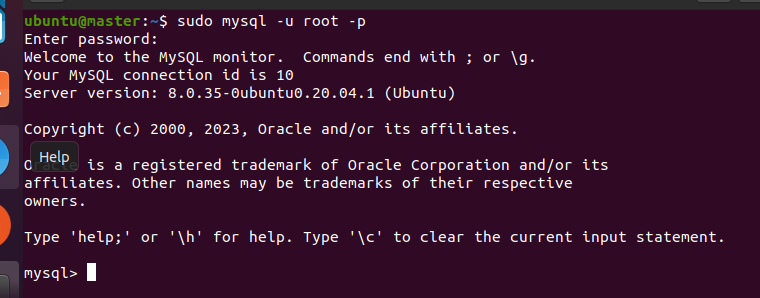

### 단계1: mysql 설치 
```shell
# 설치 
sudo apt-get install mysql-server -y
# 설치 확인 
sudo service mysql status
sudo ss -tap | grep mysql # 포트 확인
```


---
### 단계2: mysql 접속 
```shell
sudo service mysql restart
sudo mysql -u root -p # 초기비번: password
```


---
### 단계3: hive 유저 생성  
```shell
# 유저 생성
create user 'hive'@'%' identified by '123456';
```
- 패스워드 정책에 맞지않다고하면 정책변경해주자.
```shell
set global validate_password_policy=LOW;
set global validate_password_length=6;
show variables like 'validate_password%';
```

---
### 단계4: 데이터베이스 생성 및 권한 부여 
```shell
# metastore 데이터베이스 생성 
create database metastore default character set utf8;
# 권한 부여 
grant all privileges on metastore.* to 'hive'@'%';
# 권한 반영 
flush privileges;
```


---
- hive 유저로 접속 테스트 
```shell
# mysql에서 나오기 
exit 
# mysql 접속하기 
sudo mysql -u hive -p # 비번: 123456
```


