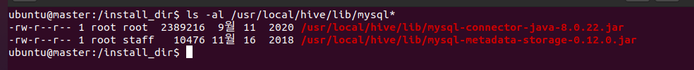

### 단계1: Apache Hive 설치 
```shell
# 설치 폴더 이동
cd /install_dir
# hive 다운로드 
sudo wget https://dlcdn.apache.org/hive/hive-3.1.2/apache-hive-3.1.2-bin.tar.gz
# hive 압출풀기
sudo tar -zxvf apache-hive-3.1.2-bin.tar.gz -C /usr/local
# 폴더 변경
sudo mv /usr/local/apache-hive-3.1.2-bin /usr/local/hive
# 결과 확인 
ls -al /usr/local/hive
```


---
### 단계2: 환경설정 
```shell
sudo vim /etc/profile
# 아래 내용 복사 
export HIVE_HOME=/usr/local/hive
export PATH=$PATH:$HIVE_HOME/bin

# 수정내용 반영 
source /etc/profile
env | grep hive
```


---
### 단계3: conf/hive-site.xml 
```shell
sudo vim /usr/local/hive/conf/hive-site.xml
```
```xml
<?xml version="1.0" encoding="UTF-8" standalone="no"?>
<?xml-stylesheet type="text/xsl" href="configuration.xsl"?>
<configuration>
        <property>
                <name>javax.jdo.option.ConnectionURL</name>
                <value>jdbc:mysql://localhost:3306/metastore?createDatabaseIfNotExist=true&amp;useSSL=false&amp;characterEncoding=UTF-8&amp;serverTimezone=UTC</value>
        </property>
        <property>
                <name>javax.jdo.option.ConnectionDriverName</name>
                <value>com.mysql.jdbc.Driver</value>
        </property>
        <property>
                <name>javax.jdo.option.ConnectionUserName</name>
                <value>hive</value>
        </property>
        <property>
                <name>javax.jdo.option.ConnectionPassword</name>
                <value>123456</value>
        </property>
        <property>
                <name>hive.metastore.schema.verfication</name>
                <value>false</value>
        </property>
</configuration>
```
---
### 단계4: MySQL JDBC Connector
```shell
cd /install_dir
sudo wget https://repo1.maven.org/maven2/mysql/mysql-connector-java/8.0.22/mysql-connector-java-8.0.22.jar

sudo cp mysql-connector-java-8.0.22.jar /usr/local/hive/lib/
ls -al /usr/local/hive/lib/mysql*
```


---
### 단계5: guava-xx.jar 파일 교체
```shell
# guava 라이브러리 버전 확인 > hive와 hadoop 라이브러리 다른 것 확인 
ls -al $HIVE_HOME/lib/gu*
ls -al $HADOOP_HOME/share/hadoop/common/lib/gu*
# 기존 라이브러리 bak 파일로 수정 
sudo mv $HIVE_HOME/lib/guava-19.0.jar $HIVE_HOME/lib/guava-19.0.jar.bak
# 하둡에 있는 라이브러리 hive로 복사 
sudo cp $HADOOP_HOME/share/hadoop/common/lib/guava-27.0-jre.jar $HIVE_HOME/lib/guava-27.0-jre.jar
```


---
### 단계6: 하둡 실행 및 hive용 디렉토리 생성 
```shell
# 하둡 실행 
. cluster-restart-all.sh
hdfs haadmin -transitionToActive namenode1 --forcemanual
hdfs haadmin -getServiceState namenode1

# hive용 디렉토리 생성
hdfs dfs -mkdir /tmp
hdfs dfs -mkdir -p /user/hive/warehouse
hdfs dfs -chmod g+w /tmp
hdfs dfs -chmod -R g+w /user

# 디렉토리 확인 
hdfs dfs -ls /
```


---
### 단계7: 메타정보 초기화
```shell
# 메타정보 초기화
$HIVE_HOME/bin/schematool -dbType mysql -initSchema

# mysql 접속 
mysql -u hive -p 
use metastore 
show tables;
```


