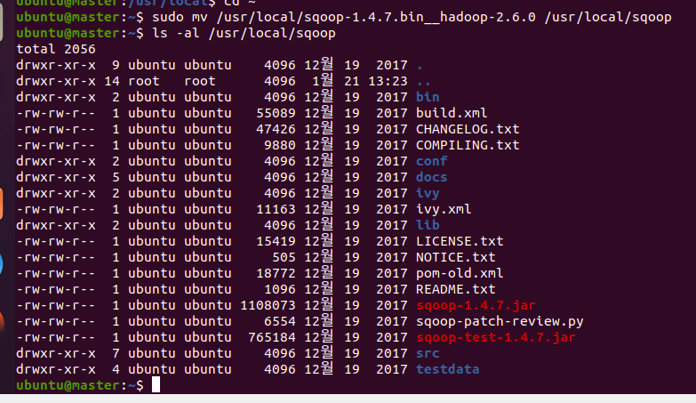
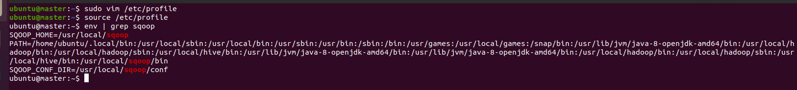
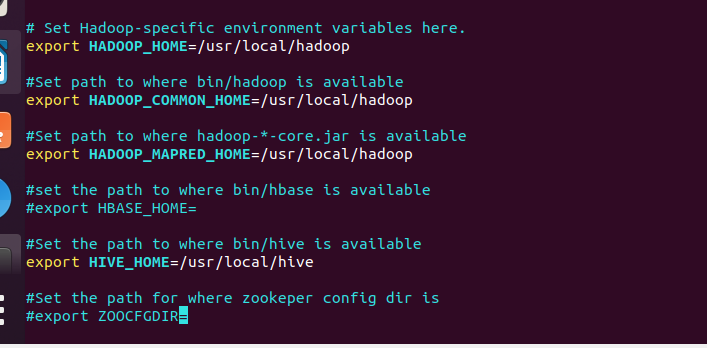
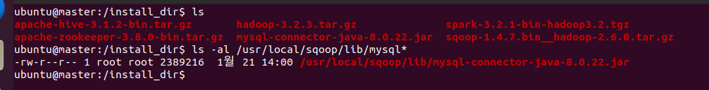
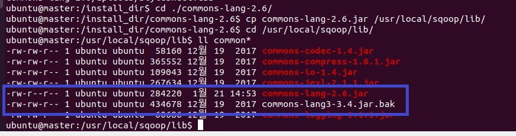
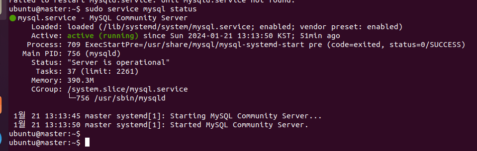
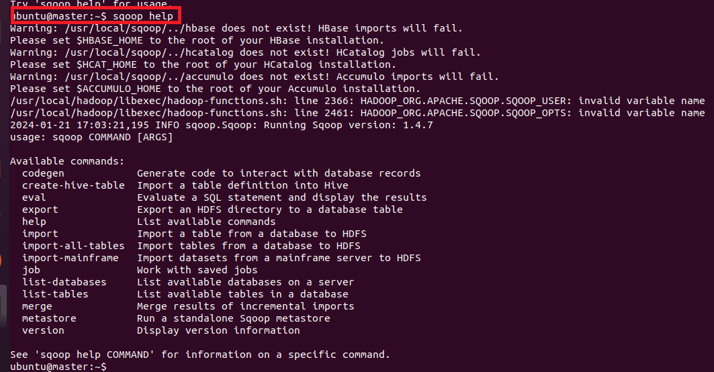
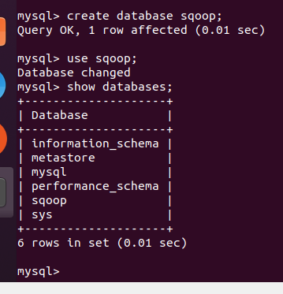
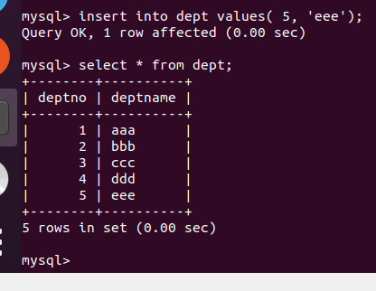
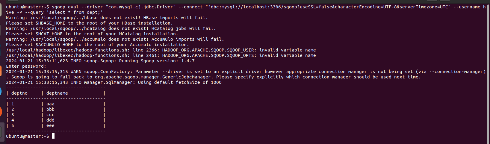

### 단계1: sqoop 설치
```shell
cd /install_dir
sudo wget https://archive.apache.org/dist/sqoop/1.4.7/sqoop-1.4.7.bin__hadoop-2.6.0.tar.gz

# sqoop 압출풀기
sudo tar -zxvf sqoop-1.4.7.bin__hadoop-2.6.0.tar.gz -C /usr/local
# 폴더 변경
sudo mv /usr/local/sqoop-1.4.7.bin__hadoop-2.6.0 /usr/local/sqoop
# 결과 확인 
ls -al /usr/local/sqoop
```


---
### 단계2: 환경설정
```shell
sudo vim /etc/profile
# 아래 내용 복사 
export SQOOP_HOME=/usr/local/sqoop
export SQOOP_CONF_DIR=$SQOOP_HOME/conf
export PATH=$PATH:$SQOOP_HOME/bin

# 수정내용 반영 
source /etc/profile
env | grep sqoop
```


---
### 단계3: sqoop-env.sh
```shell
cd $SQOOP_CONF_DIR 
cp sqoop-env-template.sh sqoop-env.sh

vim sqoop-env.sh 

# 아래내용 수정 
export HADOOP_HOME=/usr/local/hadoop
export HADOOP_COMMON_HOME=/usr/local/hadoop
export HADOOP_MAPRED_HOME=/usr/local/hadoop
```


---
### 단계4: MySQL JDBC Connector
```shell
cd /install_dir
# 만약 mysql-connector-java-8.0.22.jar 없다면, 실행 
sudo wget https://repo1.maven.org/maven2/mysql/mysql-connector-java/8.0.22/mysql-connector-java-8.0.22.jar

cp mysql-connector-java-8.0.22.jar /usr/local/sqoop/lib/
ls -al /usr/local/sqoop/lib/mysql*
```


---
### 단계5: commons-lang
```shell
cd /install_dir
sudo wget https://mirror.navercorp.com/apache//commons/lang/binaries/commons-lang-2.6-bin.tar.gz

sudo tar -zxvf commons-lang-2.6-bin.tar.gz -C /install_dir
cd ./commons-lang-2.6/
cp commons-lang-2.6.jar /usr/local/sqoop/lib/

cd /usr/local/sqoop/lib/
ll common*
mv commons-lang3-3.4.jar commons-lang3-3.4.jar.bak
```


---
### 단계6: 하둡 실행 
```shell
# 하둡 실행 
. cluster-restart-all.sh
hdfs haadmin -transitionToActive namenode1 --forcemanual
hdfs haadmin -getServiceState namenode1

# 디렉토리 확인 
hdfs dfs -ls /
```

---
### 단계7: Mysql
```shell
# running 유무 확인
sudo service mysql status
# (옵션)서버 재실행 
sudo service mysql restart
```


---
### 단계8: Sqoop 설치 확인 
```shell
sqoop help
```


---
### 단계8: 테스트 
- mysql 접속
```shell
sudo mysql -u hive -p # 비번: 123456
```
- 데이터베이스 생성 
```sql
create databse sqoop;
use sqoop;
show databases;
```


---
- 테이블 생성, 데이터 추가 
```sql
create table dept(
deptno int(10) not null,
deptname varchar(30) not null
);

insert into dept values( 1, 'aaa');
insert into dept values( 2, 'bbb');
insert into dept values( 3, 'ccc');
insert into dept values( 4, 'ddd');
insert into dept values( 5, 'eee');

select * from dept;
```


---
- sqoop을 이용한 데이터 조회  
```shell
sqoop eval  \
--driver "com.mysql.cj.jdbc.Driver" \
--connect "jdbc:mysql://localhost:3306/sqoop?useSSL=false&characterEncoding=UTF-8&serverTimezone=UTC" \
--username hive \
--password 123456 \
--query 'select * from dept;'
```


---
- sqoop을 이용한 hadoop 연동 
  - `--table`: 테이블명
  - `--target-dir`: 하둡 저장소(이미존재하면 에러발생)
  - `-m 1`: 맵리듀스의 매퍼를 한개 실행 
```shell
hdfs dfs -mkdir /sqoop
# 만약 /sqoop 존재한다면, 삭제 
hdfs dfs -rm -r /sqoop
```
```shell
sqoop import  \
--driver "com.mysql.cj.jdbc.Driver" \
--connect "jdbc:mysql://localhost:3306/sqoop?useSSL=false&characterEncoding=UTF-8&serverTimezone=UTC&allowPublicKeyRetrieval=true" \
--username hive \
--password 123456 \
--table dept \
--target-dir /sqoop/dept  \
-m 1
```


----
- https://guide.ncloud-docs.com/docs/hadoop-chadoop-4-1
- https://mygameprogamming.tistory.com/39
- https://mczo.blogspot.com/2012/04/sqoop.html

# 형님
https://jazzy-laugh-6a8.notion.site/11-2-HDFS-Sqoop-667a6d77a2f64913bd64e53ee6d414fe


