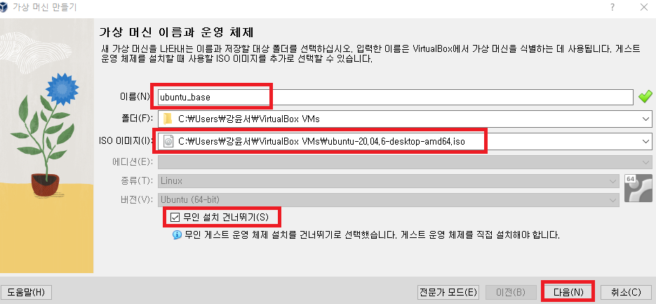
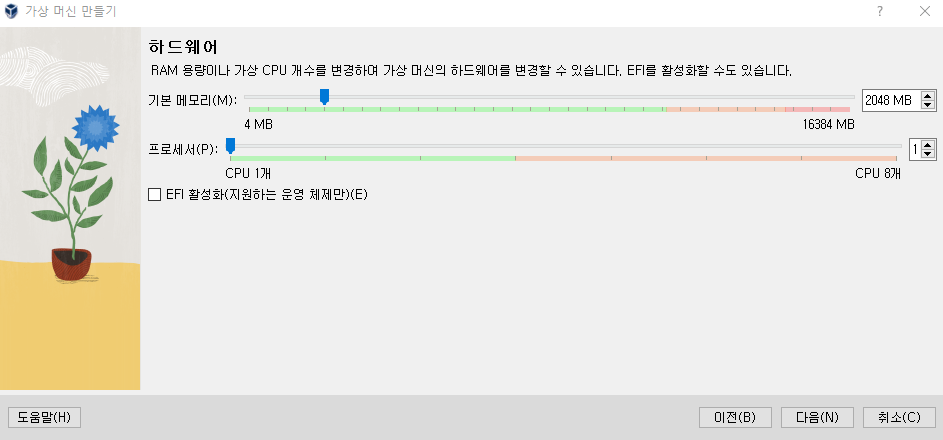
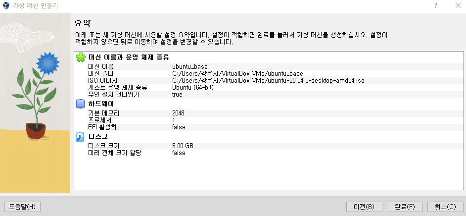
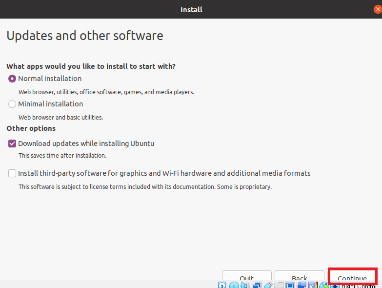
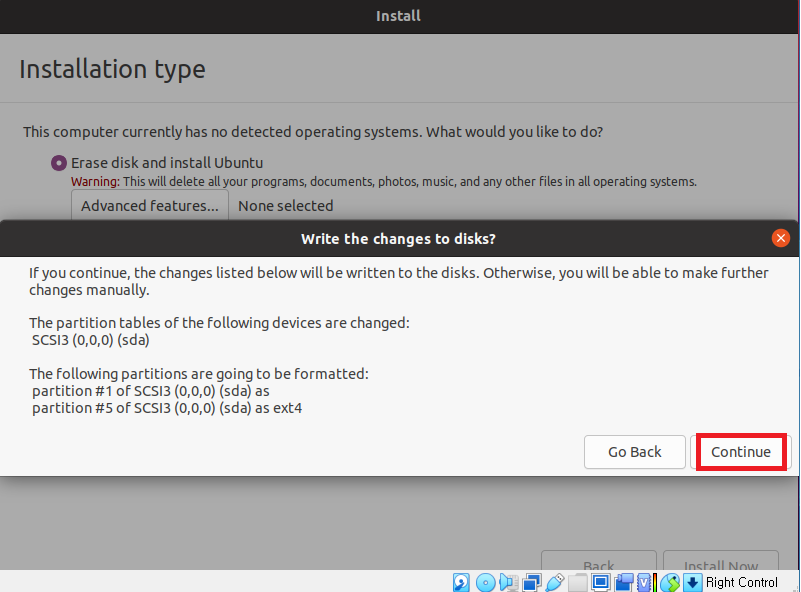
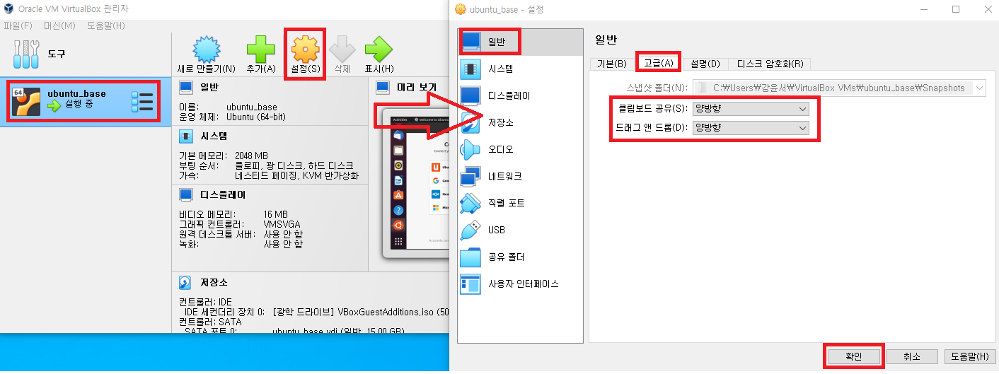
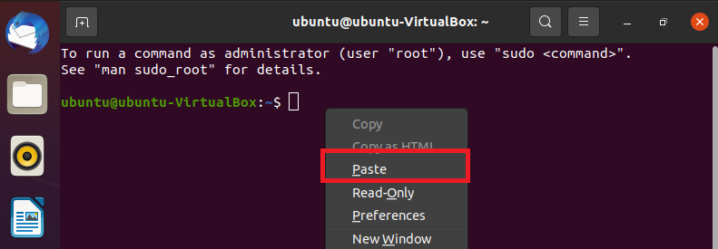
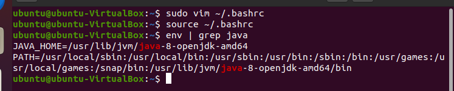
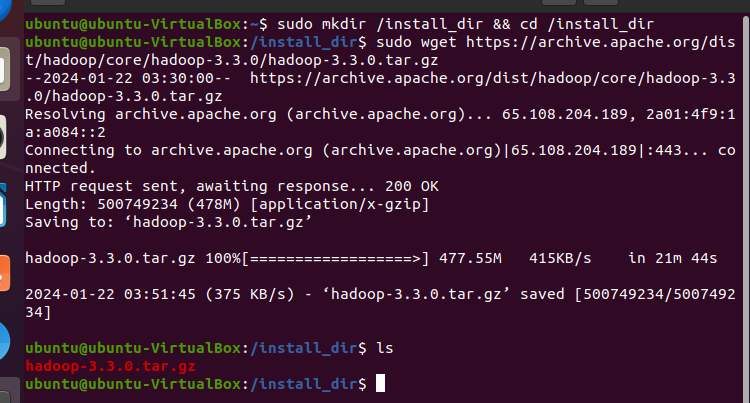

### 단계2: 새로 만들기 


---
### 단계3: 가상 머신 이름과 운영 체제 
- 이름: ubuntu_base
- ISO 이미지: 다운로드한 우분투 이미지
- 무인 설치 건너뛰기 


---
### 단계4: 하드웨어 
- 수정하지 않음  


---
### 단계5: 가상 하드 디스크 
- 30GB로 수정 


---
### 단계6: (완료) 만들기


---
### 단계7: 시작하기 


---
### 단계9: install ubuntu


---


---


---


---


---


---
- 사용자 계정 생성


---
- 설치 완료 후 재실행


---
- ubuntu 접속 


---
### 단계10: [Virtual Box 게스트 확장 프로그램 설치](https://sidepower.tistory.com/43) 


---
### 단계11: [클립보드 설정](https://sidepower.tistory.com/61)


---
- 재기동 

- 마우스 오른쪽 클릭 > Paste(붙여넣기)가 활성화 됨 


---
### 단계12: 필수 라이브러리 설치 
- 필수 라이브러리
  - `vim` : 텍스트 편집기 
  - `wget` : 웹 서버로부터 파일 다운로드
  - `unzip` : 파일 압축/해제
  - `ssh / openssh-*` : 리눅스 원격 접속
  - `net-tools` : 네트워크 툴
```shell
# 업데이트 목록 갱신
sudo apt-get -y update
# 현재 패키지 업그레이드 
sudo apt-get -y upgrade
# 신규 업데이트 설치 
sudo apt-get -y dist-upgrade
# 필수 라이브러리 설치 
sudo apt-get install -y vim wget unzip ssh openssh-* net-tools
```
---
### 단계13: Java 8 설치 
```shell
# Java 8 설치 
sudo apt-get install -y openjdk-8-jdk
# Java version 확인 
java -version
# Java 경로 확인 
readlink -f $(which java) # /usr/lib/jvm/java-8-openjdk-amd64
```


---
- 환경설정 
```shell
# 수정 
sudo vim ~/.bashrc

# 아래내용 입력 
export JAVA_HOME=/usr/lib/jvm/java-8-openjdk-amd64
export PATH=$PATH:$JAVA_HOME/bin

# 적용
source ~/.bashrc
env | grep java # 확인  
```


---
### 단계14: Apache Hadoop 다운로드  
```shell
# 설치파일 관리용 디렉토리 생성
sudo mkdir /install_dir && cd /install_dir
# 다운로드 
sudo wget https://archive.apache.org/dist/hadoop/core/hadoop-3.3.0/hadoop-3.3.0.tar.gz
# 확인 
ls
```

