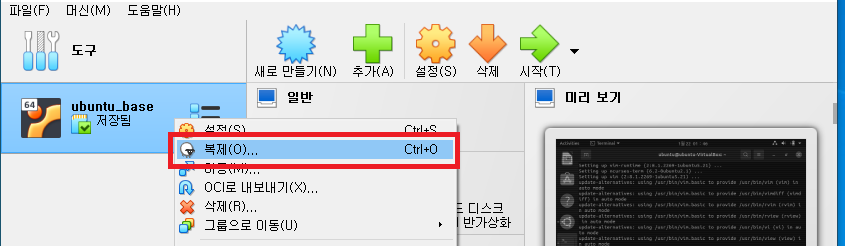
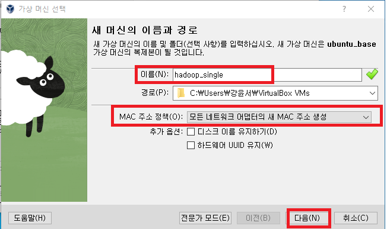

### 단계1: ubuntu_base 복제


---
- 이름: hadoop_single
- MAC 주소 정책: 모든 네트워크 어댑터의 새 MAC 주소 생성 


---
- 완전한 복제 


---
### 단계2: Java 8 설치 
```shell
# Java 8 설치 
sudo apt-get install -y openjdk-8-jdk
# Java version 확인 
java -version
# Java 경로 확인 
readlink -f $(which java)
ls -al /etc/alternatives/java # /usr/lib/jvm/java-8-openjdk-amd64
```

---
- Apache Hadoop 3.2.2 설치 
```shell
# 설치파일 관리용 디렉토리 생성
sudo mkdir /install_dir && cd /install_dir
# 설치
sudo wget https://archive.apache.org/dist/hadoop/core/hadoop-3.3.0/hadoop-3.3.0.tar.gz
# 압축 해제
sudo tar -zxvf hadoop-3.3.0.tar.gz -C /usr/local
sudo mv /usr/local/apache-hive-3.1.2-bin /usr/local/hive
# Hadoop 3.3.0 압축 해제 확인 
ls -al /usr/local/hadoop-3.3.0/

# owner(소유권)를 root로 변경 
sudo chown -R $USER:$USER /usr/local/zookeeper
# owner(소유권)이 root로 변경되었는지 확인 
ls -al /usr/local/hadoop-3.3.0/
```


