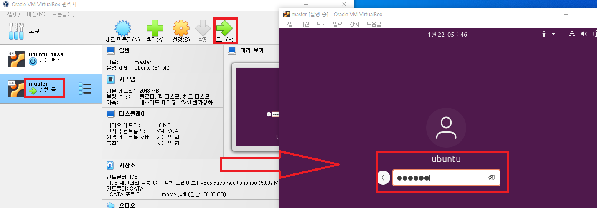
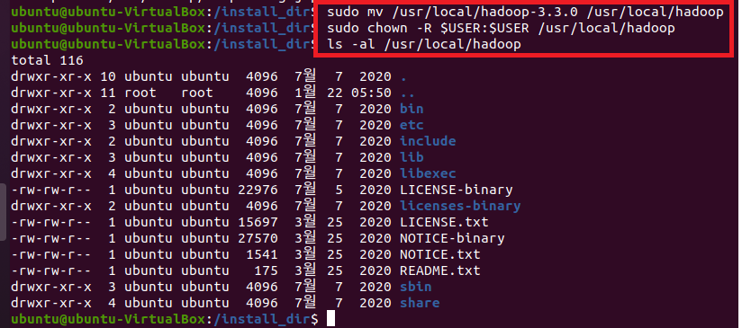
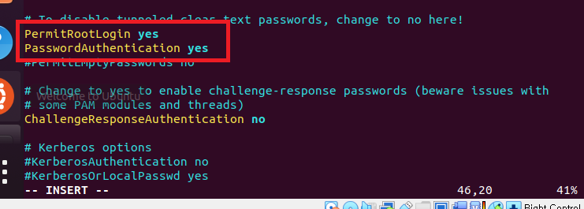

### 단계1: master 인스턴스 생성
1. 복제
2. master / 모든 네트워크 어댑터의 새 MAC 주소 생성 
3. 완전한 복제 


---
### 단계2: master 접속  


---
### 단계3: hadoop 설치 
```shell
cd /install_dir

# Hadoop 압축 해제
sudo tar -zxvf hadoop-3.3.0.tar.gz -C /usr/local
# Hadoop 디렉토리 이름 변경
sudo mv /usr/local/hadoop-3.3.0 /usr/local/hadoop
# owner(소유권)를 변경 
sudo chown -R $USER:$USER /usr/local/hadoop
# owner(소유권)이 root로 변경되었는지 확인 
ls -al /usr/local/hadoop
```


---
### 단계4: Hadoop 환경설정  
```shell
# 수정 
sudo vim ~/.bashrc

# 아래내용 입력 
export HADOOP_HOME=/usr/local/hadoop
export PATH=$PATH:$HADOOP_HOME/bin:$HADOOP_HOME/sbin

export YARN_CONF_DIR=$HADOOP_HOME/etc/hadoop
export HADOOP_CONF_DIR=$HADOOP_HOME/etc/hadoop
export HADOOP_COMMON_HOME=$HADOOP_HOME
export HADOOP_HDFS_HOME=$HADOOP_HOME
export HADOOP_YARN_HOME=$HADOOP_HOME
export HADOOP_MAPRED_HOME=$HADOOP_HOME
```


---
```shell
# 적용
source ~/.bashrc
env | grep hadoop # 확인  
```


---
### 단계5: sshd_config 수정 
- worker와 ssh 통신할 때, 비번 생략 설정 
```shell
sudo vim /etc/ssh/sshd_config

# sshd_config파일에서 아래와 같이 수정 
PermitRootLogin yes # (root 로그인 허용여부를 결정함,yes, no, without-password를 사용할 수 있음) 
PasswordAuthentication yes # (열쇠글 인증을 설정하는 것으로 프로토콜 버전 1과 2 모두 적용) 
```


---
- 수정내용적용
```shell
# 재실행 
systemctl restart sshd
# 확인 
systemctl status sshd
```


