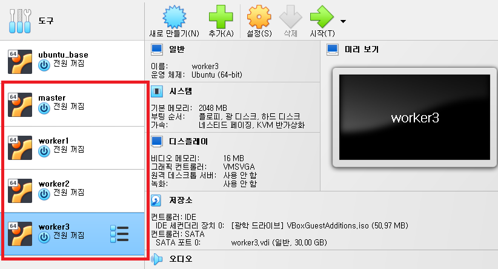
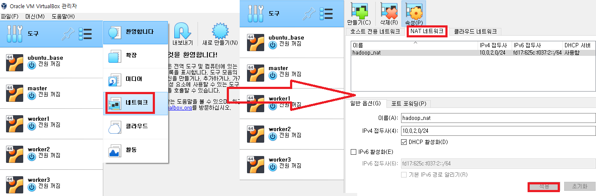
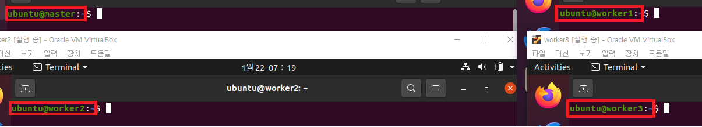
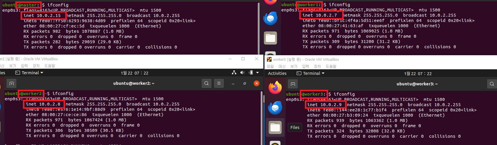
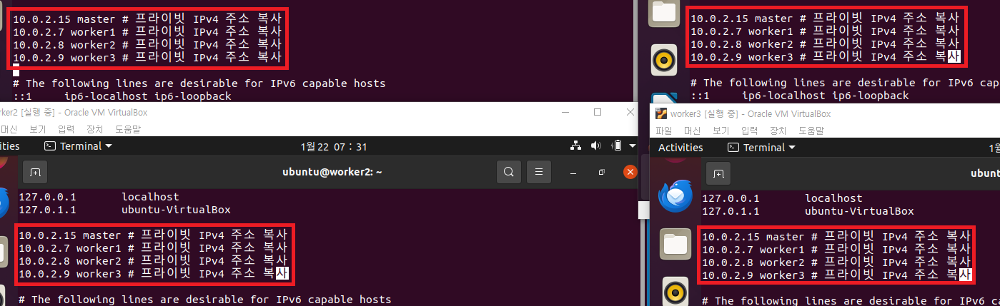
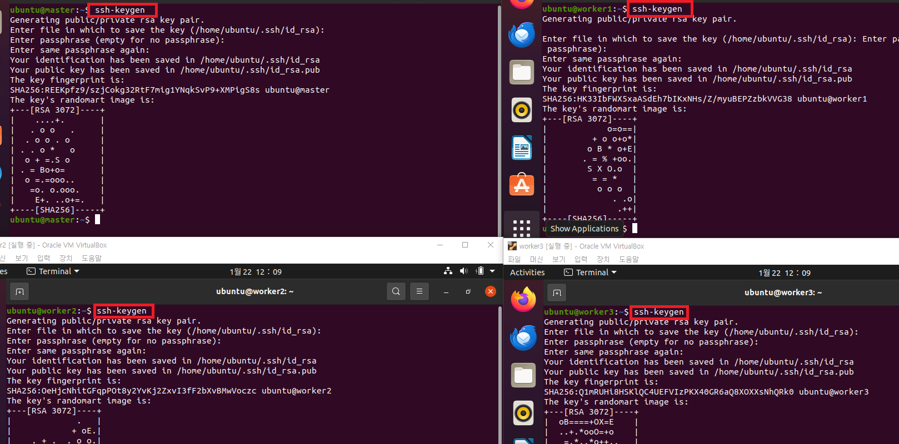
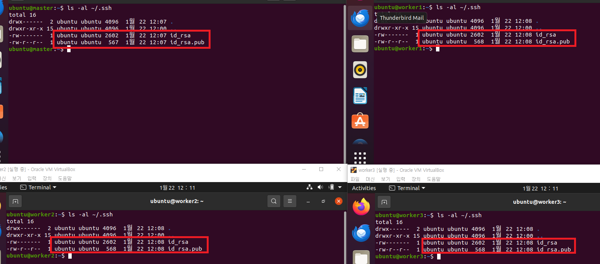
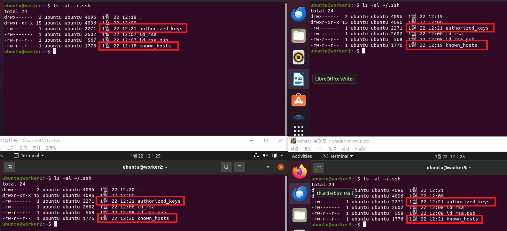
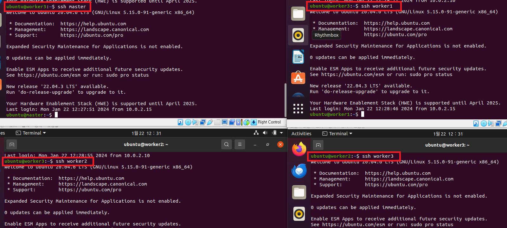

### 단계1: worker 생성
- master를 이용하여 3개의 worker 생성


---
### 단계2: NAT 네트워크 생성 


---
### 단계3: 모두 실행 > NAT 네트워크 적용
- 모두 적용: master, worker1, worker2, worker3


---
### 단계4: 모두 실행 >  hostname 적용 
- 각각 인스턴스명: master, worker1, worker2, worker3
```shell
sudo hostnamectl set-hostname 인스턴스명
hostname
```

-  재기동


---
### 단계5: 모두 실행 > ip 확인 
```shell
ifconfig
``` 


---
### 단계6:  모두 실행 > Hosts 설정
- 각 프라이빗 IPv4 주소 복사 및 적용 
```shell
# hosts 파일 편집
sudo vim /etc/hosts

# 아래 내용처럼 ip주소 추가 후 저장
10.0.2.15 master # 프라이빗 IPv4 주소 복사
10.0.2.11 worker1 # 프라이빗 IPv4 주소 복사
10.0.2.10 worker2 # 프라이빗 IPv4 주소 복사
10.0.2.12 worker3 # 프라이빗 IPv4 주소 복사
```


---
### 단계7: 모두 실행 > ssh-keygen 생성 
```shell
ssh-keygen # enter 3번
cd ~/.ssh
```


---
```shell
ls -al ~/.ssh
```


---
### 단계8: 모두 실행 > ssh public key 교환 작업 
- 입력순서: yes & 비번 
```shell
ssh-copy-id ubuntu@master
ssh-copy-id ubuntu@worker1
ssh-copy-id ubuntu@worker2
ssh-copy-id ubuntu@worker3
```


---
- 결과 확인
```shell
ls -al ~/.ssh
```


---
### 단계9: 모두 실행 >  접속 테스트 
```shell
ssh master
ssh worker1
ssh worker2
ssh worker3
```


