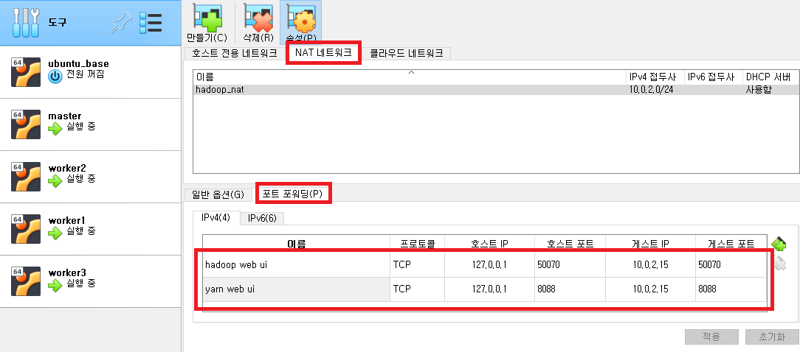
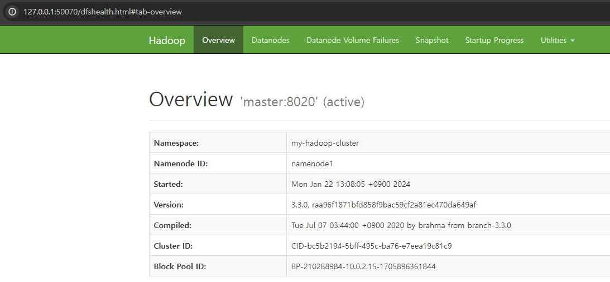
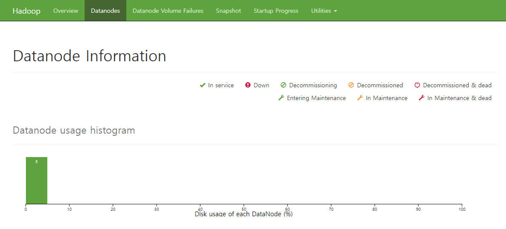
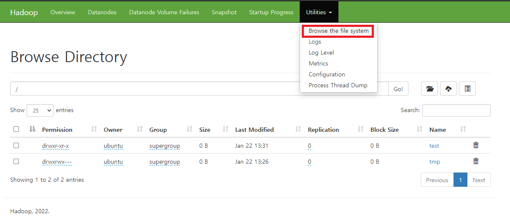
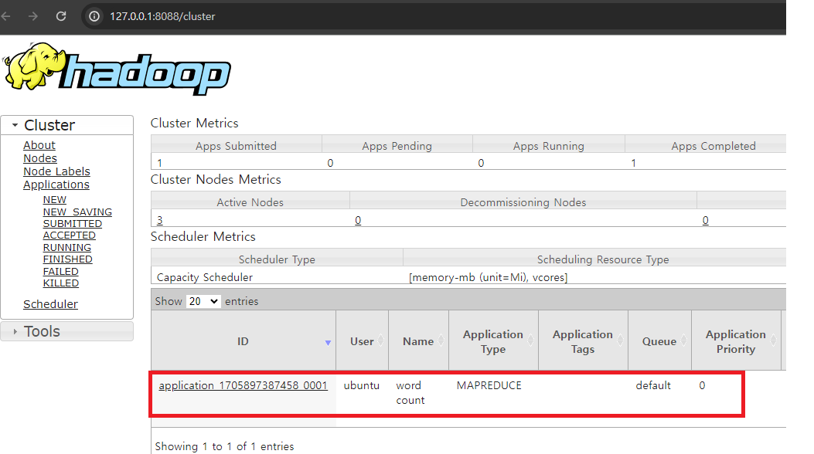
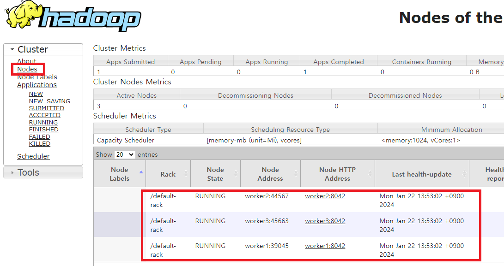
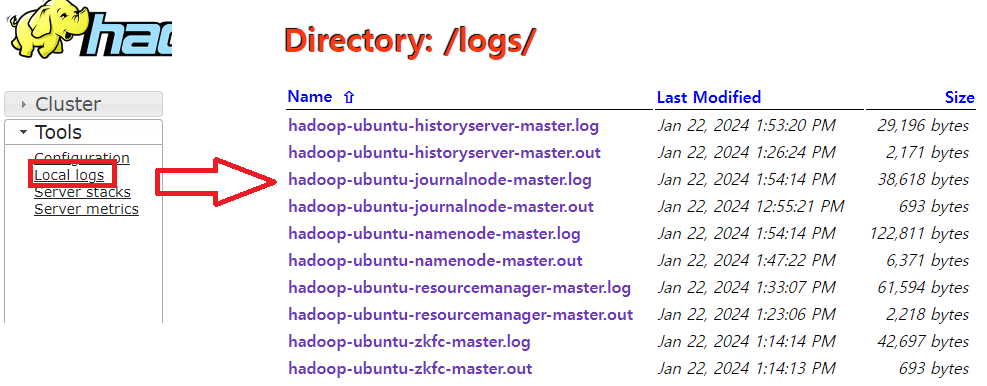

### 단계1: master 서버 > 사용하고 있는 port
- `hadoop web ui`: 50070
- `yarn web ui`: 8088
```shell
netstat -ntlp
```
---


---
### 단계2: 포트 포워딩
- 호스트 IP: 127.0.0.1 / 호스트 port: 50070 & 8088
- 게스트 IP: master 서버 ip / 게스트 port: 50070 & 8088


---
### 단계3: hadoop web ui
- http://127.0.0.1:50070/


---
- Datanode 확인 


---
- 디렉토리 확인 


---
- log 확인 


---
### 단계4: yarn web ui
- http://127.0.0.1:8088/
- word count 테스트 이력도 확인 가능 


---
- Datanode 확인


---
- log 확인

