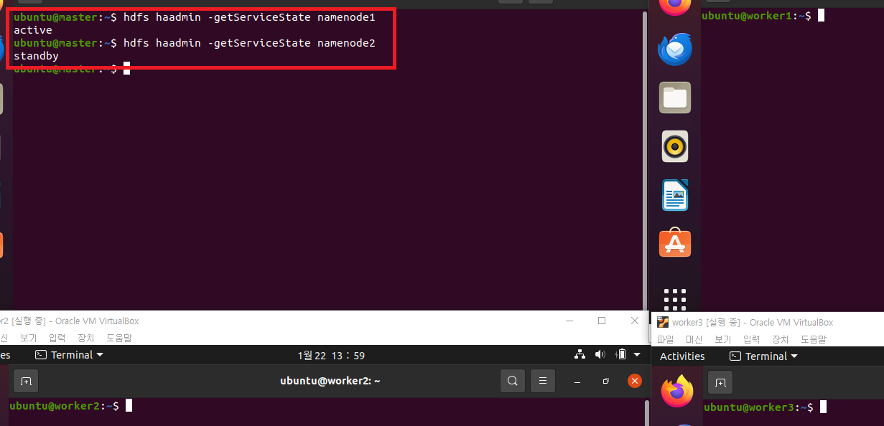
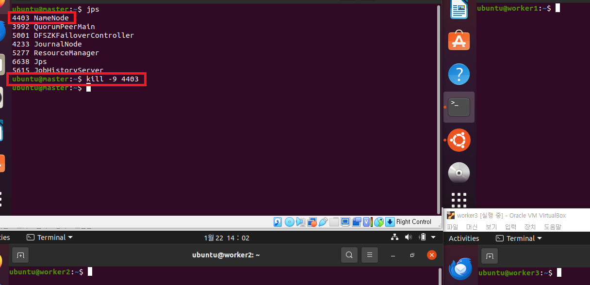

### 단계1: master > NameNode 상태 확인 
```shell
hdfs haadmin -getServiceState namenode1 
hdfs haadmin -getServiceState namenode2
```


---
```shell
jps
```


---
### 단계2: master > NameNode kill
```shell
# jps 프로세스 확인
jps

1664 NameNode
2786 JobHistoryServer
4359 Jps

# NameNode 프로세스 kill
kill -9 1664
```
---


---
### 단계3: 결과 확인 
- NameNode: worker1
```shell
# NameNode1 상태 확인
hdfs haadmin -getServiceState namenode1 # error
# NameNode2 상태 확인
hdfs haadmin -getServiceState namenode2 # active

jps
```
---


---
### 단계4: hadoop web ui & yarn web ui 확인 
- hadoop web ui: http://127.0.0.1:50070/
- yarn web ui: http://127.0.0.1:8088/


---
### 단계5: worker1 > Hadoop 예제 테스트
```shell
yarn jar  $HADOOP_HOME/share/hadoop/mapreduce/hadoop-mapreduce-examples-3.3.0.jar pi 16 1000
```


---
- yarn web ui: http://127.0.0.1:8088/


---
### 단계6: Hadoop, Yarn, Zookeeper 를 모두 중단 
```shell
# Jobhistory stop
mapred --daemon stop historyserver

# Zookeeper stop
/usr/local/zookeeper/bin/zkServer.sh stop
ssh worker1 "/usr/local/zookeeper/bin/zkServer.sh stop"
ssh worker2 "/usr/local/zookeeper/bin/zkServer.sh stop"

# Hadoop stop
$HADOOP_HOME/sbin/stop-all.sh
```
---


---
### 단계7: 중단 확인 
```shell
jps
```


