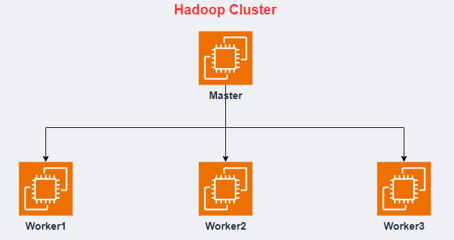

# Hadoop Cluster 아키텍처

---
# [1. 하둡 설치](./1.%20하둡%20설치.md)

---
# [2. 하둡 설정](./2.%20하둡%20설정.md)

---
# [3. Zookeeper](./3.%20Zookeeper.md)

---
# [4. worker 생성 및 네트워크](./4.%20worker%20생성%20및%20네트워크.md)

---
# [5. Zookeeper 실행](./5.%20Zookeeper%20실행.md)

---
# [6. Hadoop & Yarn 실행](./6.%20Hadoop%20&%20Yarn%20실행.md)

---
# [7. WEB UI](./7.%20WEB%20UI.md)

---
# [8. Hadoop FailOver 테스트](./8.%20Hadoop%20FailOver%20테스트.md)

---
# [9. 실행 스크립트 생성](./9.%20실행%20스크립트%20생성.md)

