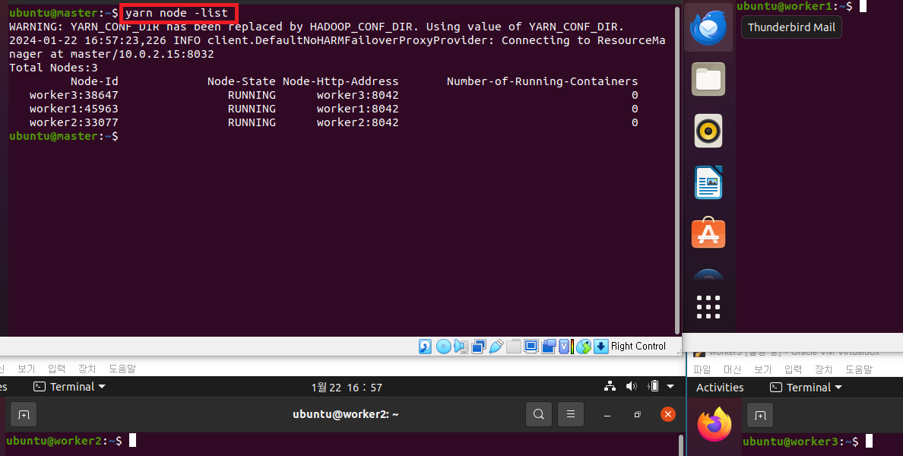
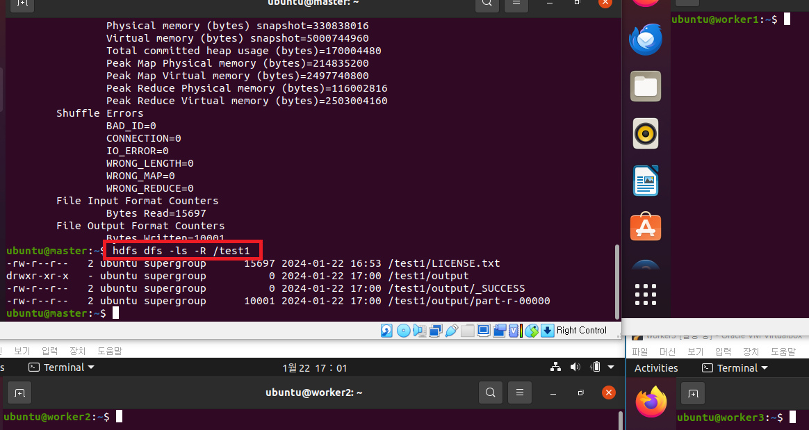

# [yan 명령어](https://jyoondev.tistory.com/66)
## node
- node 명령어는 얀이 관리하고있는 기기들 즉 데이터노드를 관리할 수 있습니다.
```shell
yarn node -list # 노드 리스트 조회 
```


---
## jar
- jar 명령을 통해 jvm기반의 어플리케이션을 실행할 수 있습니다.
```shell
yarn jar /usr/local/hadoop/share/hadoop/mapreduce/hadoop-mapreduce-examples-3.3.0.jar wordcount hdfs:///test1/LICENSE.txt /test1/output
hdfs dfs -ls -R /test1
```


---
- http://127.0.0.1:8088/


---
## application
- application명령어는 얀 위에서 실행되거나 이미 실행된 프로그램의 상태를 확인할 수 있는 명령어입니다.
```shell
# 현재 작업중인 작업 목록을 확인할 수 있습니다.
yarn application -list
# yarn web ui에서 ID 확인 
yarn application -status application_1705378575393_0001
```


