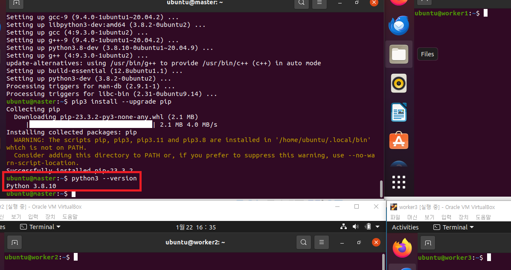

# 파이썬 설치 
```shell
# 파이썬 설치 
sudo apt-get install -y python3-pip
pip3 install --upgrade pip
# 버전 확인 
python3 --version
```
---


---
# master > 하둡 실행 
```shell
# 실행
. cluster-start-all.sh
# 확인 
jps
```
---


---
# [1. hadoop 명령어](./1.%20hadoop%20명령어.md)

---
# [2. yarn 명령어](./2.%20yarn%20명령어.md)

---
# [3. mapreduce](./3.%20mapreduce.md)

---
# master > 하둡 정지 
```shell
# 정지
. cluster-stop-all.sh
# 확인 
jps
```
---


