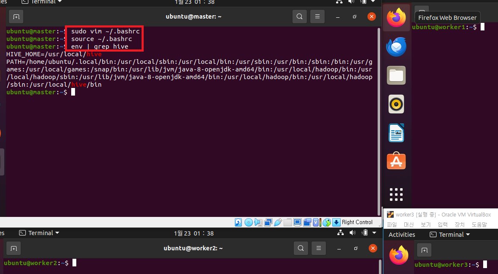
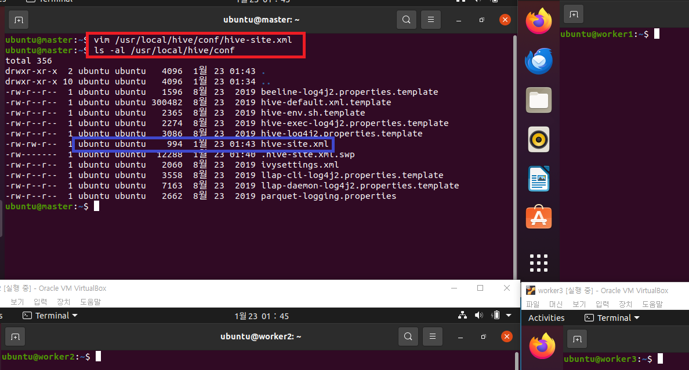
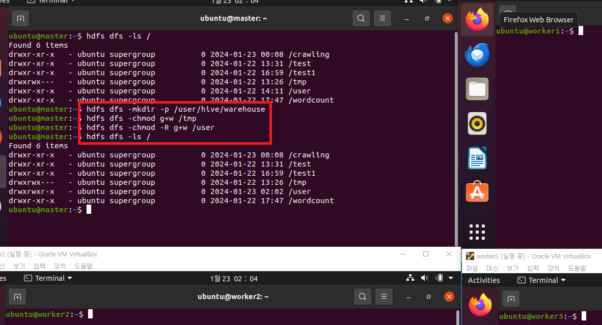

# hive 설치 및 설정 
### 단계1: Apache Hive 설치 
```shell
# 설치 폴더 이동
cd /install_dir
# hive 다운로드 
sudo wget https://dlcdn.apache.org/hive/hive-3.1.2/apache-hive-3.1.2-bin.tar.gz
# hive 압출풀기
sudo tar -zxvf apache-hive-3.1.2-bin.tar.gz -C /usr/local
# 폴더 변경
sudo mv /usr/local/apache-hive-3.1.2-bin /usr/local/hive
# owner(소유권)를 변경 
sudo chown -R $USER:$USER /usr/local/hive
# 결과 확인 
ls -al /usr/local/hive
```
---


---
### 단계2: 환경설정 
```shell
sudo vim ~/.bashrc
# 아래 내용 복사 
export HIVE_HOME=/usr/local/hive
export PATH=$PATH:$HIVE_HOME/bin

# 수정내용 반영 
source ~/.bashrc
env | grep hive
```
---


---
### 단계3: conf/hive-site.xml 
```shell
vim /usr/local/hive/conf/hive-site.xml
```
```xml
<?xml version="1.0" encoding="UTF-8" standalone="no"?>
<?xml-stylesheet type="text/xsl" href="configuration.xsl"?>
<configuration>
        <property>
                <name>javax.jdo.option.ConnectionURL</name>
                <value>jdbc:mysql://localhost:3306/metastore?createDatabaseIfNotExist=true&amp;useSSL=false&amp;allowPublicKeyRetrieval=true&amp;characterEncoding=UTF-8&amp;serverTimezone=UTC</value>
        </property>
        <property>
                <name>javax.jdo.option.ConnectionDriverName</name>
                <value>com.mysql.cj.jdbc.Driver</value>
        </property>
        <property>
                <name>javax.jdo.option.ConnectionUserName</name>
                <value>hive</value>
        </property>
        <property>
                <name>javax.jdo.option.ConnectionPassword</name>
                <value>123456</value>
        </property>
        <property>
                <name>datanucleus.autoCreateSchema</name>
                <value>false</value>
        </property>

        <property>
                <name>datanucleus.fixedDatastore</name>
                <value>true</value>
        </property>

        <property>
                <name>datanucleus.autoCreateTables</name>
                <value>True</value>
        </property>

</configuration>
```
---
- 확인
```shell
ls -al /usr/local/hive/conf
```


---
### 단계4: MySQL JDBC Connector
```shell
cd /install_dir
sudo wget https://repo1.maven.org/maven2/mysql/mysql-connector-java/8.0.22/mysql-connector-java-8.0.22.jar
sudo cp mysql-connector-java-8.0.22.jar /usr/local/hive/lib/

sudo chown -R $USER:$USER /usr/local/hive
ls -al /usr/local/hive/lib/mysql*
```
---


---
### 단계5: guava-xx.jar 파일 교체
```shell
# guava 라이브러리 버전 확인 > hive와 hadoop 라이브러리 다른 것 확인 
ls -al $HIVE_HOME/lib/gu*
ls -al $HADOOP_HOME/share/hadoop/common/lib/gu*

# 기존 라이브러리 bak 파일로 수정 
mv $HIVE_HOME/lib/guava-19.0.jar $HIVE_HOME/lib/guava-19.0.jar.bak

# 하둡에 있는 라이브러리 hive로 복사 
cp $HADOOP_HOME/share/hadoop/common/lib/guava-27.0-jre.jar $HIVE_HOME/lib/guava-27.0-jre.jar

# 결과 확인 
ls -al $HIVE_HOME/lib/gu*
```
---


---
### 단계6: 하둡 실행
```shell
# 하둡 실행 
. cluster-start-all.sh

hdfs haadmin -getServiceState namenode1
hdfs haadmin -getServiceState namenode2

jps
```
---


---
### 단계7: hive용 디렉토리 생성 
```shell
# hive용 디렉토리 생성
hdfs dfs -mkdir /tmp
hdfs dfs -mkdir -p /user/hive/warehouse
hdfs dfs -chmod g+w /tmp
hdfs dfs -chmod -R g+w /user

# 디렉토리 확인 
hdfs dfs -ls /
```
---


---
### 단계7: 메타정보 초기화
```shell
# 메타정보 초기화
$HIVE_HOME/bin/schematool -dbType mysql -initSchema
# mysql 접속 
mysql -u hive -p 
```
```sql
use metastore 
show tables;
```
---


---
# hive 테스트
### 단계1: hive접속 
```shell
hive 
```


---
### 단계2: 테스트 및 확인 
```sql
-- 데이터베이스 생성
create database test;
use test;
-- 테이블 생성
create table test.tab1(col1 integer, col2 string);
show tables;
-- 데이터 추가하기 
insert into table test.tab1 select 1 as col1, 'hive' as col2;
-- 데이터 조회하기 
select * from test.tab1;
```
---


---
- http://127.0.0.1:8088/cluster


---
### 단계3: hive 나오기 
```shell
quit;
```


