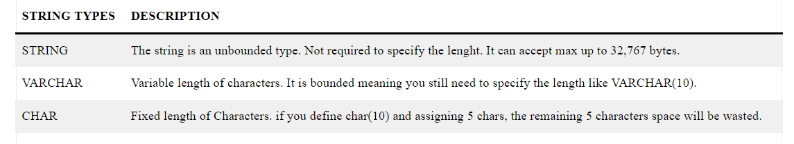
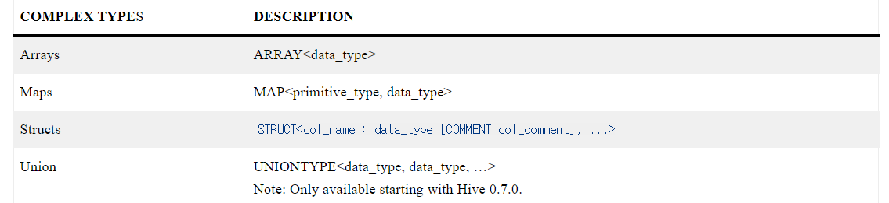
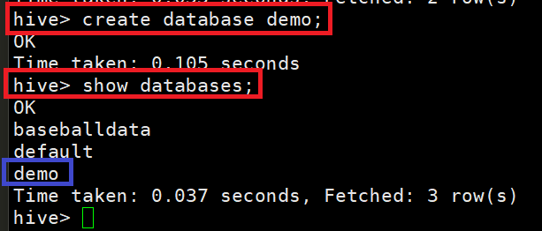
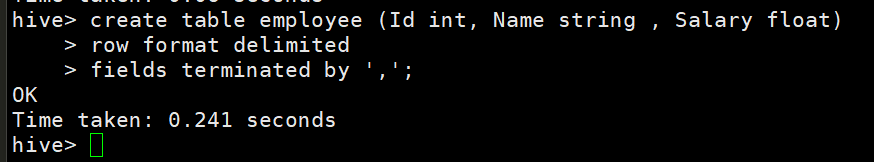
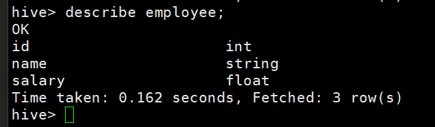
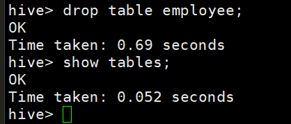

# [Data Types](https://sparkbyexamples.com/apache-hive/hive-data-types-primitive-complex/)

---
### Numberic Types


---
### Date/Time Types


### String Types


---
### Misc Types


### Complex Types


---
# [Database](https://www.javatpoint.com/hive-create-database)

---
### 단계1: database 조회
```shell
show databases;
```


---
### 단계2: database 생성
```shell
create database demo; 
show databases;
```


---
### 단계3: database 삭제
```shell
drop database demo; 
show databases;
```


---
# [Table](https://www.javatpoint.com/hive-create-table)

---
### 단계1: database 생성 및 적용 
```shell
create database if not exists demo; # 생성
use demo; # 적용 
```


---
### 단계2: table 생성 
```shell
create table employee (Id int, Name string , Salary float)  
row format delimited  
fields terminated by ','; 
```


---
### 단계3: table 조회  
```shell
show tables;
```


---
### 단계4: table 상세 조회  
```shell
describe employee;
```


---
### 단계5: table 삭제  
```shell
drop table employee;
show tables;
```


---
# [Alter Table](https://www.javatpoint.com/hive-alter-table)

---


