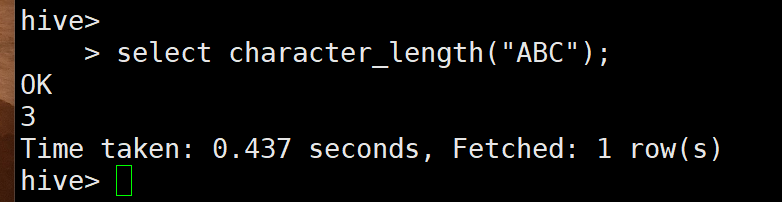
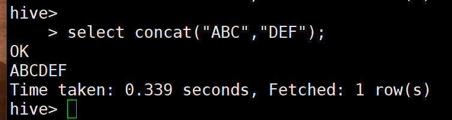
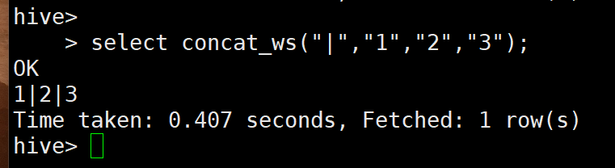
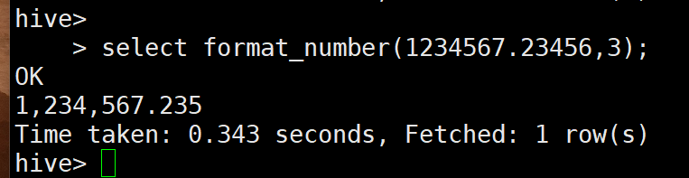
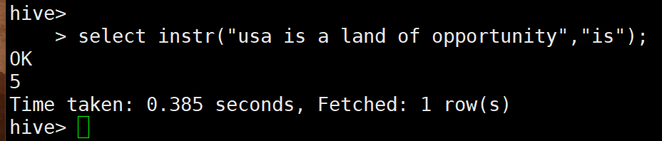
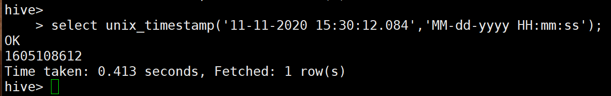
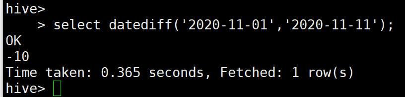
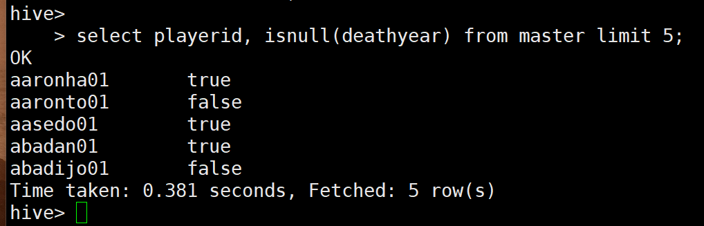
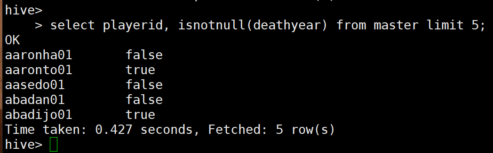

# [String Functions](https://sparkbyexamples.com/apache-hive/hive-built-in-string-functions-with-examples/)

---
### 단계1: character_length() returns length of the string
```sql
select character_length("ABC");
```


---
### 단계2: concat() function concatenates the multiple strings
```sql
select concat("ABC","DEF");
```


---
### 단계3: concat_ws() function concatenates string with delimiter separator
```sql
select concat_ws("|","1","2","3");
```


---
### 단계4: format_number() function formats integer with comma separator
```sql
select format_number(1234567.23456,3);
```


---
### 단계5: instr() searches for a string in a input string and returns the index
```sql
select instr("usa is a land of opportunity","is");
```


---
# [Date and Timestamp Functions](https://sparkbyexamples.com/apache-hive/hive-date-and-timestamp-functions-examples/)

---
### 단계1: from_unixtime(bigint unixtime[, string format])
```sql
select from_unixtime(1605108612,'MM-dd-yyyy HH:mm:ss');
```


---
### 단계2: unix_timestamp() – Gets Unix Epoch time in seconds
```sql
select unix_timestamp('11-11-2020 15:30:12.084','MM-dd-yyyy HH:mm:ss');
```


---
### 단계3: to_date(string timestamp) – Converts Timestamp string to Date type
```sql
select to_date('2020-11-11 15:30:12.084');
```


---
### 단계4: current_timestamp() – Get current Timestamp along with Data and Time
```sql
select current_timestamp();
```


---
### 단계5: datediff(string enddate, string startdate)
```sql
select datediff('2020-11-01','2020-11-11');
```


---
# [Conditional Functions](https://sparkbyexamples.com/apache-hive/hive-conditional-functions-with-examples/)

---
### 단계1: isnull( a )
```sql
select playerid, isnull(deathyear) from master limit 5;
```


---
### 단계2: isnotnull ( a )
```sql
select playerid, isnotnull(deathyear) from master limit 5;
```


---
### 단계3: If(boolean testCondition, T valueTrue, T valueFalseOrNull)
```sql
select playerid, if(isnull(deathyear),'dead','alive') from master limit 5;
```


---
# [Aggregate Functions](https://sparkbyexamples.com/apache-hive/hive-aggregate-functions-with-examples/)

---
### 단계1: Select Count and Count Distinct
```sql
select count(playerid) from master;
select count(distinct birthcountry, playerid) from master;
```
### 단계2: Sum of a Column and sum of Distinct Columns
```sql
select sum(salary) from salaries;
select sum(distinct salary) from salaries;
select teamid, sum(salary) from salaries group by teamid;
```

---
### 단계3: Average (Avg) of a Column & Average of Distinct Column
```sql
select avg(salary) from salaries;
select avg(distinct salary) from salaries;
select teamid, avg(salary) from salaries group by teamid;
```
### 단계4: min(col) – Get Minimum value of a column
```sql
select min(salary) from salaries;
```
### 단계5: max(col) – Get Maximum value of a column
```sql
select max(salary) from salaries;
```
---
### 단계6: collect_set(col) – Collapse the records by Group and Converts into an Array
```sql
select birthcountry, collect_set(birthcity) from master group by birthcountry;
```
### 단계7: collect_list(col) – Collapse the records by Group and Converts values into an Array
```sql
select birthcountry, collect_list(birthcity) from master group by birthcountry;
```


