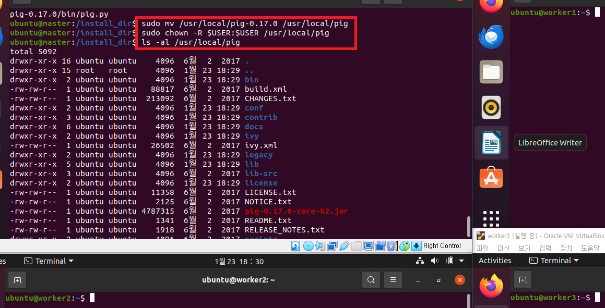
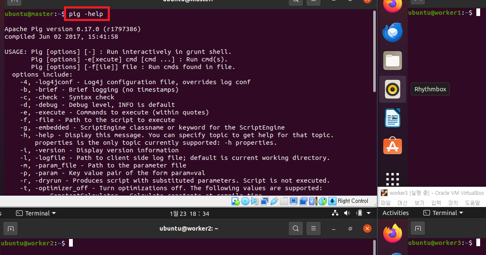
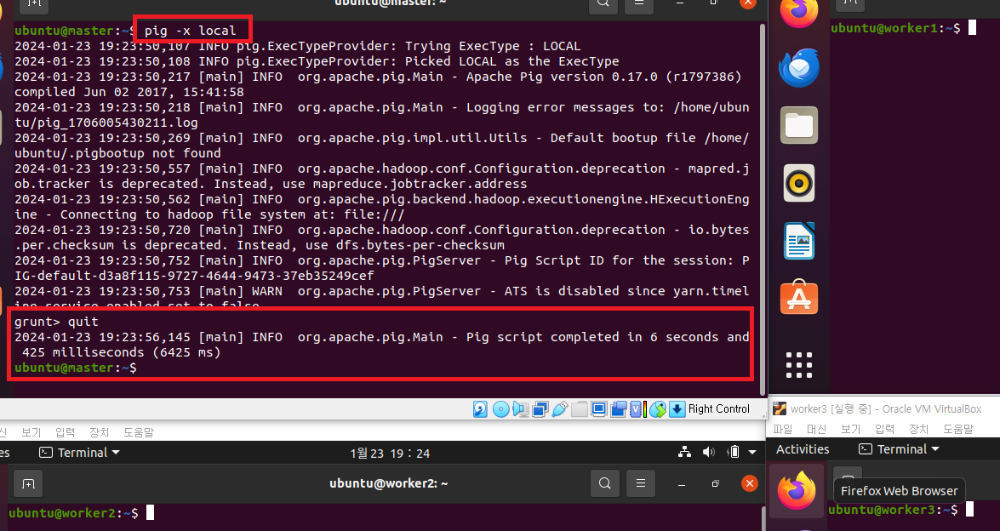
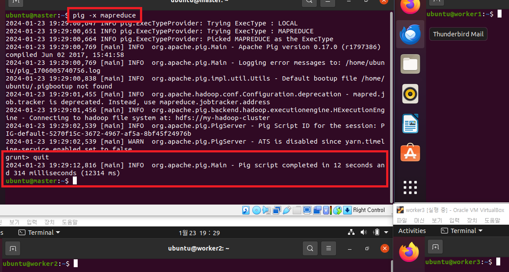

# Pig 설치 및 설정
### 단계1: Pig 설치 
```shell
# 설치 폴더 이동
cd /install_dir
# 다운로드 
sudo wget https://downloads.apache.org/pig/pig-0.17.0/pig-0.17.0.tar.gz
# 압출풀기
sudo tar -zxvf pig-0.17.0.tar.gz -C /usr/local
# 폴더 변경
sudo mv /usr/local/pig-0.17.0 /usr/local/pig
# owner(소유권)를 변경 
sudo chown -R $USER:$USER /usr/local/pig
# 결과 확인 
ls -al /usr/local/pig
```
---


---
### 단계2: 환경설정 
```shell
sudo vim ~/.bashrc
# 아래 내용 복사 
export PIG_HOME=/usr/local/pig
export PATH=$PATH:$PIG_HOME/bin

# 수정내용 반영 
source ~/.bashrc
env | grep pig
```
---


---
### 단계2: pig 확인 
```shell
pig -help
```  


---
### 단계3: 하둡 실행
```shell
# 하둡 실행 
. cluster-start-all.sh

hdfs haadmin -getServiceState namenode1
hdfs haadmin -getServiceState namenode2

jps
```
---


---
### 단계4: 로컬 모드 pig 실행 및 나오기 
- 로컬 모드: 이 모드에서는 Hadoop Pig 언어가 단일 모드로 실행됩니다.
```shell
# pig 실행
pig -x local
# pig 나오기
quit
```
---


---
### 단계5: 맵리듀스 모드 pig 실행 및 나오기 
- Map Reduce 모드: 이 모드에서는 Pig Latin으로 작성된 쿼리가 다음으로 변환됩니다.
```shell
# pig 실행
pig # 또는 pig -x mapreduce
# pig 나오기
quit
```
---

