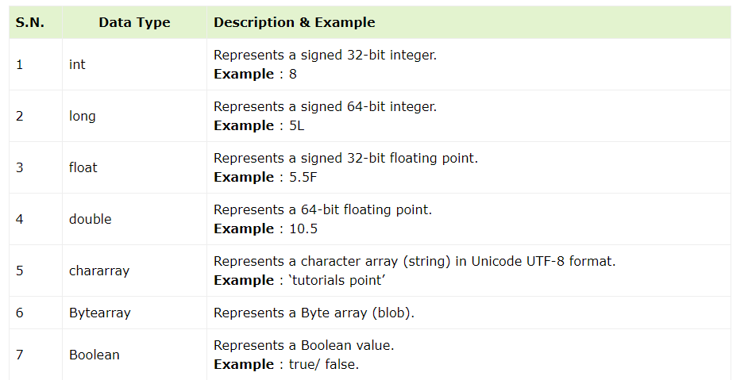
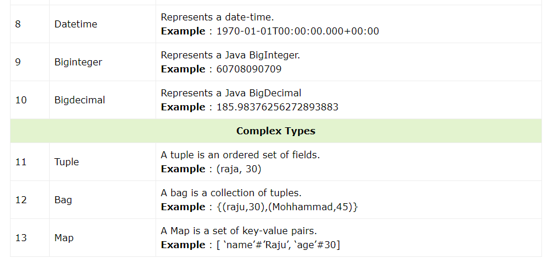
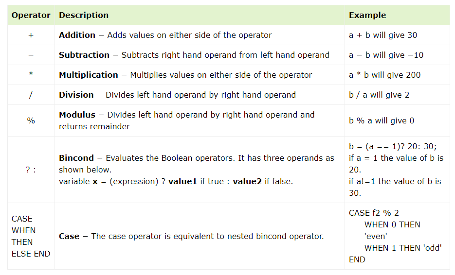

# [Pig 기초 문법](https://www.tutorialspoint.com/apache_pig/pig_latin_basics.htm)

---
### Pig Latin – Data types

---

---
### Pig Latin – Arithmetic Operators
> Suppose a = 10 and b = 20.

---
### Pig Latin – Comparison Operators

---
### Pig Latin – Relational Operations

---

