# [Reading Data](https://www.tutorialspoint.com/apache_pig/apache_pig_reading_data.htm)

---
### 단계1: student_data.txt
```shell
vim student_data.txt

# 아래내용 입력 
001,Rajiv,Reddy,9848022337,Hyderabad
002,siddarth,Battacharya,9848022338,Kolkata
003,Rajesh,Khanna,9848022339,Delhi
004,Preethi,Agarwal,9848022330,Pune
005,Trupthi,Mohanthy,9848022336,Bhuwaneshwar
006,Archana,Mishra,9848022335,Chennai.
```
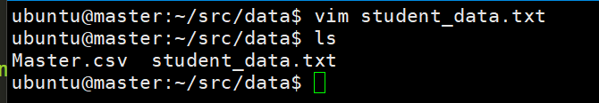

---
### 단계2: hadoop 데이터 전달
```shell
hdfs dfs -mkdir -p /pig/student/input
hdfs dfs -put student_data.txt /pig/student/input
# hadoop 데이터 확인 
hdfs dfs -ls -R /pig/student
```
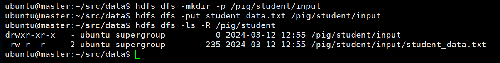

---
### 단계3: Pig 접속 
```shell
pig
```


---
### 단계4: LOAD
```shell
student = LOAD '/pig/student/input/student_data.txt' 
   USING PigStorage(',')
   as ( id:int, firstname:chararray, lastname:chararray, phone:chararray, 
   city:chararray );
```


---
### 단계5: Dump 
```shell
dump student
```


---
### 단계6: describe
```shell
describe student
```


---
### 단계7: STORE
```shell
STORE student INTO '/pig/student/output/' USING PigStorage (',');
```
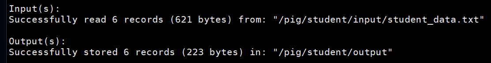
- pig 종료 
```shell
quit; 
```
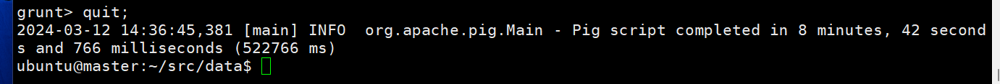

---
- 결과 확인 
```shell
hdfs dfs -ls -R /pig/student
```
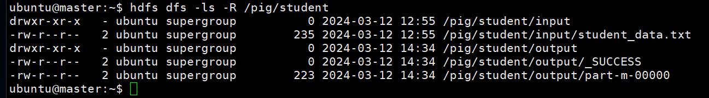
```shell
hdfs dfs -cat /pig/student/output/*
```
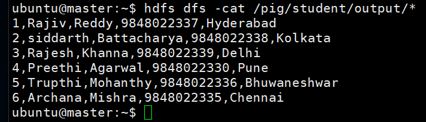

---
# [Group By](https://www.tutorialspoint.com/apache_pig/apache_pig_group_operator.htm)

---
### 단계1: student_details.txt
```shell
vim student_details.txt

# 아래내용 작성 
001,Rajiv,Reddy,21,9848022337,Hyderabad
002,siddarth,Battacharya,22,9848022338,Kolkata
003,Rajesh,Khanna,22,9848022339,Delhi
004,Preethi,Agarwal,21,9848022330,Pune
005,Trupthi,Mohanthy,23,9848022336,Bhuwaneshwar
006,Archana,Mishra,23,9848022335,Chennai
007,Komal,Nayak,24,9848022334,trivendram
008,Bharathi,Nambiayar,24,9848022333,Chennai
```


---
### 단계2: hadoop 데이터 전달
```shell
hdfs dfs -mkdir -p /pig/student_groupby/input
hdfs dfs -put student_details.txt /pig/student_groupby/input
# hadoop 데이터 확인 
hdfs dfs -ls -R /pig/student_groupby
```
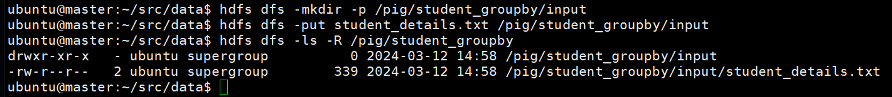

---
### 단계3: LOAD
- pig 접속
```shell
pig
```
- LOAD
```shell
student_details = LOAD '/pig/student_groupby/input/student_details.txt' USING PigStorage(',')
   as (id:int, firstname:chararray, lastname:chararray, age:int, phone:chararray, city:chararray);
```


---
### 단계4: GROUP
```shell
group_data = GROUP student_details by age;
Dump group_data;
```
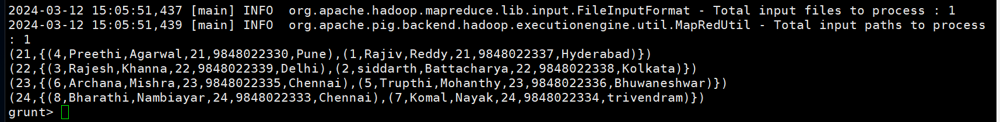

---
### 단계5: Grouping by Multiple Columns
```shell
group_multiple = GROUP student_details by (age, city);
Dump group_multiple;
```
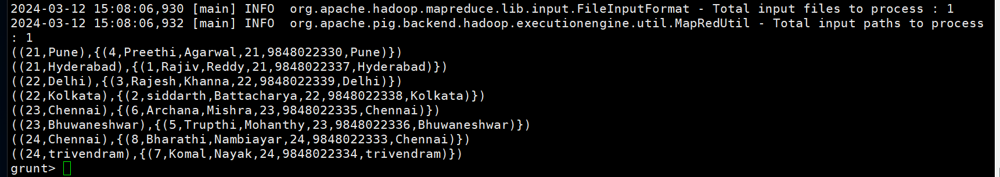

---
# [Join](https://www.tutorialspoint.com/apache_pig/apache_pig_join_operator.htm)

---
### 단계1: Create files
```shell
vim customers.txt
# 아래내용 작성 
1,Ramesh,32,Ahmedabad,2000.00
2,Khilan,25,Delhi,1500.00
3,kaushik,23,Kota,2000.00
4,Chaitali,25,Mumbai,6500.00 
5,Hardik,27,Bhopal,8500.00
6,Komal,22,MP,4500.00
7,Muffy,24,Indore,10000.00
```
```shell
vim orders.txt
# 아래내용 작성 
102,2009-10-08 00:00:00,3,3000
100,2009-10-08 00:00:00,3,1500
101,2009-11-20 00:00:00,2,1560
103,2008-05-20 00:00:00,4,2060
```
---
### 단계2: hadoop 데이터 전달
```shell
hdfs dfs -mkdir -p /pig/join/input
hdfs dfs -put customers.txt /pig/join/input
hdfs dfs -put orders.txt /pig/join/input
# hadoop 데이터 확인 
hdfs dfs -ls -R /pig/join
```
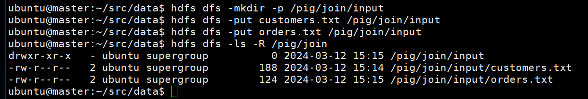

---
### 단계3: Inner Join
- LOAD
```shell
customers = LOAD '/pig/join/input/customers.txt' USING PigStorage(',')
   as (id:int, name:chararray, age:int, address:chararray, salary:int);
  
orders = LOAD '/pig/join/input/orders.txt' USING PigStorage(',')
   as (oid:int, date:chararray, customer_id:int, amount:int);
```


---
- Join
```shell
coustomer_orders = JOIN customers BY id, orders BY customer_id;
Dump coustomer_orders;
```


---
### 단계4: Left Outer Join
```shell
outer_left = JOIN customers BY id LEFT OUTER, orders BY customer_id;
Dump outer_left;
```


---
### 단계5: Full Outer Join
```shell
outer_full = JOIN customers BY id FULL OUTER, orders BY customer_id;
Dump outer_full; 
```
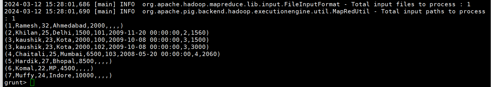

