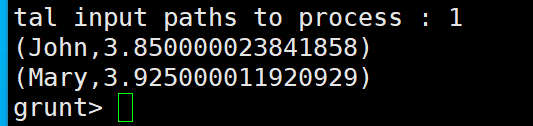
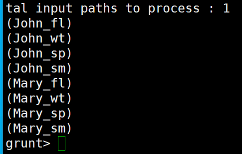
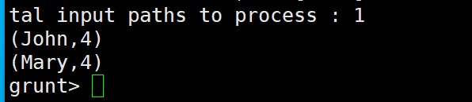
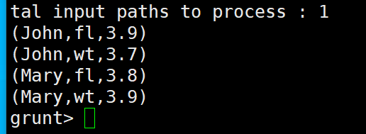
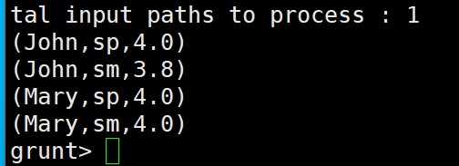

# [Pig 내장함수](https://runebook.dev/ko/docs/apache_pig/func?page=11)

---
### 단계1: student.txt
```shell
vim student.txt
# 작성해주세요.
John,fl,3.9F
John,wt,3.7F
John,sp,4.0F
John,sm,3.8F
Mary,fl,3.8F
Mary,wt,3.9F
Mary,sp,4.0F
Mary,sm,4.0F
```
### 단계3: hadoop 데이터 전달 
```shell
hdfs dfs -mkdir -p /pig/function/input
hdfs dfs -put student.txt /pig/function/input
# hadoop 데이터 확인 
hdfs dfs -ls -R /pig/function
```
---
### 단계4: LOAD
```shell
A = LOAD '/pig/function/input/student.txt' 
USING PigStorage(',') 
AS (name:chararray, term:chararray, gpa:float);

DUMP A;
```


---
### 단계5: GROUP
```shell
B = GROUP A BY name;

DUMP B;
```


---
## AVG
- 단일 열 백에 있는 숫자 값의 평균을 계산합니다.
```shell
avg1 = FOREACH B GENERATE $0, AVG($1.gpa);

dump avg1;
```


---
## CONCAT
- 동일한 유형의 두 개 이상의 표현식을 연결합니다.
```shell
concat1 = FOREACH A GENERATE CONCAT(name, '_', term);

dump concat1;
```


---
## COUNT
- 가방의 요소 수를 계산합니다.
```shell
count1 = FOREACH B GENERATE $0, COUNT($1);

dump count1;
```


---
## MAX(생략: MIN, SUM)
- 단일 열 백에 있는 숫자 값 또는 문자 배열의 최대값을 계산합니다. - MAX에서는 전역 최대값의 경우 선행 GROUP ALL 문이 필요하고 그룹 최대값의 경우 GROUP BY 문이 필요합니다.
```shell
max1 = FOREACH B GENERATE $0, MAX($1.gpa);

dump max1;
```


---
## IN
- IN 연산자를 사용하면 표현식이 값 목록의 값과 일치하는지 쉽게 테스트할 수 있습니다. 
```shell
in1 = FILTER A BY term IN ('fl', 'wt');

dump in1;
```


---
## NOT IN
```shell
in2 = FILTER A BY NOT term IN ('fl', 'wt');

dump in2;
```


---
## SIZE
- Pig 데이터 유형을 기반으로 요소 수를 계산합니다.
```shell
size1 = FOREACH A GENERATE name, SIZE(name);

dump size1;
```


