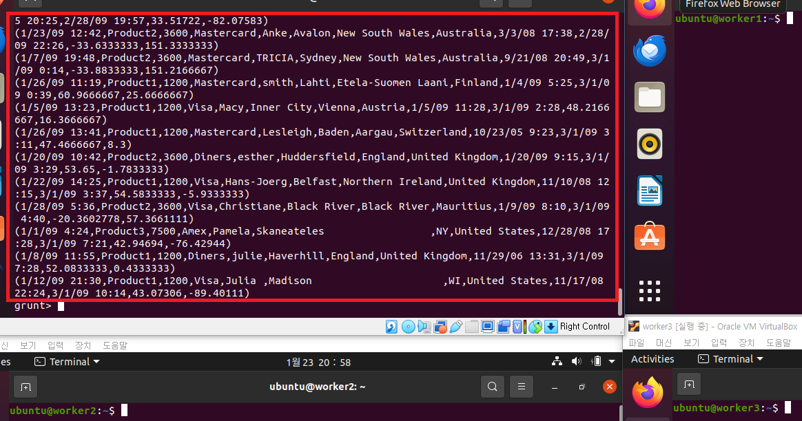
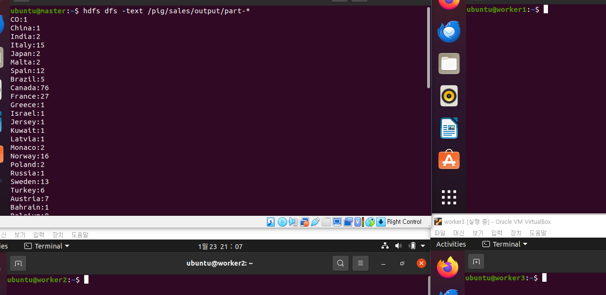

# [SalesJan2009 데이터 분석](https://www.guru99.com/ko/introduction-to-pig-and-hive.html) 
### 단계1: 우분투에 SalesJan2009 저장
```shell
sudo wget https://raw.githubusercontent.com/good593/course_data_engineering/main/hadoop%20ecosystem/samples/7.%20Pig%20%EC%82%AC%EC%9A%A9%ED%95%98%EA%B8%B0/SalesJan2009.csv
```


---
### 단계2: 하둡에 SalesJan2009 저장
```shell
mv /home/ubuntu/SalesJan2009.csv /home/ubuntu/src/data/SalesJan2009.csv

hdfs dfs -mkdir -p /pig/sales/input
# hadoop 데이터 전달
hdfs dfs -put /home/ubuntu/src/data/SalesJan2009.csv /pig/sales/input
# hadoop 데이터 확인 
hdfs dfs -ls -R /pig/sales
```
---


---
### 단계3: pig에 데이터 로드 
```shell
# 접속
pig

# 데이터 로드 
salesTable = LOAD '/pig/sales/input/SalesJan2009.csv' USING PigStorage(',') AS (Transaction_date:chararray,Product:chararray,Price:chararray,Payment_Type:chararray,Name:chararray,City:chararray,State:chararray,Country:chararray,Account_Created:chararray,Last_Login:chararray,Latitude:chararray,Longitude:chararray);
# 데이터 출력
DUMP salesTable;
```
---


---
### 단계4: 국가별 필드별 데이터 그룹화
```shell
GroupByCountry = GROUP salesTable BY Country;
```
### 단계5: 각 튜플에 대해 '그룹별국가', 양식-> 국가 이름: 판매된 제품 수의 결과 문자열을 생성합니다.
```shell
CountByCountry = FOREACH GroupByCountry GENERATE CONCAT((chararray)$0,CONCAT(':',(chararray)COUNT($1)));
```
### 단계6: Data Flow의 결과를 디렉터리에 저장합니다.
```shell
STORE CountByCountry INTO '/pig/sales/output' USING PigStorage('\t');
```
---


---
### 단계7: 결과 데이터 확인 
```shell
hdfs dfs -text /pig/sales/output/part-*
```



