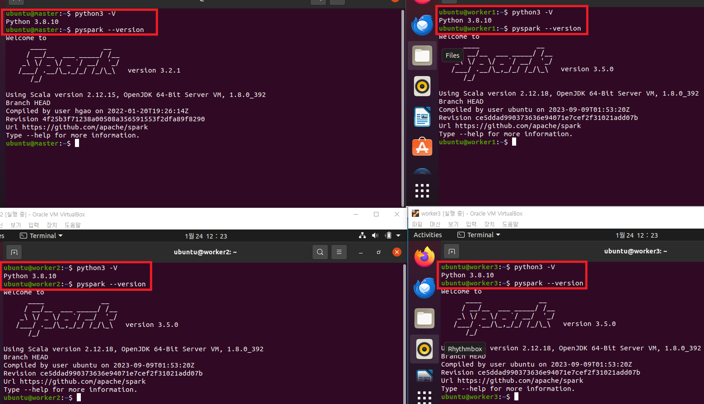
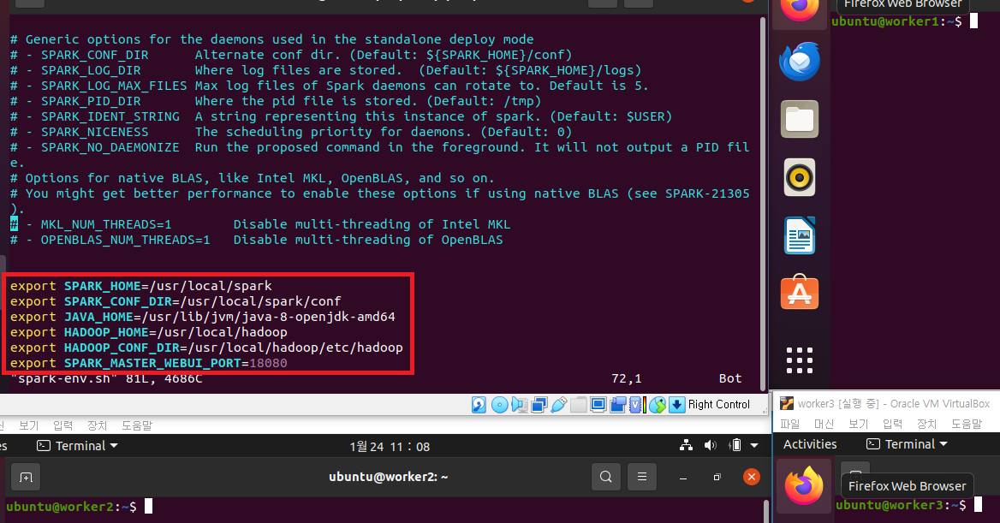
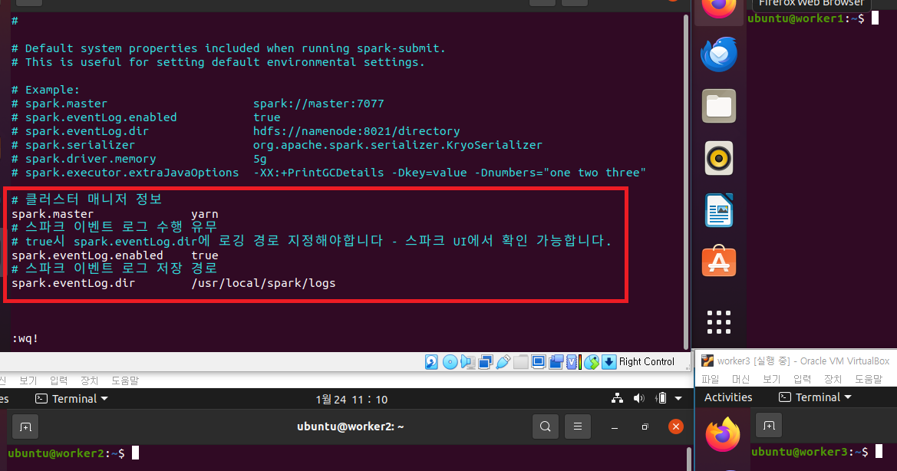
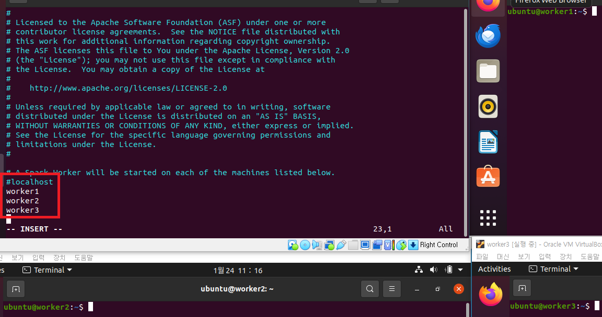
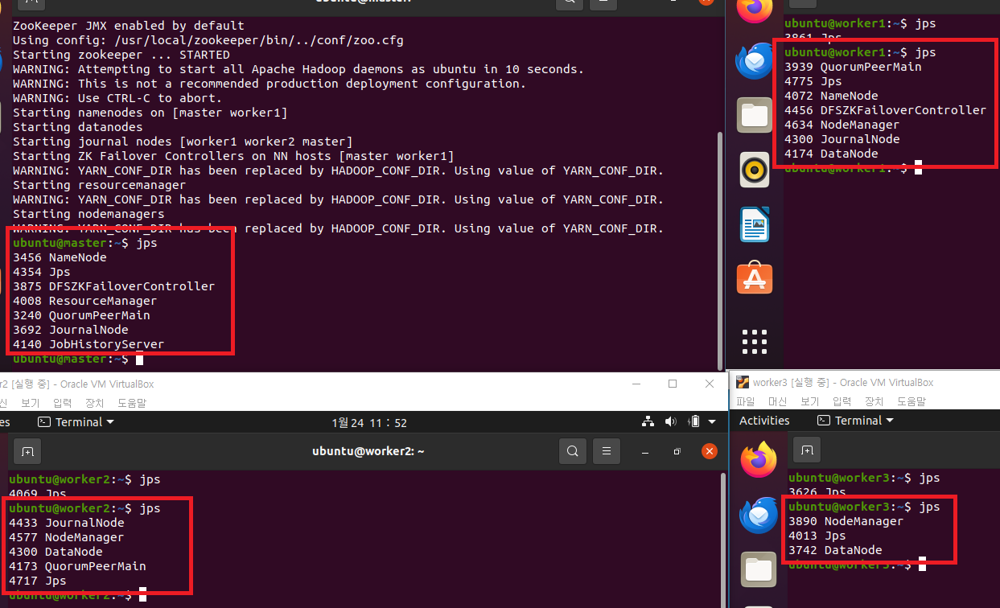
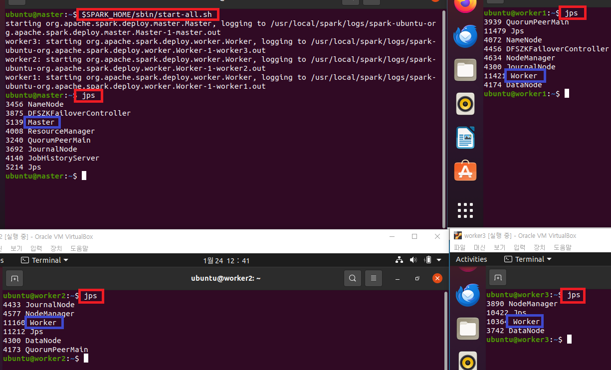
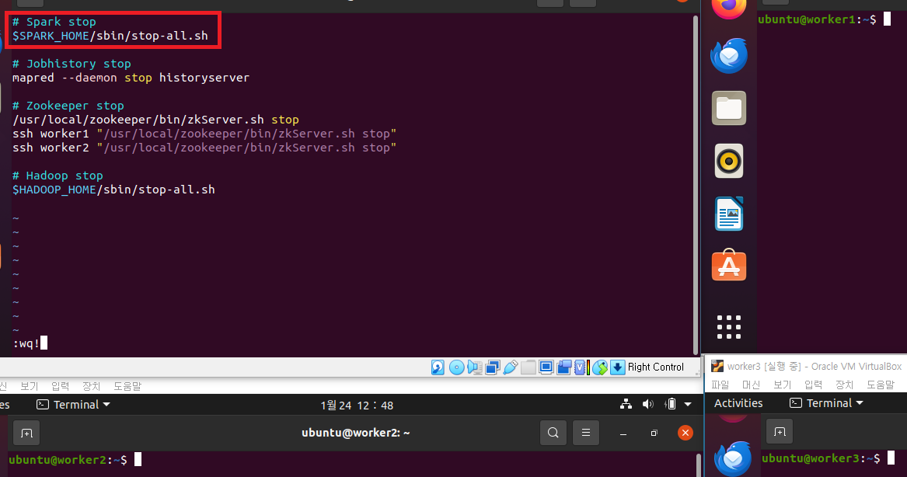
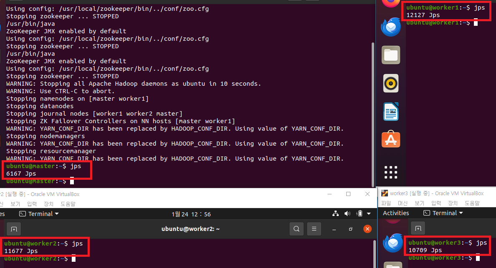
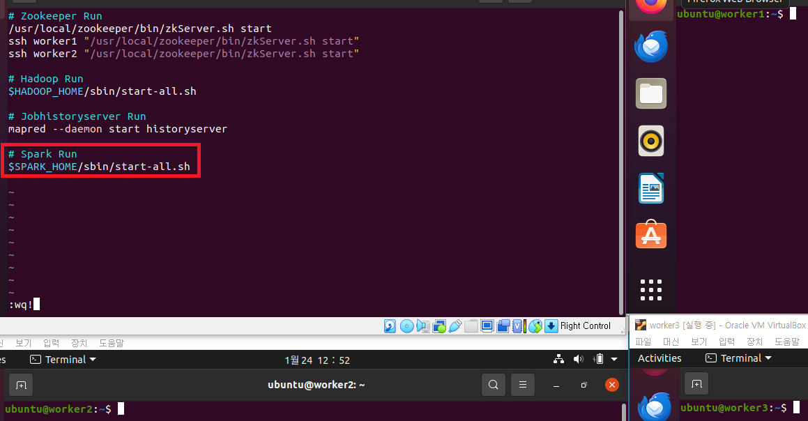

### 단계1: (모든 서버) Spark 설치 
```shell
# 설치 관리용 디렉토리 이동
cd /install_dir
# Spark 3.2.1 압축 해제
sudo tar -xzvf spark-3.2.1-bin-hadoop3.2.tgz -C /usr/local
# Spark 디렉토리 이름 변경
sudo mv /usr/local/spark-3.2.1-bin-hadoop3.2 /usr/local/spark
# owner(소유권)를 변경 
sudo chown -R $USER:$USER /usr/local/spark
# 결과 확인 
ls -al /usr/local/spark
```
- 없다면, 다운로드 
```shell
# Spark 3.2.1 설치
sudo wget https://archive.apache.org/dist/spark/spark-3.2.1/spark-3.2.1-bin-hadoop3.2.tgz
```

---


---
### 단계2: (모든 서버) Python & PySpark 설치 
```shell
# Python 버전 확인
python3 -V
# PySpark 설치
pip3 install pyspark findspark
# pyspark 버전 확인 
pyspark --version
```
- 만약 python(또는 pip3)이 없다면, 설치 
```shell
sudo apt-get install -y python3-pip
pip3 install --upgrade pip
```
---


---
### 단계3: (모든 서버) Python & Spark 환경설정
```shell
sudo vim ~/.bashrc
# 아래 내용 복사 
export PYTHONPATH=/usr/bin/python3
export PYSPARK_PYTHON=/usr/bin/python3
export PATH=$PATH:/usr/bin/python3

export SPARK_HOME=/usr/local/spark
export PATH=$PATH:$SPARK_HOME/bin:$SPARK_HOME/sbin

# 수정내용 반영 
source ~/.bashrc
env | grep python3
env | grep spark
```
---


---
### 단계4: spark-env.sh
```shell
# spark-env.sh 파일 카피
cd $SPARK_HOME/conf
cp spark-env.sh.template spark-env.sh

# spark-env.sh 파일 편집
vim spark-env.sh

# 아래 내용 수정 후 저장
export SPARK_HOME=/usr/local/spark
export SPARK_CONF_DIR=/usr/local/spark/conf
export JAVA_HOME=/usr/lib/jvm/java-8-openjdk-amd64
export HADOOP_HOME=/usr/local/hadoop
export HADOOP_CONF_DIR=/usr/local/hadoop/etc/hadoop
export SPARK_MASTER_WEBUI_PORT=18080
```
---


---
### 단계5: spark-defaults.conf
```shell
# Spark spark-defaults.conf.template 파일 복사
cp /usr/local/spark/conf/spark-defaults.conf.template /usr/local/spark/conf/spark-defaults.conf

# Spark spark-defaults.conf 파일 설정
vim /usr/local/spark/conf/spark-defaults.conf

# 아래 설정 후 저장 
# 클러스터 매니저 정보
spark.master              yarn
# 스파크 이벤트 로그 수행 유무
# true시 spark.eventLog.dir에 로깅 경로 지정해야합니다 - 스파크 UI에서 확인 가능합니다.
spark.eventLog.enabled    true
# 스파크 이벤트 로그 저장 경로
spark.eventLog.dir        /usr/local/spark/logs
```
---


---
### 단계6: Spark logs 디렉토리 생성
```shell
mkdir -p /usr/local/spark/logs 
ls -al /usr/local/spark
```
---


---
### 단계7: workers 파일 편집
```shell
# Spark workers 파일 생성
cp /usr/local/spark/conf/workers.template /usr/local/spark/conf/workers

# Spark workers 파일 설정
vim /usr/local/spark/conf/workers

# 아래 설정 후 저장(단, localhost는 주석 처리한다.)
worker1
worker2
worker3
```
---


---
### 단계8: 하둡 실행  
```shell
# 실행
. cluster-start-all.sh
# 확인 
jps
```
---


---
### 단계9: Spark 실행 
- Master: master
- Worker: worker1, worker2, worker3
```shell
$SPARK_HOME/sbin/start-all.sh
```
---


---
### 단계10: cluster-stop-all.sh 수정 
```shell
vim cluster-stop-all.sh

# 아래 내용작성 > 맨위에 추가 
# Spark stop
$SPARK_HOME/sbin/stop-all.sh
```
---


---
- cluster-stop-all.sh 실행
```shell
. cluster-stop-all.sh
```


---
### 단계11: cluster-start-all.sh 수정 
```shell
vim cluster-start-all.sh

# 아래 내용작성 > 맨아래 추가 
# Spark Run
$SPARK_HOME/sbin/start-all.sh
```
---


---
- cluster-start-all.sh 실행
```shell
. cluster-start-all.sh
```


