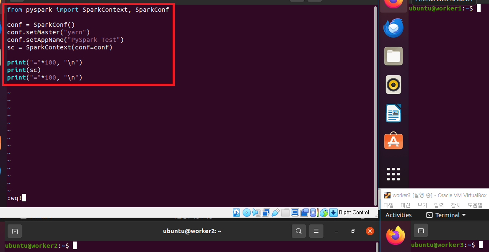
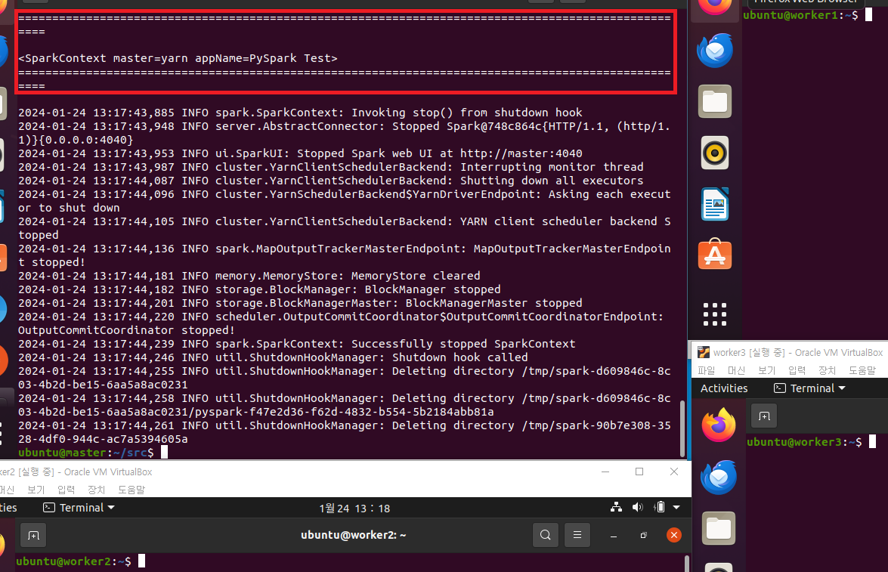
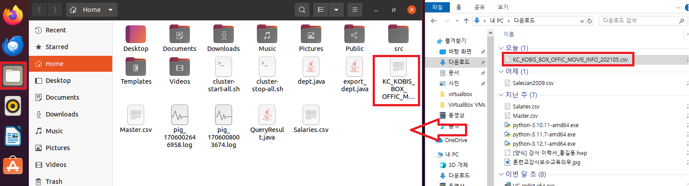
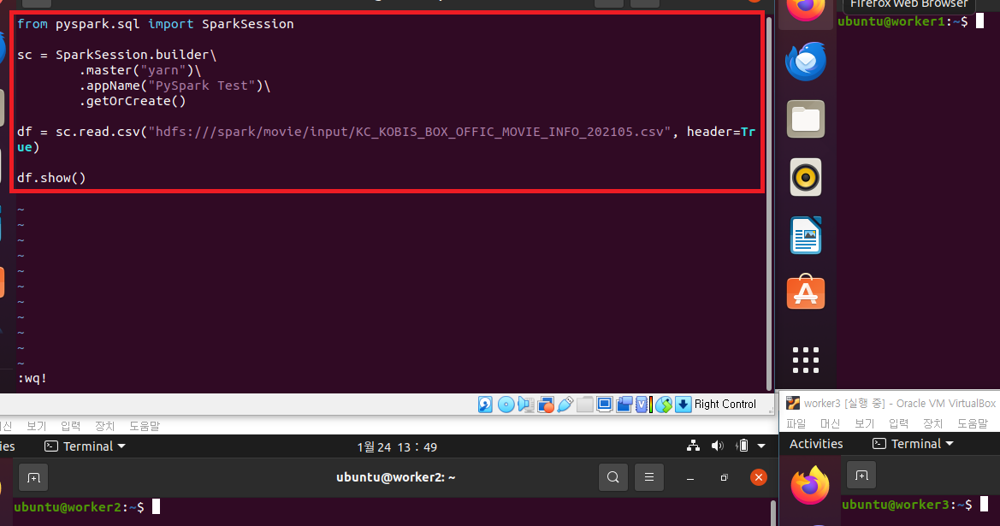
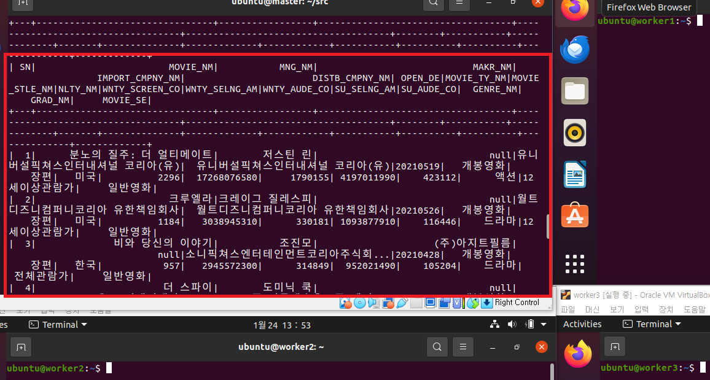

### 단계1: Spark 예제
- cluster 모드로 실행 > 출력값 확인 x 
```shell
spark-submit --class org.apache.spark.examples.SparkPi --master yarn --deploy-mode cluster --driver-memory 512m --executor-memory 512m --executor-cores 1 $SPARK_HOME/examples/jars/spark-examples_2.12-3.2.1.jar 5
```


---
- client 모드로 실행 > 출력값 확인 o  
```shell
spark-submit --class org.apache.spark.examples.SparkPi --master yarn --deploy-mode client --driver-memory 512m --executor-memory 512m --executor-cores 1 $SPARK_HOME/examples/jars/spark-examples_2.12-3.2.1.jar 5
```


---
### 단계2: PySpark 예제1
- pyspark_example.py 작성 
```shell
# 스크립트 편집
cd src
vim pyspark_example.py
```
```python
# pyspark_example.py 아래 내용 저장
from pyspark import SparkContext, SparkConf

conf = SparkConf()
conf.setMaster("yarn")
conf.setAppName("PySpark Test")
sc = SparkContext(conf=conf)

print("="*100, "\n")
print(sc)
print("="*100, "\n")
```
---


---
- pyspark_example.py 실행 
```shell
spark-submit --master yarn --deploy-mode client pyspark_example.py
```


---
### 단계2: PySpark 예제2
- KC_KOBIS_BOX_OFFIC_MOVIE_INFO_202105.csv 다운로드 


---
- HDFS로 csv 파일 업로드
```shell
ls 
mv KC_KOBIS_BOX_OFFIC_MOVIE_INFO_202105.csv /home/ubuntu/src/data/KC_KOBIS_BOX_OFFIC_MOVIE_INFO_202105.csv

# hadoop 디렉토리 생성
hdfs dfs -mkdir -p /spark/movie/input
# hadoop 데이터 전달
hdfs dfs -put /home/ubuntu/src/data/KC_KOBIS_BOX_OFFIC_MOVIE_INFO_202105.csv /spark/movie/input
# hadoop 데이터 확인 
hdfs dfs -ls -R /spark/movie
```
---


---
- pyspark_example2.py 편집 
```shell
cd src
# 스크립트 편집
vim pyspark_example2.py
```
```python
# pyspark_example2.py 아래 내용 저장
from pyspark.sql import SparkSession

sc = SparkSession.builder\
        .master("yarn")\
        .appName("PySpark Test")\
        .getOrCreate()

df = sc.read.csv("hdfs:///spark/movie/input/KC_KOBIS_BOX_OFFIC_MOVIE_INFO_202105.csv", header=True)

df.show()
```
---


---
- 실행 
```shell
spark-submit --master yarn --deploy-mode client pyspark_example2.py
``` 


