### 단계1: Zeppelin 설치
```shell
# 디렉토리 이동
cd /install_dir

# Zeppelin 다운로드
sudo wget https://downloads.apache.org/zeppelin/zeppelin-0.10.1/zeppelin-0.10.1-bin-all.tgz

# Zeppelin 압축 해제
sudo tar -zxvf zeppelin-0.10.1-bin-all.tgz -C /usr/local/

# Zeppelin 디렉토리 이름 변경
sudo mv /usr/local/zeppelin-0.10.1-bin-all/ /usr/local/zeppelin

# Zeppelin 디렉토리 소유자 변경
sudo chown -R $USER:$USER /usr/local/zeppelin

# 확인 
ls -al /usr/local/zeppelin
```
---


---
### 단계2: Zeppelin 환경설정
```shell
sudo vim ~/.bashrc
# 아래 내용 복사 
export ZEPPELIN_HOME=/usr/local/zeppelin
export PATH=$PATH:$ZEPPELIN_HOME/bin

# 수정내용 반영 
source ~/.bashrc
env | grep zeppelin
```
---
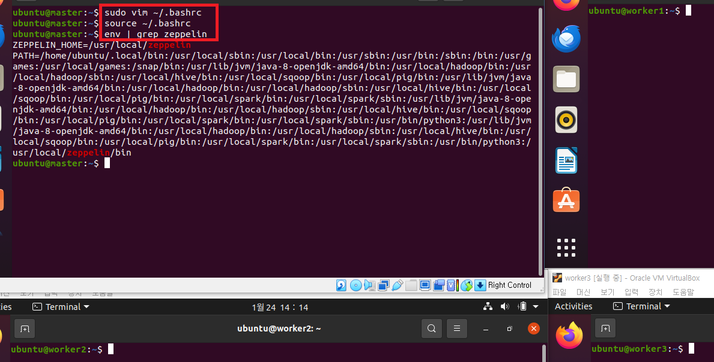

---
### 단계3: zeppelin-site.xml
```shell
# Zeppelin 환경설정 디렉토리 이동
cd /usr/local/zeppelin/conf
# zeppelin-site.xml 파일 복사
cp zeppelin-site.xml.template zeppelin-site.xml
# zeppelin-site.xml 파일 편집
vim zeppelin-site.xml

# 아래 내용 수정 후 저장
<property>
  <name>zeppelin.server.addr</name>
  <value>0.0.0.0</value>
  <description>Server binding address</description>
</property>

<property>
  <name>zeppelin.server.port</name>
  <value>18888</value>
  <description>Server port.</description>
</property>
```
---
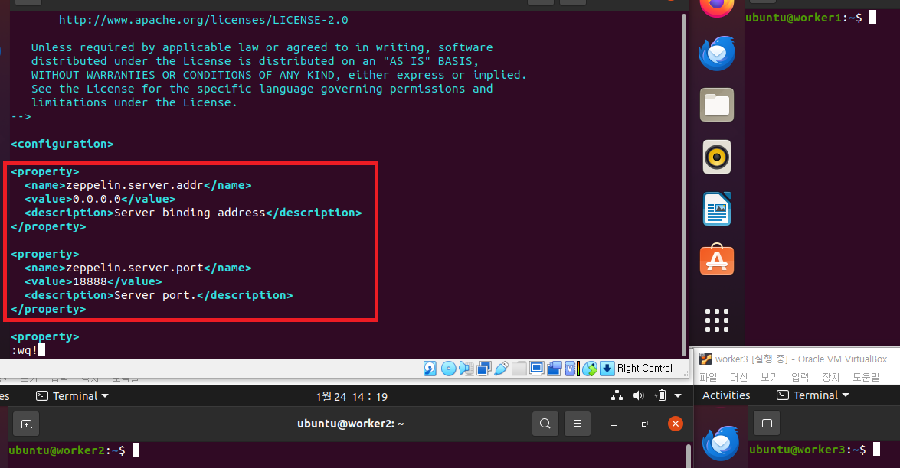

---
### 단계4: zeppelin-env.sh
```shell
# zeppelin-env.sh 파일 복사
cp zeppelin-env.sh.template zeppelin-env.sh

# zeppelin-env.sh 파일 편집
vim zeppelin-env.sh

# 아래 내용 수정 후 저장
export JAVA_HOME=/usr/lib/jvm/java-8-openjdk-amd64
export HADOOP_HOME=/usr/local/hadoop
export YARN_CONF_DIR=$HADOOP_HOME/etc/hadoop
export HADOOP_CONF_DIR=$HADOOP_HOME/etc/hadoop
export SPARK_HOME=/usr/local/spark
export SPARK_MASTER=yarn
export ZEPPELIN_PORT=18888
export PYTHONPATH=/usr/bin/python3
export PYSPARK_PYTHON=/usr/bin/python3
export PYSPARK_DRIVER_PYTHON=/usr/bin/python3
```
---
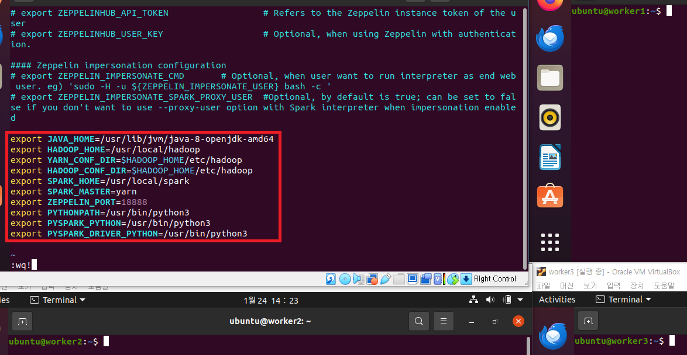

---
### 단계5: Zeppelin 실행
- hadoop, spark 실행된 상태에서 실행 
```shell
zeppelin-daemon.sh start
```


---
### 단계6: NAT 네트워크 > 포트 포워딩 
- 호스트IP: 127.0.0.1 / 호스트 포트: 18888
- 게스트IP: 10.0.2.15 / 게스트 포트: 18888


---
### 단계7: Zeppelin Web UI 접속 
- 기본 계정 : admin / admin
- http://127.0.0.1:18888/#/


---
### 단계8: Zeppelin Web UI 환경설정


---
- spark.submit.deployMode: `cluster`
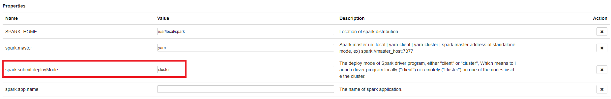
- 저장 


---
- 수정 내용 확인 후 home으로 이동 
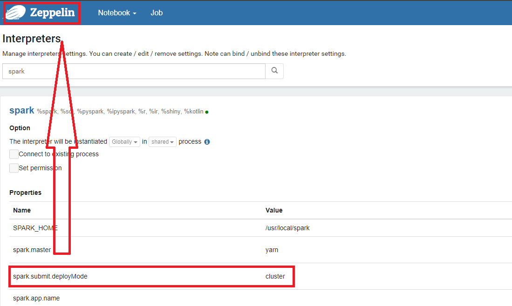

---
### 단계9: Create New Note
- Note Name: `/tutorial/ex01.py`
- Default Interpreter: `spark-submit`
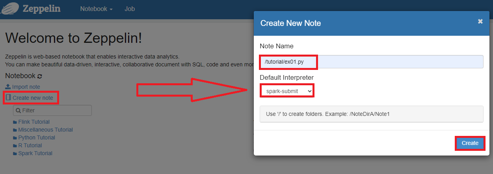

---
- 실행: shift + enter
```shell
%spark.pyspark
```
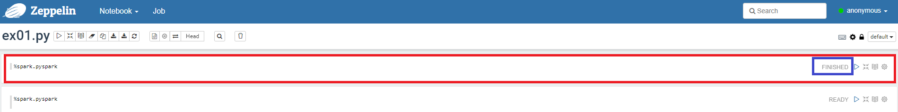
- 마우스를 아래 선으로 이동하면, Add Paragraph를 이용하여 layer를 추가할 수 있음 

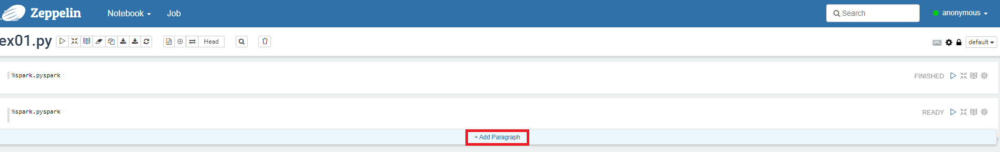

---
### 단계10: KC_KOBIS_BOX_OFFIC_MOVIE_INFO_202105.csv 조회
```shell
%spark.pyspark

from pyspark.sql import SparkSession
from pyspark.sql.functions import col


sc = SparkSession.builder\
        .master("yarn")\
        .appName("Jmkim Test")\
        .getOrCreate()

df = sc.read.csv("hdfs:///spark/movie/input/KC_KOBIS_BOX_OFFIC_MOVIE_INFO_202105.csv", header=True)
df.select(col("MOVIE_NM"), col("MNG_NM"), col("IMPORT_CMPNY_NM"), col("GRAD_NM")).show()
```
---
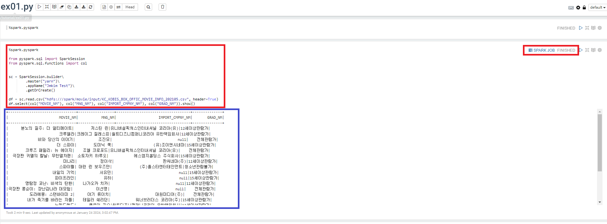

---
### 단계11: df.printSchema()
```shell
%spark.pyspark

df.printSchema()
```
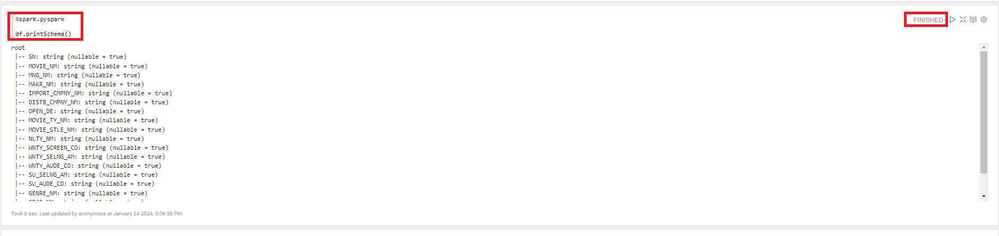

---
### 단계12: spark.sql 예제
```shell
%spark.pyspark
df.createOrReplaceTempView("movie")
```
```shell
%spark.sql
select * from movie
```
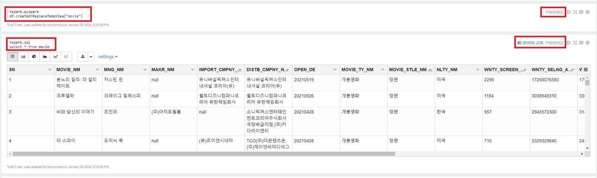

---
```shell
%spark.sql

select MOVIE_NM, MNG_NM, DISTB_CMPNY_NM, OPEN_DE, GENRE_NM, GRAD_NM from movie
```
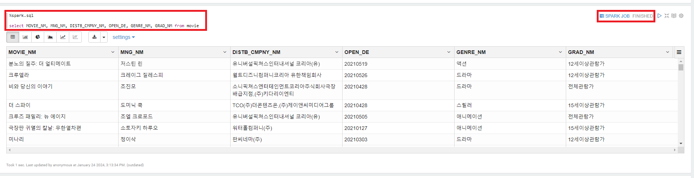

---
```shell
%spark.sql

select NLTY_NM, count(*) from movie group by NLTY_NM
```
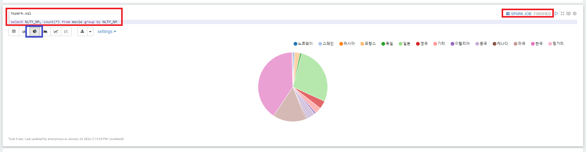

---
### 단계13: 종료 
- zeppelin 종료 
```shell
# zeppelin 종료 
zeppelin-daemon.sh stop
```


---
- 하둡 & 스파크 정지 
```shell
# 정지
. cluster-stop-all.sh
# 확인 
jps
```
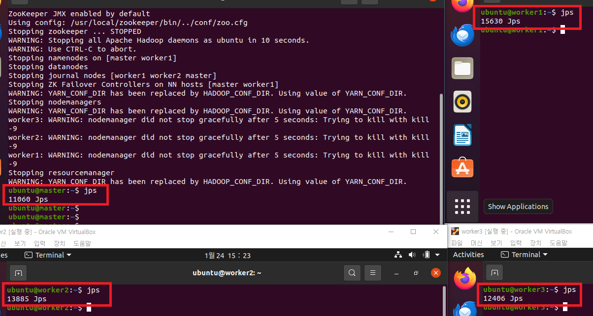

---
# 실행 스크립트 변경 

---
### 단계1: cluster-start-all.sh
```shell
# 쉘 스크립트 편집
vim cluster-start-all.sh
# 가장 아래쪽에 내용 추가 후 저장
zeppelin-daemon.sh start
```


---
### 단계2: cluster-stop-all.sh
```shell
# 쉘 스크립트 편집
vim cluster-stop-all.sh
# 가장 위쪽에 내용 추가 후 저장
zeppelin-daemon.sh stop
```
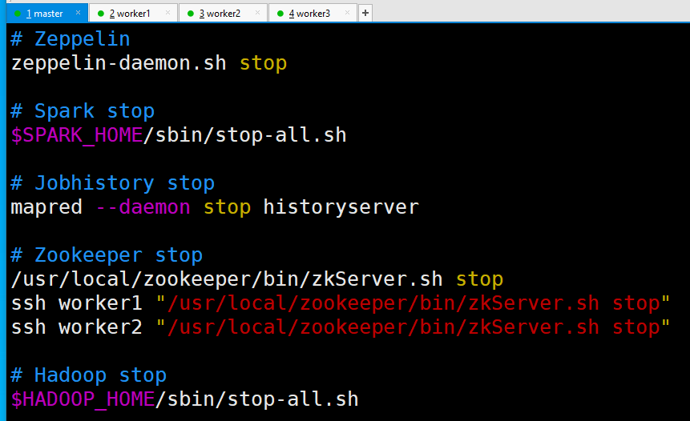