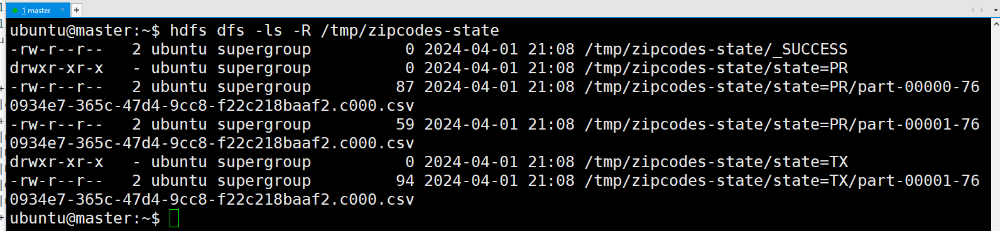
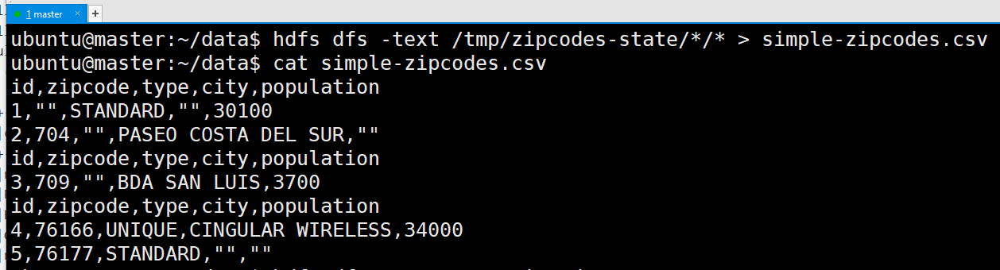
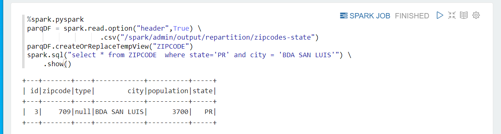
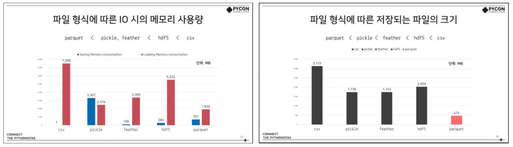

# Create SparkContext
```python
%spark.pyspark

import pyspark
from pyspark.sql import SparkSession
spark = SparkSession.builder.master("yarn") \
                    .appName('SparkByExamples.com') \
                    .getOrCreate()
                    
print(spark.sparkContext)
print("Spark App Name : "+ spark.sparkContext.appName)
```
---
## [PySpark transform()](https://sparkbyexamples.com/pyspark/pyspark-transform-function/)
```python
# Prepare Data
simpleData = (("Java",4000,5), \
    ("Python", 4600,10),  \
    ("Scala", 4100,15),   \
    ("Scala", 4500,15),   \
    ("PHP", 3000,20),  \
  )
columns= ["CourseName", "fee", "discount"]

# Create DataFrame
df = spark.createDataFrame(data = simpleData, schema = columns)
df.printSchema()
df.show(truncate=False)
```
---
### 단계1: Create Custom Functions
```python
# Custom transformation 1
from pyspark.sql.functions import upper
def to_upper_str_columns(df):
    return df.withColumn("CourseName",upper(df.CourseName))

# Custom transformation 2
def apply_discount(df):
    return df.withColumn("discounted_fee",  \
             df.fee - (df.fee * df.discount) / 100)
```
### 단계2: PySpark Apply DataFrame.transform()
```python
df.transform(to_upper_str_columns) \
        .transform(apply_discount).show(truncate=False)
```
---
### 단계3: transform with lambda
```python
# Create DataFrame with Array
data = [
 ("James,,Smith",["Java","Scala","C++"],["Spark","Java"]),
 ("Michael,Rose,",["Spark","Java","C++"],["Spark","Java"]),
 ("Robert,,Williams",["CSharp","VB"],["Spark","Python"])
]
df = spark.createDataFrame(data=data,schema=["Name","Languages1","Languages2"])
df.printSchema()
df.show()

# using transform() function
from pyspark.sql.functions import upper
from pyspark.sql.functions import transform
df.select(transform("Languages1", lambda x: upper(x)).alias("languages1")) \
  .show()
```
---
## [PySpark map()](https://sparkbyexamples.com/pyspark/pyspark-map-transformation/)
```python
data = [('James','Smith','M',30),
  ('Anna','Rose','F',41),
  ('Robert','Williams','M',62), 
]

columns = ["firstname","lastname","gender","salary"]
df = spark.createDataFrame(data=data, schema = columns)
df.show()
```
---
### 단계1: 예제
```python
rdd2=df.rdd.map(lambda x: 
    (x["firstname"]+","+x["lastname"],x["gender"],x["salary"]*2)
    ) 
df2=rdd2.toDF(["name","gender","new_salary"]   )
df2.show()
```
### 단계2: 예제
```python
def func1(x):
    firstName=x.firstname
    lastName=x.lastname
    name=firstName+","+lastName
    gender=x.gender.lower()
    salary=x.salary*2
    return (name,gender,salary)

rdd2=df.rdd.map(lambda x: func1(x))
df2.show()
```
---
## [PySpark foreach()](https://sparkbyexamples.com/pyspark/pyspark-foreach-usage-with-examples/)
```python
# Prepare Data
columns = ["Seqno","Name"]
data = [("1", "john jones"),
    ("2", "tracey smith"),
    ("3", "amy sanders")]

# Create DataFrame
df = spark.createDataFrame(data=data,schema=columns)
df.show()
```
---
### 단계1: PySpark foreach() Usage
```python
# foreach() with accumulator Example
accum=spark.sparkContext.accumulator(0)

df.foreach(lambda x:accum.add(int(x.Seqno)))
print(accum.value) #Accessed by driver
```
### 단계2: RDD foreach() Example
```python
# foreach() with RDD example
accum=spark.sparkContext.accumulator(0)
rdd=spark.sparkContext.parallelize([1,2,3,4,5])
rdd.foreach(lambda x:accum.add(x))
print(accum.value) #Accessed by driver
```
---
## [PySpark Random Sample](https://sparkbyexamples.com/pyspark/pyspark-sampling-example/)

---
### 단계1: Using fraction to get a random sample
- By using fraction between 0 to 1, it returns the approximate number of the fraction of the dataset. 
- For example, 0.1 returns 10% of the rows. 
- However, this does not guarantee it returns the exact 10% of the records.
```python
# 100개 데이터 생성
df=spark.range(100)
# 렌덤하게 6% 데이터 추출(다만, 5~7% 데이터가 추출될 수 있음)
print(df.sample(0.06).collect())
```
---
### 단계2: Using seed to reproduce the same Samples
- To get consistent same random sampling uses the same slice value for every run. 
- Change slice value to get different results.
```python
print(df.sample(0.1,123).collect())

print(df.sample(0.1,123).collect())

print(df.sample(0.1,456).collect())
```
---
### 단계3: Sample withReplacement (May contain duplicates)
- some times you may need to get a random sample with repeated values. 
- By using the value true, results in repeated values.
```python
print(df.sample(True,0.3,123).collect()) #with Duplicates
#Output: 0,5,9,11,14,14,16,17,21,29,33,41,42,52,52,54,58,65,65,71,76,79,85,96
print(df.sample(0.3,123).collect()) # No duplicates
#Output: 0,4,17,19,24,25,26,36,37,41,43,44,53,56,66,68,69,70,71,75,76,78,83,84,88,94,96,97,98
```
---
## [PySpark fillna() & fill()](https://sparkbyexamples.com/pyspark/pyspark-fillna-fill-replace-null-values/)
```python
# Prepare Data
data = [(1, None, "STANDARD", None, "PR", 30100), \
    (2, 704, None, "PASEO COSTA DEL SUR", "PR", None), \
    (3, 709, None, "BDA SAN LUIS", "PR", 3700), \
    (4, 76166, "UNIQUE", "CINGULAR WIRELESS", "TX", 34000), \
    (5, 76177, "STANDARD", None, "TX", None) \
  ]

# Create DataFrame
columns= ["id", "zipcode", "type", "city", "state", "population"]
df = spark.createDataFrame(data = data, schema = columns)
df.printSchema()
df.show(truncate=False)
```
---
### 단계1: PySpark Replace NULL/None Values with Zero (0)
```python
#Replace 0 for null for all integer columns
df.na.fill(value=0).show()

#Replace 0 for null on only population column 
df.na.fill(value=0,subset=["population"]).show()
```
### 단계2: PySpark Replace Null/None Value with Empty String
```python
df.na.fill("").show()

df.na.fill("unknown",["city"]) \
    .na.fill("",["type"]).show()

df.na.fill({"city": "unknown", "type": ""}) \
    .show()
```
---
## [PySpark Pivot and Unpivot DataFrame](https://sparkbyexamples.com/pyspark/pyspark-pivot-and-unpivot-dataframe/)
```python
#Create spark session
data = [("Banana",1000,"USA"), ("Carrots",1500,"USA"), ("Beans",1600,"USA"), \
      ("Orange",2000,"USA"),("Orange",2000,"USA"),("Banana",400,"China"), \
      ("Carrots",1200,"China"),("Beans",1500,"China"),("Orange",4000,"China"), \
      ("Banana",2000,"Canada"),("Carrots",2000,"Canada"),("Beans",2000,"Mexico")]

columns= ["Product","Amount","Country"]
df = spark.createDataFrame(data = data, schema = columns)
df.printSchema()
df.show(truncate=False)
```
---
### 단계1: Pivot PySpark DataFrame
```python
# Applying pivot()
pivotDF = df.groupBy("Product").pivot("Country").sum("Amount")
pivotDF.printSchema()
pivotDF.show(truncate=False)
```
### 단계2: Pivot Performance improvement
```python
countries = ["USA","China","Canada","Mexico"]
pivotDF = df.groupBy("Product").pivot("Country", countries).sum("Amount")
pivotDF.show(truncate=False)
```
---
## [PySpark partitionBy() – Write to Disk](https://sparkbyexamples.com/pyspark/pyspark-partitionby-example/)
```python
# Prepare Data
data = [(1, None, "STANDARD", None, "PR", 30100), \
    (2, 704, None, "PASEO COSTA DEL SUR", "PR", None), \
    (3, 709, None, "BDA SAN LUIS", "PR", 3700), \
    (4, 76166, "UNIQUE", "CINGULAR WIRELESS", "TX", 34000), \
    (5, 76177, "STANDARD", None, "TX", None) \
  ]

# Create DataFrame
columns= ["id", "zipcode", "type", "city", "state", "population"]
df = spark.createDataFrame(data = data, schema = columns)
df.printSchema()
df.show(truncate=False)
```
---
### 단계1: PySpark partitionBy()
- save data from pyspark to hdfs
```python
#partitionBy()
df.write.option("header",True) \
        .partitionBy("state") \
        .mode("overwrite") \
        .csv("/tmp/zipcodes-state")
```
---
### 단계2: search data on hdfs
```shell
hdfs dfs -ls -R /tmp/zipcodes-state
```


---
### 단계3: read data on hdfs
```shell
hdfs dfs -text /tmp/zipcodes-state/*/*
```


---
### 단계4: simple-zipcodes.csv
```shell
hdfs dfs -text /tmp/zipcodes-state/*/* > simple-zipcodes.csv
```


---
### 단계4: put to hdfs
```shell
hdfs dfs -mkdir -p /spark/admin/input
hdfs dfs -put simple-zipcodes.csv /spark/admin/input
hdfs dfs -ls -R /spark/admin/input
```


---
### 단계5: read data by pyspark
```python
df1=spark.read.option("header",True) \
        .csv("/spark/admin/input/simple-zipcodes.csv")
df1.printSchema()
df1.show(truncate=False)
```


---
### 단계6: PySpark partitionBy() Multiple Columns
- pyspark
```python
df.write.option("header",True) \
        .partitionBy("state","city") \
        .mode("overwrite") \
        .csv("/spark/admin/output/partitionBy/zipcodes-state")
```
- hdfs
```shell
hdfs dfs -ls /spark/admin/output/partitionBy/zipcodes-state/*/
```


---
### 단계7: Using repartition() and partitionBy() together
- pyspark
```python
df.repartition(2) \
        .write.option("header",True) \
        .partitionBy("state") \
        .mode("overwrite") \
        .csv("/spark/admin/output/repartition/zipcodes-state")
```
- hdfs
```shell
hdfs dfs -ls /spark/admin/output/repartition/zipcodes-state/*/
```


---
### 단계8: Read a Specific Partition
```python
dfSinglePart=spark.read.option("header",True) \
            .csv("/spark/admin/output/repartition/zipcodes-state/state=PR")
dfSinglePart.printSchema()
dfSinglePart.show()
```


---
### 단계9: PySpark SQL – Read Partition Data
```python
parqDF = spark.read.option("header",True) \
                  .csv("/spark/admin/output/repartition/zipcodes-state")
parqDF.createOrReplaceTempView("ZIPCODE")
spark.sql("select * from ZIPCODE  where state='PR' and city = 'BDA SAN LUIS'") \
    .show()
```


---
## [PySpark Read and Write Parquet File](https://sparkbyexamples.com/pyspark/pyspark-read-and-write-parquet-file/)
### Parquet file 이란?
- 파케이(parquet)이란 하둡에서 칼럼방식으로 저장하는 저장 포맷을 말합니다.
- 높은 압축률. 칼럼 단위로 구성하면 데이터가 더 균일하므로 압축률이 높아진다.
- 데이터를 전체 칼럼중에서 일부 칼럼을 선택해서 가져오는 형식이므로 선택되지 않은 칼럼의 데이터에서는 I/O가 발생하지 않게된다.
- 칼럼에 동일한 데이터 타입이 저장되기 때문에 칼럼별로 적합한(데이터형에 유리한) 인코딩을 사용할 수 있다.
---



---
### 단계1: createDataFrame
```python
data =[("James ","","Smith","36636","M",3000),
              ("Michael ","Rose","","40288","M",4000),
              ("Robert ","","Williams","42114","M",4000),
              ("Maria ","Anne","Jones","39192","F",4000),
              ("Jen","Mary","Brown","","F",-1)]
columns=["firstname","middlename","lastname","dob","gender","salary"]
df=spark.createDataFrame(data,columns)
df.show()
```
---
### 단계2: using write.parquet()
```python
# Write DataFrame to parquet file using write.parquet()
df.write.parquet("/spark/admin/output/parquet/people.parquet")
```
```shell
hdfs dfs -ls /spark/admin/output/parquet/*
```


---
### 단계2: Pyspark Read Parquet file into DataFrame
```python
# Read parquet file using read.parquet()
parDF=spark.read.parquet("/spark/admin/output/parquet/people.parquet")
```
### 단계3: Append or Overwrite an existing Parquet file
```python
# Using append and overwrite to save parquet file
df.write.mode('append').parquet("/spark/admin/output/append/people.parquet")
df.write.mode('append').parquet("/spark/admin/output/append/people.parquet")

df.write.mode('overwrite').parquet("/spark/admin/output/overwrite/people.parquet")
df.write.mode('overwrite').parquet("/spark/admin/output/overwrite/people.parquet")
```

---
## [PySpark SQL Date and Timestamp](https://sparkbyexamples.com/pyspark/pyspark-sql-date-and-timestamp-functions/)
- createDataFrame
```python
from pyspark.sql.functions import *

data=[["1","2020-02-01"],["2","2019-03-01"],["3","2021-03-01"]]
df=spark.createDataFrame(data,["id","input"])
df.show()
```
---
### 단계1: current_date()
```python
df.select(current_date().alias("current_date")
  ).show(1)
```
### 단계2: date_format()
```python
df.select(col("input"), 
    date_format(col("input"), "MM-dd-yyyy").alias("date_format") 
  ).show()
```
### 단계3: to_date()
```python
df.select(col("input"), 
    to_date(col("input"), "yyy-MM-dd").alias("to_date") 
  ).show()
```
---
### 단계4: datediff()
```python
df.select(col("input"), 
    datediff(current_date(),col("input")).alias("datediff")  
  ).show()
```
### 단계5: months_between()
```python
df.select(col("input"), 
    months_between(current_date(),col("input")).alias("months_between")  
  ).show()
```
### 단계6: trunc()
```python
df.select(col("input"), 
    trunc(col("input"),"Month").alias("Month_Trunc"), 
    trunc(col("input"),"Year").alias("Month_Year"), 
    trunc(col("input"),"Month").alias("Month_Trunc")
   ).show()
```
---
### 단계7: add_months() , date_add(), date_sub()
```python
df.select(col("input"), 
    add_months(col("input"),3).alias("add_months"), 
    add_months(col("input"),-3).alias("sub_months"), 
    date_add(col("input"),4).alias("date_add"), 
    date_sub(col("input"),4).alias("date_sub") 
  ).show()
```
### 단계8: year(), month(), month(),next_day(), weekofyear()
```python
df.select(col("input"), 
     year(col("input")).alias("year"), 
     month(col("input")).alias("month"), 
     next_day(col("input"),"Sunday").alias("next_day"), 
     weekofyear(col("input")).alias("weekofyear") 
  ).show()
```
---
### 단계9: dayofweek(), dayofmonth(), dayofyear()
```python
df.select(col("input"),  
     dayofweek(col("input")).alias("dayofweek"), 
     dayofmonth(col("input")).alias("dayofmonth"), 
     dayofyear(col("input")).alias("dayofyear"), 
  ).show()
```
### 단계10: current_timestamp()
```python
df.select(current_timestamp().alias("current_timestamp")
  ).show(1,truncate=False)
```
---
### 단계11: to_timestamp()
```python
data=[["1","02-01-2020 11 01 19 06"],["2","03-01-2019 12 01 19 406"],["3","03-01-2021 12 01 19 406"]]
df2=spark.createDataFrame(data,["id","input"])
df2.show(truncate=False)

df2.select(col("input"), 
    to_timestamp(col("input"), "MM-dd-yyyy HH mm ss SSS").alias("to_timestamp") 
  ).show(truncate=False)
```
### 단계12: hour(), Minute() and second()
```python
data=[["1","2020-02-01 11:01:19.06"],["2","2019-03-01 12:01:19.406"],["3","2021-03-01 12:01:19.406"]]
df3=spark.createDataFrame(data,["id","input"])

df3.select(col("input"), 
    hour(col("input")).alias("hour"), 
    minute(col("input")).alias("minute"),
    second(col("input")).alias("second") 
  ).show(truncate=False)
```


